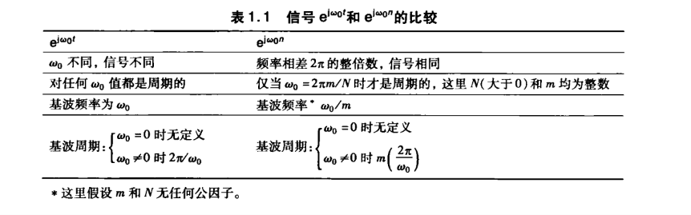

# 2026.7.23

信号能量与功率

信号时间函数X(t)/X[n]一般定义为平方X*X在无穷区间上的积分（求和）作为总能量，/2T或/（2N+1）后积分/求和为无限区间平均功率

通过信号能量与功率可以区分出三类信号

1.信号具有有限能量，即无限区间上总能量（E~∞~<∞），且这类函数无限区间上的平均功率必然为0，eg：矩形脉冲，x(t)=u(t)-u(t-τ)

2.P~∞~有限，则E∞无限，eg：x（t）=k

3.P~∞~与E~∞~均无限，eg：x(t)=t

自变换，括号内的整体作为自变量来看待，整体数值的加减值对应实际图像的移动数值，整体内的自变量，例如3（t-1）与3t-1的区别，这个要按照计算法则顺序来计算或者说映射到实习的波形变换，前者为先时移再缩放，或者打开括号后，先缩放后时移，后者就是先缩放后时移

even/odd 偶/奇

任何一个信号都可以分解为一个偶信号与一个奇信号之和

例如x(t)，构造两个信号，ev[x(t)]=1/2[x(t)+x(-t)],od[x(t)]=1/2[x(t)-x(-t)]

离散与连续均适用

谐波信号：一列频率为倍数关系的信号，比如一个信号x(t)，f为f~0~，依次信号频率为2f~0~，3f~0~.......，eg：Φ~k~(t)=e^jkω0t^

离散复指数信号的谐波信号是有限数量的重复

