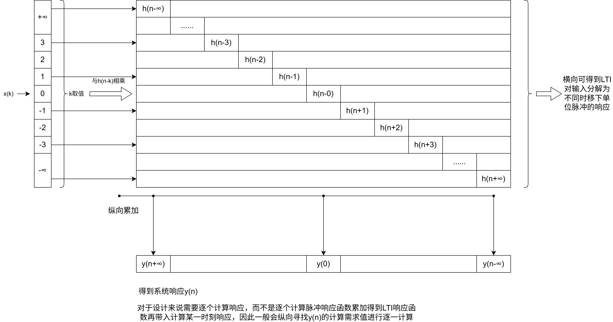

# 2026.7.23

信号能量与功率

信号时间函数X(t)/X[n]一般定义为平方X*X在无穷区间上的积分（求和）作为总能量，/2T或/（2N+1）后积分/求和为无限区间平均功率

通过信号能量与功率可以区分出三类信号

1.信号具有有限能量，即无限区间上总能量（E~∞~<∞），且这类函数无限区间上的平均功率必然为0，eg：矩形脉冲，x(t)=u(t)-u(t-τ)

2.P~∞~有限，则E∞无限，eg：x（t）=k

3.P~∞~与E~∞~均无限，eg：x(t)=t

自变换，括号内的整体作为自变量来看待，整体数值的加减值对应实际图像的移动数值，整体内的自变量，例如3（t-1）与3t-1的区别，这个要按照计算法则顺序来计算或者说映射到实习的波形变换，前者为先时移再缩放，或者打开括号后，先缩放后时移，后者就是先缩放后时移

even/odd 偶/奇

任何一个信号都可以分解为一个偶信号与一个奇信号之和

例如x(t)，构造两个信号，ev[x(t)]=1/2[x(t)+x(-t)],od[x(t)]=1/2[x(t)-x(-t)]

离散与连续均适用

谐波信号：一列频率为倍数关系的信号，比如一个信号x(t)，f为f~0~，依次信号频率为2f~0~，3f~0~.......，eg：Φ~k~(t)=e^jkω0t^

离散复指数信号的谐波信号是有限数量的重复

# 2026.7.24

离散：

看到这里时我存在一个疑问，就是h(n)是对应δ(n)的输出，或者说相应，但是对于δ(n)只有n=0时为1，其余均为0，理论上h(n)除了n=0应该均得到一致的响应，但是此时需要考虑到时不变系统存在记忆性，例如fir，是可以存储零点值参与到附近响应点的权重计算的，或者说一个线性时不变系统的输入变量是n，而不是对应的n的输入值，这是和数学里函数关键的对应点,或者说更严谨一些，系统的输入是一个序列，而不是一个一个的点，而关键响应点在于序列的顺序坐标
$$
y[n]=\sum_{k=-∞}^{+∞}x[k]h_{k}[n]
$$

$$
h_k[n]=h_0[n-k]
$$

$$
h[n]=h_0[n](去掉角标)
$$

$$
y[n]=\sum_{k=-∞}^{k=+∞}x[k]h[n-k]
$$

最后一式称为卷积和或者叠加和，并且用符号记为：
$$
y[n]=x[n]*h[n]
$$
最后一式最右侧代表线性时不变系统对应不同时移下的单位脉冲的响应序列，不同响应序列根据性质，经过对应输入序列的缩放得到对应的输出响应

连续的就不记了

下面是一些性质：

first：交换律

通过上图的计算过程，可以和清晰的确定离散卷积的计算具有交换律，即：
$$
x[n]*h[n]=h[n]*x[n]=\sum_{k=-∞}^{k=+∞}h[k]x[n-k]
$$
该性质意味着一个输入为x[n]的单位冲激响应为h[n]的LTI系统与输入为h[n]的单位冲激响应为x[n]的LTI系统会得到同样的y[n]

second："乘法"分配律

不解释

third:"乘法"结合律

不多做解释，依次可以推论出，两个级联的LTI系统，与一个单位冲激响应为  两者单位冲激响应卷积   的一个LTI系统等效

前提都是LTI系统，如果是对于非线性的，比如平方系统，先乘二再平方和先平方再乘二是完全不一致的

ps:上面的图好tm像矩阵运算啊，还是那种特殊的矩阵，就是矩阵乘法啊， 

LTI 的卷积矩阵天然就是 Toeplitz矩阵，对角线全一致，δ对应的矩阵就是线代中的单位矩阵，以后的信号变成周期信号，卷积矩阵会变成Circulant Matrix（循环矩阵）

**LTI 系统有三种完全等价的描述方式**：

1. **时域**：冲激响应 h[n]和卷积；
2. **矩阵**：Toeplitz 卷积矩阵 H；
3. **频域**：频率响应 H(ejω)。

forth:可逆性

u[n]作为LTI系统的单位冲激响应时代表一个累加器

δ[n]则煤油任何效果，δ[n-k]则代表时移

h[n]=δ[n]-δ[n-1]则代表一次差分，效果是累加器的逆系统
$$
y[n]=x[n]-x[n-1]
$$

$$
令x[n]=\delta[n]得到h[n]=\delta[n]-\delta[n-1]即逆系统的冲激响应
$$

$$
验证:u[n]*(\delta[n]-\delta[n-1])
$$

$$
=u[n]*\delta[n]-u[n]*\delta[n-1]
$$

$$
=u[n]-u[n-1]
$$

$$
==\delta[n]
$$

fifth：因果性

因果性的前提是
$$
h[n]=0,n<0
$$
一个LTI系统的因果性等效于他的冲激响应是一个因果信号

sixth：稳定性，感觉不做重点

seventh：单位阶跃响应

即当x[n]=u[n]时的系统输出响应
