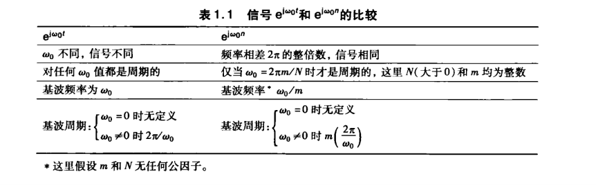
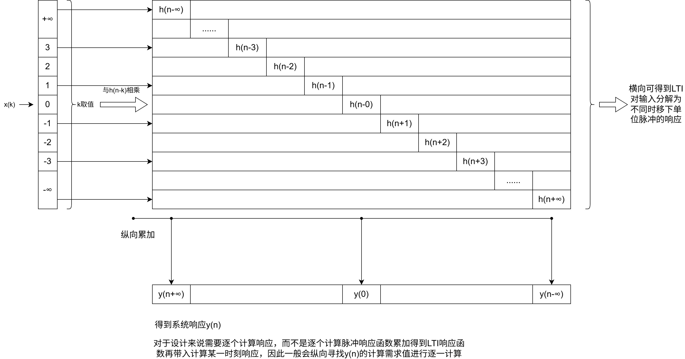

# 2026.7.23

信号能量与功率

信号时间函数X(t)/X[n]一般定义为平方X*X在无穷区间上的积分（求和）作为总能量，/2T或/（2N+1）后积分/求和为无限区间平均功率

通过信号能量与功率可以区分出三类信号

1.信号具有有限能量，即无限区间上总能量（E~∞~<∞），且这类函数无限区间上的平均功率必然为0，eg：矩形脉冲x(t)=u(t)-u(t-τ)$

2.$P_{\infty}$$有限，则$$E_{\infty}$无限，eg：x（t）=k

3.$P_{\infty}$与$E_{\infty}$均无限，eg：x(t)=t

自变换，括号内的整体作为自变量来看待，整体数值的加减值对应实际图像的移动数值，整体内的自变量，例如3（t-1）与3t-1的区别，这个要按照计算法则顺序来计算或者说映射到实习的波形变换，前者为先时移再缩放，或者打开括号后，先缩放后时移，后者就是先缩放后时移

even/odd 偶/奇

任何一个信号都可以分解为一个偶信号与一个奇信号之和

例如x(t)，构造两个信号，ev[x(t)]=1/2[x(t)+x(-t)],od[x(t)]=1/2[x(t)-x(-t)]

离散与连续均适用

谐波信号：一列频率为倍数关系的信号，比如一个信号x(t)，f为f~0~，依次信号频率为2f~0~，3f~0~.......，eg：Φ~k~(t)=e^jkω0t^

离散复指数信号的谐波信号是有限数量的重复

# 2026.7.24

离散：

看到这里时我存在一个疑问，就是h(n)是对应δ(n)的输出，或者说相应，但是对于δ(n)只有n=0时为1，其余均为0，理论上h(n)除了n=0应该均得到一致的响应，但是此时需要考虑到时不变系统存在记忆性，例如fir，是可以存储零点值参与到附近响应点的权重计算的，或者说一个线性时不变系统的输入变量是n，而不是对应的n的输入值，这是和数学里函数关键的对应点,或者说更严谨一些，系统的输入是一个序列，而不是一个一个的点，而关键响应点在于序列的顺序坐标
$$
y[n]=\sum_{k=-∞}^{+∞}x[k]h_{k}[n]
$$

$$
h_k[n]=h_0[n-k]
$$

$$
h[n]=h_0[n](去掉角标)
$$

$$
y[n]=\sum_{k=-∞}^{k=+∞}x[k]h[n-k]
$$

最后一式称为卷积和或者叠加和，并且用符号记为：
$$
y[n]=x[n]*h[n]
$$
最后一式最右侧代表线性时不变系统对应不同时移下的单位脉冲的响应序列，不同响应序列根据性质，经过对应输入序列的缩放得到对应的输出响应

连续的就不记了

下面是一些性质：

first：交换律

通过上图的计算过程，可以和清晰的确定离散卷积的计算具有交换律，即：
$$
x[n]*h[n]=h[n]*x[n]=\sum_{k=-∞}^{k=+∞}h[k]x[n-k]
$$
该性质意味着一个输入为x[n]的单位冲激响应为h[n]的LTI系统与输入为h[n]的单位冲激响应为x[n]的LTI系统会得到同样的y[n]

second："乘法"分配律

不解释

third:"乘法"结合律

不多做解释，依次可以推论出，两个级联的LTI系统，与一个单位冲激响应为  两者单位冲激响应卷积   的一个LTI系统等效

前提都是LTI系统，如果是对于非线性的，比如平方系统，先乘二再平方和先平方再乘二是完全不一致的

ps:上面的图好tm像矩阵运算啊，还是那种特殊的矩阵，就是矩阵乘法啊， 

LTI 的卷积矩阵天然就是 Toeplitz矩阵，对角线全一致，δ对应的矩阵就是线代中的单位矩阵，以后的信号变成周期信号，卷积矩阵会变成Circulant Matrix（循环矩阵）

**LTI 系统有三种完全等价的描述方式**：

1. **时域**：冲激响应 h[n]和卷积；
2. **矩阵**：Toeplitz 卷积矩阵 H；
3. **频域**：频率响应 H(ejω)。

forth:可逆性

u[n]作为LTI系统的单位冲激响应时代表一个累加器

δ[n]则煤油任何效果，δ[n-k]则代表时移

h[n]=δ[n]-δ[n-1]则代表一次差分，效果是累加器的逆系统
$$
y[n]=x[n]-x[n-1]
$$

$$
令x[n]=\delta[n]得到h[n]=\delta[n]-\delta[n-1]即逆系统的冲激响应
$$

$$
验证:u[n]*(\delta[n]-\delta[n-1])
$$

$$
=u[n]*\delta[n]-u[n]*\delta[n-1]
$$

$$
=u[n]-u[n-1]
$$

$$
==\delta[n]
$$

fifth：因果性

因果性的前提是
$$
h[n]=0,n<0
$$
一个LTI系统的因果性等效于他的冲激响应是一个因果信号

sixth：稳定性，感觉不做重点

seventh：单位阶跃响应

即当x[n]=u[n]时的系统输出响应

# 2026.7.27

FIR（finite impulse response）有限脉冲响应

h[n]=δ[n]-δ[n-1]则代表一次差分，一般称为u~1~[n]（u~1~(t)）或者说可以代表求导的效果，对应的矩阵就是差分矩阵，主对角线是1，下方一条次对角线为-1，其余为0，且连续进行卷积就是连续求导，二阶导之类的(u~2~(t))，其实u~1~(t)就是δ(t)的导数

奇异函数还有一个斜坡函数，定义是t*u(t),
$$
u_{-2}(t)=u(t)*u(t)=\int_{-\infty}^{t}u(\tau)d\tau=tu(t)
$$
u(t)是δ(t)de积分，自身卷积后的u~-2~(t)就是二次积分，所以下标从-2开始

或者说以下关系表：
$$
\delta(t)=u_{0}(t)
$$

$$
u(t)=u_{-1}(t)
$$

抄一个gpt的表格

| 下标                | 名称             | 数学表达                        | 与 ($$\delta(t)$$) 关系 | 作用理解              |
| ------------------- | ---------------- | ------------------------------- | ----------------------- | --------------------- |
| ($$u_3(t)$$)        | 三阶冲激导数     | ($$\frac{d^3\delta(t)}{dt^3}$$) | ($$\delta'''(t)$$)      | 更高阶瞬态变化        |
| ($$u_2(t)$$)        | 二阶冲激导数     | ($$\frac{d^2\delta(t)}{dt^2}$$) | ($$\delta''(t)$$)       | 二阶变化率            |
| ($$u_1(t)$$)        | 一阶冲激导数     | ($$\frac{d\delta(t)}{dt}$$)     | ($$\delta'(t)$$)        | 冲激偶（偶极冲激）    |
| **($$u_0(t)$$)**    | **单位冲激函数** | ($$\delta(t)$$)                 | 本身                    | 瞬时输入，LTI系统核心 |
| **($$u_{-1}(t)$$)** | **单位阶跃函数** | ($$u(t)$$)                      | ($$\int\delta(t)dt$$)   | 从0跳变到1            |
| ($$u_{-2}(t)$$)     | 斜坡函数         | ($$t u(t)$$)                    | ($$\int u(t)dt$$)       | 线性增长              |
| ($$u_{-3}(t)$$)     | 抛物线函数       | ($$\frac{t^2}{2}u(t)$$)         | 二次积分                | 二阶累积              |
| ($$u_{-4}(t)$$)     | 三次曲线         | ($$\frac{t^3}{6}u(t)$$)         | 三阶积分                | 更高阶累积            |

这么一看求导或者积分对应到卷积运算就类似于卷积乘法

离散时间傅里叶级数：
$$
x[n]=\sum_{k=<N>}a_ke^{j\omega_{0}n}=\sum_{k=<N>}a_ke^{j(2\pi/N)n}
$$

$$
a_k=1/N\sum_{n=<N>}x[n]e^{-jk\omega_{0}n}=1/N\sum_{n=<N>}x[n]e^{-jk(2\pi/N)n}
$$

傅里叶级数的根基是LTI系统对复指数信号的响应很简单，响应结果同样是一个复指数信号，只不过需要乘一个因子，该因子的计算方式：
$$
H(s)=\int_{-\infty}^{+\infty}h{(\tau)}e^{-s\tau}d\tau
$$
推导:
$$
输入x(t)=e^{st}
$$

$$
y(t)=\int_{-\infty}^{+\infty}h(\tau)x(t-\tau)d\tau
$$

$$
y(t)=\int_{-\infty}^{+\infty}h(\tau)e^{s(t-\tau)}d\tau
$$

$$
y(t)=e^{st}\int_{-\infty}^{+\infty}h(\tau)e^{-s\tau}d\tau
$$

$$
y(t)=H(s)e^{st}
$$

对于离散响应：
$$
x[n]=z^n
$$

$$
y[n]=H[z]z^n
$$

$$
H[z]=\sum_{k=-\infty}^{k=+\infty}h[k]z^{-k}
$$

$$
对于z=e^{j\omega}
$$

$$
此时的H(e^{j\omega})=\sum_{k=-\infty}^{k=+\infty}h[k]e^{-j\omega k}称为系统的频率响应
$$

对于任意：
$$
周期信号x(t)=\sum_{k=-\infty}^{k=+\infty}a_ke^{jk\omega_{0}t}
$$
则：
$$
y(t)=\sum_{k=-\infty}^{k=+\infty}a_kH(jk\omega_{0})e^{jk\omega_{0}t}
$$
LTI系统的作用就是通过乘以相应频率上的说频率响应值（对应的$$H(jk\omega_{0})$$）来诸葛改变输入信号的每一个傅里叶系数

对于离散时间系统来说：
$$
x[n]=\sum_{k=<N>}a_{k}e^{jk(2\pi/N)n}
$$

$$
y[n]=\sum_{k=<N>}a_{k}H(e^{j(2\pi k/N)})e^{jk(2\pi/N)n}
$$

y[n]与x[n]具有相同的周期，输出的第k个傅里叶系数就是输入的第k个傅里叶系数与对应频率响应值（$$H(e^{j(2\pi k/N)})$$）的乘积

这里离散与连续的特征函数自变量不一致应该是不需要纠结的

# 2026.7.28

一阶递归离散时间滤波器

LTI方程如下：
$$
y[n]-ay[n-1]=x[n]
$$

$$
为了计算频率响应，令x[n]=e^{j\omega n}
$$

$$
则y[n]=H(e^{j\omega})e^{j\omega n}
$$

$$
H(e^{j\omega})e^{j\omega n}-aH(e^{j\omega})e^{j\omega(n-1)}=e^{j\omega n}
$$

$$
于是H(e^{j\omega})=1/(1-ae^{-j\omega})
$$

由于LTI响应对于同一频率只是一个缩放效果，即使相位发生变化也没关系，所以存在第四个式子，可以解出该LTI方程的频率响应，通过这个频率响应，再加上任意周期信号可以进行傅里叶展开，再利用冲激响应导出的这个频率响应处理对应频率信号的特性可以计算出任何周期信号通过该系统的响应信号（不同a值下的），此时可以通过a的值来实现不同的响应效果

非递归离散时间滤波器

一般形式：
$$
y[n]=\sum_{k=-N}^{M}b_kx[n-k]
$$
也就是常说的加权平均

举例：
$$
y[n]=1/3(x[n+1]+x[n]+x[n-1])
$$
先计算h[n]
$$
h[n]=1/3(\delta[n+1]+\delta[n]+\delta[n-1])
$$

$$
此时的H(e^{j\omega})=\sum_{k=-1}^{k=+1}h[k]e^{-j\omega k}
$$

$$
=1/3(e^{j\omega}+1+e^{-j\omega})
$$

一般化平均滤波器：
$$
y[n]=1/(N+M+1)\sum_{k=-N}^Mx[n-k]
$$
通过调整窗口N+M+1的大小可以改变截止频率(低通)

或者再有差分方程之类的(高通)，如此：
$$
y[n]=(x[n]-x[n-1])/2
$$
