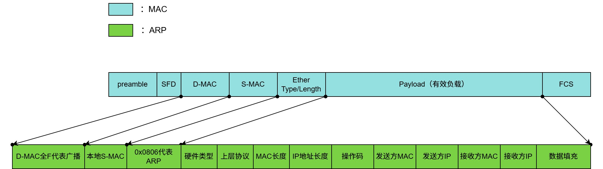
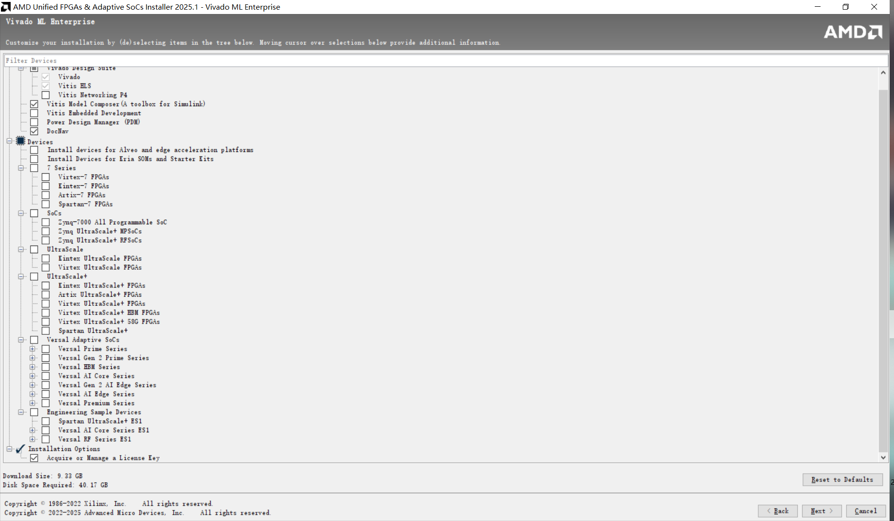

# **协议篇**

前言：本篇为初代笔者手工打造，干货满满，如果有人可以读到这里发现了错误希望可以联系管理员或者直接评论讨论与修正错误，开源精神

最初的笔者整理内容时对uart、spi、i2c、axi协议有了很到位的掌握，所以只有简短介绍，有关axi协议这里附上Xilinx主从接口的demo方便研读学习（最初笔者就是看demo学习的axi协议），demo无AXI outstanding与out of order功能体现

## **UART**

uart是一种 **异步串口通信协议**，只需两根线：**TX、RX**。

-   没有时钟线，双方需事先约定波特率。
-   数据帧格式通常是：**起始位（低） + 数据位（5\~9位） + 可选校验位 + 停止位（高）**。

## **SPI**

SPI 是一种 **同步串行总线协议**，由主设备控制，常见于 MCU 与外设的高速通信。

-   **信号线**：通常 4 根 —— **SCLK（时钟）、MOSI（主出从入）、MISO（主入从出）、CS/SS（片选）**。
-   **通信方式**：主机产生时钟，从机依时钟收发数据，支持 **全双工**。
-   **工作模式**：由 **CPOL（时钟极性）** 和 **CPHA（时钟相位）** 决定，共有 **4 种模式**，主从机必须匹配，否则数据会错位。

## **I2C**

I²C 是一种 **双线主从总线协议**，两根线分别是 **SCL（时钟）** 和 **SDA（数据）**。

-   **电平特性**：总线是开漏结构，需要上拉电阻。空闲时两条线都为高电平。通信时要求 **SCL 高电平期间 SDA 必须稳定**，数据只允许在 SCL 低电平时改变。
-   **起始/停止条件**：当 **SDA 在 SCL 高电平时从高变低**表示起始（START），**从低变高**表示停止（STOP）。
-   **数据传输**：以字节为单位，每 8 位后从机要返回 1 位应答（ACK/NACK）。
-   **寻址方式**：通常先发 7 位设备地址 + 1 位读写标志。后续可能跟寄存器地址，再进行数据读写。
-   **读写区别**：

写：主机 → [设备地址+W] → [寄存器地址] → [数据字节] → STOP

读：主机 → [设备地址+W] → [寄存器地址] → **重新 START** → [设备地址+R] → 从机回数据 →STOP

## **AXI（AMBA总线之一，Xilinx（AMD）FPGA 大动脉）AMBA总线是ARM大动脉**

AXI4 是五通道的主从总线：写地址 （AW）、写数据 （W）、写响应 （B）、读地址（ AR）、读数据 （R）。每个通道都有 **VALID+READY** 的独立握手：**VALID 拉高后必须保持到 READY为1** ，期间信号必须稳定；为避免死锁，**VALID 不应依赖 READY**。

（突发方面，AXI4 支持 **1–256 拍** 的 FIXED/INCR/WRAP 突发，**不跨 4KB 边界**；写响应 **B 在整段突发结束后返回一次**，读数据 **R 每拍返回，最后一拍 RLAST**。）

突发方面，AXI支持原地突发，顺序突发，回环突发，原地突发地址不变，顺序突发地址递增，回环突发地址触碰下边界后会跳转到上边界。

为提升吞吐，协议允许 outstanding，可同时挂起多笔事务。从机可以支持out of order乱序处理事务。在访缓存和访内存时这两个功能可以降低事务阻塞的概率，但是在相对简单的纯数字逻辑中不会很常用。

子协议上，**AXI-Lite** 去掉了突发和 ID，常用于寄存器配置；**AXI-Stream** 没有地址，主要用作连续数据流传递。

```verilog
///////////////////////////////////////
//功能：AXI4 slave demo
//源文件是纯英文注释，初代笔者在学习后做了一些简单注释方便阅读
///////////////////////////////////////

`timescale 1 ns / 1 ps

    module axi_full_v1_0_S00_AXI #
    (
        // Users to add parameters here

        // User parameters ends
        // Do not modify the parameters beyond this line

        // Width of ID for for write address, write data, read address and read data
        parameter integer C_S_AXI_ID_WIDTH  = 1,//地址寄存器的id位宽，作用不大
        // Width of S_AXI data bus
        parameter integer C_S_AXI_DATA_WIDTH    = 32,//数据总线位宽，
        // Width of S_AXI address bus
        parameter integer C_S_AXI_ADDR_WIDTH    = 6,//地址总线位宽
        // Width of optional user defined signal in write address channel
        parameter integer C_S_AXI_AWUSER_WIDTH  = 0,//用户自定义写地址位宽
        // Width of optional user defined signal in read address channel
        parameter integer C_S_AXI_ARUSER_WIDTH  = 0,
        // Width of optional user defined signal in write data channel
        parameter integer C_S_AXI_WUSER_WIDTH   = 0,//用户自定义写数据位宽
        // Width of optional user defined signal in read data channel
        parameter integer C_S_AXI_RUSER_WIDTH   = 0,
        // Width of optional user defined signal in write response channel
        parameter integer C_S_AXI_BUSER_WIDTH   = 0
    )
    (
        // Users to add ports here

        // User ports ends
        // Do not modify the ports beyond this line

        // Global Clock Signal
        input wire  S_AXI_ACLK,//全局时钟不必多说
        // Global Reset Signal. This Signal is Active LOW
        input wire  S_AXI_ARESETN,//全局复位不必多说
        // Write Address ID
        input wire [C_S_AXI_ID_WIDTH-1 : 0] S_AXI_AWID,//写id端口，依旧是用处不大
        // Write address
        input wire [C_S_AXI_ADDR_WIDTH-1 : 0] S_AXI_AWADDR,//写地址端口
        // Burst length. The burst length gives the exact number of transfers in a burst
        input wire [7 : 0] S_AXI_AWLEN,//写突发长度，A的含义代表写突发长度在进行基地址存取的时候就已经被读入了，后面的两个也是一样的原因
        // Burst size. This signal indicates the size of each transfer in the burst
        input wire [2 : 0] S_AXI_AWSIZE,//写突发的尺寸，000代表8，之后递增代表数字每次翻倍
        // Burst type. The burst type and the size information, 
    // determine how the address for each transfer within the burst is calculated.
        input wire [1 : 0] S_AXI_AWBURST,//突发模式，决定了突发传输中的每一次数据传输对地址的改变模式
        // Lock type. Provides additional information about the
    // atomic characteristics of the transfer.
        input wire  S_AXI_AWLOCK,
        // Memory type. This signal indicates how transactions
    // are required to progress through a system.
        input wire [3 : 0] S_AXI_AWCACHE,
        // Protection type. This signal indicates the privilege
    // and security level of the transaction, and whether
    // the transaction is a data access or an instruction access.
        input wire [2 : 0] S_AXI_AWPROT,
        // Quality of Service, QoS identifier sent for each
    // write transaction.
        input wire [3 : 0] S_AXI_AWQOS,
        // Region identifier. Permits a single physical interface
    // on a slave to be used for multiple logical interfaces.
        input wire [3 : 0] S_AXI_AWREGION,
        // Optional User-defined signal in the write address channel.
        input wire [C_S_AXI_AWUSER_WIDTH-1 : 0] S_AXI_AWUSER,
        // Write address valid. This signal indicates that
    // the channel is signaling valid write address and
    // control information.
        input wire  S_AXI_AWVALID,//写地址有效信号，当从设备检测到它为有效时会把地址线上的地址存入内部的地址寄存器
        // Write address ready. This signal indicates that
    // the slave is ready to accept an address and associated
    // control signals.
        output wire  S_AXI_AWREADY,//这个输出端口有效代表从设备已经接受好了主设备给的地址，作为对于写地址有效信号的响应信号，如果主设备将写地址信号置为有效但是煤油监测到这个信号有效的话代表从设备的上一次传输数据还没有结束或者出现了其他异常
        // Write Data
        input wire [C_S_AXI_DATA_WIDTH-1 : 0] S_AXI_WDATA,//写数据通道不必多说
        // Write strobes. This signal indicates which byte
    // lanes hold valid data. There is one write strobe
    // bit for each eight bits of the write data bus.
        input wire [(C_S_AXI_DATA_WIDTH/8)-1 : 0] S_AXI_WSTRB,//写数据通道有效的控制信号，他的位宽等于数据通道的字节数，哪一位为1将会把哪一个字节写入存储器设备
        // Write last. This signal indicates the last transfer
    // in a write burst.
        input wire  S_AXI_WLAST,//在主机将最后一个数据加载到数据总线上时应同时将这个信号拉高代表数据传输完毕
        // Optional User-defined signal in the write data channel.
        input wire [C_S_AXI_WUSER_WIDTH-1 : 0] S_AXI_WUSER,
        // Write valid. This signal indicates that valid write
    // data and strobes are available.
        input wire  S_AXI_WVALID,//写有效信号，在监测到写地址准备信号有效之后才可以将这个信号置为有效去进行传输第一个数据，否则会出现异常情况
        // Write ready. This signal indicates that the slave
    // can accept the write data.
        output wire  S_AXI_WREADY,//当主机监测到这个信号为有效时代表第一个数据已经成功写入了存储器并且可以将第二个数据更新到数据总线上面了，总而言之就是主机必须监测到这个信号有效才可以更新数据总线上面的数据，只不过开始与结束可能会涉及到更多的信号分析
        // Response ID tag. This signal is the ID tag of the
    // write response.
        output wire [C_S_AXI_ID_WIDTH-1 : 0] S_AXI_BID,//响应ID，代表写响应信号的设备地址
        // Write response. This signal indicates the status
    // of the write transaction.
        output wire [1 : 0] S_AXI_BRESP,//响应模式
        // Optional User-defined signal in the write response channel.
        output wire [C_S_AXI_BUSER_WIDTH-1 : 0] S_AXI_BUSER,
        // Write response valid. This signal indicates that the
    // channel is signaling a valid write response.
        output wire  S_AXI_BVALID,//从设备发出的写响应的有效信号
        // Response ready. This signal indicates that the master
    // can accept a write response.
        input wire  S_AXI_BREADY,//主设备对写响应的应答
        // Read address ID. This signal is the identification
    // tag for the read address group of signals.
        input wire [C_S_AXI_ID_WIDTH-1 : 0] S_AXI_ARID,
        // Read address. This signal indicates the initial
    // address of a read burst transaction.
        input wire [C_S_AXI_ADDR_WIDTH-1 : 0] S_AXI_ARADDR,//参考写
        // Burst length. The burst length gives the exact number of transfers in a burst
        input wire [7 : 0] S_AXI_ARLEN,//参考写
        // Burst size. This signal indicates the size of each transfer in the burst
        input wire [2 : 0] S_AXI_ARSIZE,//参考写
        // Burst type. The burst type and the size information, 
    // determine how the address for each transfer within the burst is calculated.
        input wire [1 : 0] S_AXI_ARBURST,//参考写
        // Lock type. Provides additional information about the
    // atomic characteristics of the transfer.
        input wire  S_AXI_ARLOCK,//参考写
        // Memory type. This signal indicates how transactions
    // are required to progress through a system.
        input wire [3 : 0] S_AXI_ARCACHE,//参考写
        // Protection type. This signal indicates the privilege
    // and security level of the transaction, and whether
    // the transaction is a data access or an instruction access.
        input wire [2 : 0] S_AXI_ARPROT,//参考写
        // Quality of Service, QoS identifier sent for each
    // read transaction.
        input wire [3 : 0] S_AXI_ARQOS,//参考写
        // Region identifier. Permits a single physical interface
    // on a slave to be used for multiple logical interfaces.
        input wire [3 : 0] S_AXI_ARREGION,//参考写
        // Optional User-defined signal in the read address channel.
        input wire [C_S_AXI_ARUSER_WIDTH-1 : 0] S_AXI_ARUSER,
        // Write address valid. This signal indicates that
    // the channel is signaling valid read address and
    // control information.
        input wire  S_AXI_ARVALID,//参考写
        // Read address ready. This signal indicates that
    // the slave is ready to accept an address and associated
    // control signals.
        output wire  S_AXI_ARREADY,//参考写
        // Read ID tag. This signal is the identification tag
    // for the read data group of signals generated by the slave.
        output wire [C_S_AXI_ID_WIDTH-1 : 0] S_AXI_RID,//参考写
        // Read Data
        output wire [C_S_AXI_DATA_WIDTH-1 : 0] S_AXI_RDATA,//参考写
        // Read response. This signal indicates the status of
    // the read transfer.
        output wire [1 : 0] S_AXI_RRESP,//参考写
        // Read last. This signal indicates the last transfer
    // in a read burst.
        output wire  S_AXI_RLAST,//参考写
        // Optional User-defined signal in the read address channel.
        output wire [C_S_AXI_RUSER_WIDTH-1 : 0] S_AXI_RUSER,
        // Read valid. This signal indicates that the channel
    // is signaling the required read data.
        output wire  S_AXI_RVALID,//参考写
        // Read ready. This signal indicates that the master can
    // accept the read data and response information.
        input wire  S_AXI_RREADY//参考写
    );

    // AXI4FULL signals
    reg [C_S_AXI_ADDR_WIDTH-1 : 0]  axi_awaddr;//写地址寄存器，当写地址信号有效时会将地址线上的地址加载到内部
    reg     axi_awready;//写地址准备完成信号，当主机检测到这个信号有效时代表已经可以发送写信号和写数据了
    reg     axi_wready;//写准备信号，这个信号有效的时候代表从机已经将第一个数据成功写入存储器了，主机可以将新的数据加载到数据总线上面了
    reg [1 : 0]     axi_bresp;
    reg [C_S_AXI_BUSER_WIDTH-1 : 0]     axi_buser;
    reg     axi_bvalid;
    reg [C_S_AXI_ADDR_WIDTH-1 : 0]  axi_araddr;
    reg     axi_arready;
    reg [C_S_AXI_DATA_WIDTH-1 : 0]  axi_rdata;
    reg [1 : 0]     axi_rresp;
    reg     axi_rlast;
    reg [C_S_AXI_RUSER_WIDTH-1 : 0]     axi_ruser;
    reg     axi_rvalid;
    // aw_wrap_en determines wrap boundary and enables wrapping
    wire aw_wrap_en;
    // ar_wrap_en determines wrap boundary and enables wrapping
    wire ar_wrap_en;
    // aw_wrap_size is the size of the write transfer, the
    // write address wraps to a lower address if upper address
    // limit is reached
    wire [31:0]  aw_wrap_size ; 
    // ar_wrap_size is the size of the read transfer, the
    // read address wraps to a lower address if upper address
    // limit is reached
    wire [31:0]  ar_wrap_size ; 
    // The axi_awv_awr_flag flag marks the presence of write address valid
    reg axi_awv_awr_flag;//代表一次写数据正在进行，当这个信号为高的时候从机将不会对主机发出的写地址有效信号进行响应
    //The axi_arv_arr_flag flag marks the presence of read address valid
    reg axi_arv_arr_flag; 
    // The axi_awlen_cntr internal write address counter to keep track of beats in a burst transaction
    reg [7:0] axi_awlen_cntr;//写突发次数寄存器
    //The axi_arlen_cntr internal read address counter to keep track of beats in a burst transaction
    reg [7:0] axi_arlen_cntr;
    reg [1:0] axi_arburst;
    reg [1:0] axi_awburst;//写突发模式
    reg [7:0] axi_arlen;
    reg [7:0] axi_awlen;//写突发长度
    //local parameter for addressing 32 bit / 64 bit C_S_AXI_DATA_WIDTH
    //ADDR_LSB is used for addressing 32/64 bit registers/memories
    //ADDR_LSB = 2 for 32 bits (n downto 2) 
    //ADDR_LSB = 3 for 42 bits (n downto 3)

    localparam integer ADDR_LSB = (C_S_AXI_DATA_WIDTH/32)+ 1;//用作从接口内部与存储设备的地址控制常量，因为AXI4接口的高带宽性导致存储器无法将一个地址写入完整的一次带宽数据，需要多个地址来共同存储一次带宽数据
    localparam integer OPT_MEM_ADDR_BITS = 3;//同上
    localparam integer USER_NUM_MEM = 1;//用户设备数量常量
    //----------------------------------------------
    //-- Signals for user logic memory space example
    //------------------------------------------------
    wire [OPT_MEM_ADDR_BITS:0] mem_address;
    wire [USER_NUM_MEM-1:0] mem_select;
    reg [C_S_AXI_DATA_WIDTH-1:0] mem_data_out[0 : USER_NUM_MEM-1];

    genvar i;
    genvar j;
    genvar mem_byte_index;

    // I/O Connections assignments

    assign S_AXI_AWREADY    = axi_awready;
    assign S_AXI_WREADY = axi_wready;
    assign S_AXI_BRESP  = axi_bresp;
    assign S_AXI_BUSER  = axi_buser;
    assign S_AXI_BVALID = axi_bvalid;
    assign S_AXI_ARREADY    = axi_arready;
    assign S_AXI_RDATA  = axi_rdata;
    assign S_AXI_RRESP  = axi_rresp;
    assign S_AXI_RLAST  = axi_rlast;
    assign S_AXI_RUSER  = axi_ruser;
    assign S_AXI_RVALID = axi_rvalid;
    assign S_AXI_BID = S_AXI_AWID;
    assign S_AXI_RID = S_AXI_ARID;
    assign  aw_wrap_size = (C_S_AXI_DATA_WIDTH/8 * (axi_awlen)); 
    assign  ar_wrap_size = (C_S_AXI_DATA_WIDTH/8 * (axi_arlen)); 
    assign  aw_wrap_en = ((axi_awaddr & aw_wrap_size) == aw_wrap_size)? 1'b1: 1'b0;
    assign  ar_wrap_en = ((axi_araddr & ar_wrap_size) == ar_wrap_size)? 1'b1: 1'b0;

    // Implement axi_awready generation

    // axi_awready is asserted for one S_AXI_ACLK clock cycle when both
    // S_AXI_AWVALID and S_AXI_WVALID are asserted. axi_awready is
    // de-asserted when reset is low.

    always @( posedge S_AXI_ACLK )
    begin
      if ( S_AXI_ARESETN == 1'b0 )
        begin
          axi_awready <= 1'b0;
          axi_awv_awr_flag <= 1'b0;
        end 
      else
        begin    
          if (~axi_awready && S_AXI_AWVALID && ~axi_awv_awr_flag && ~axi_arv_arr_flag)
            begin
              // slave is ready to accept an address and
              // associated control signals
              axi_awready <= 1'b1;
              axi_awv_awr_flag  <= 1'b1; 
              // used for generation of bresp() and bvalid
            end
          else if (S_AXI_WLAST && axi_wready)          
          // preparing to accept next address after current write burst tx completion
            begin
              axi_awv_awr_flag  <= 1'b0;
            end
          else        
            begin
              axi_awready <= 1'b0;
            end
        end 
    end       
    // Implement axi_awaddr latching

    // This process is used to latch the address when both 
    // S_AXI_AWVALID and S_AXI_WVALID are valid. 

    always @( posedge S_AXI_ACLK )
    begin
      if ( S_AXI_ARESETN == 1'b0 )
        begin
          axi_awaddr <= 0;
          axi_awlen_cntr <= 0;
          axi_awburst <= 0;
          axi_awlen <= 0;
        end 
      else
        begin    
          if (~axi_awready && S_AXI_AWVALID && ~axi_awv_awr_flag)
            begin
              // address latching 
              axi_awaddr <= S_AXI_AWADDR[C_S_AXI_ADDR_WIDTH - 1:0];  
               axi_awburst <= S_AXI_AWBURST; 
               axi_awlen <= S_AXI_AWLEN;     
              // start address of transfer
              axi_awlen_cntr <= 0;
            end   
          else if((axi_awlen_cntr <= axi_awlen) && axi_wready && S_AXI_WVALID)        
            begin

              axi_awlen_cntr <= axi_awlen_cntr + 1;

              case (axi_awburst)
                2'b00: // fixed burst
                // The write address for all the beats in the transaction are fixed
                  begin
                    axi_awaddr <= axi_awaddr;          
                    //for awsize = 4 bytes (010)
                  end   
                2'b01: //incremental burst
                // The write address for all the beats in the transaction are increments by awsize
                  begin
                    axi_awaddr[C_S_AXI_ADDR_WIDTH - 1:ADDR_LSB] <= axi_awaddr[C_S_AXI_ADDR_WIDTH - 1:ADDR_LSB] + 1;
                    //awaddr aligned to 4 byte boundary
                    axi_awaddr[ADDR_LSB-1:0]  <= {ADDR_LSB{1'b0}};   
                    //for awsize = 4 bytes (010)
                  end   
                2'b10: //Wrapping burst
                // The write address wraps when the address reaches wrap boundary 
                  if (aw_wrap_en)
                    begin
                      axi_awaddr <= (axi_awaddr - aw_wrap_size); 
                    end
                  else 
                    begin
                      axi_awaddr[C_S_AXI_ADDR_WIDTH - 1:ADDR_LSB] <= axi_awaddr[C_S_AXI_ADDR_WIDTH - 1:ADDR_LSB] + 1;
                      axi_awaddr[ADDR_LSB-1:0]  <= {ADDR_LSB{1'b0}}; 
                    end                      
                default: //reserved (incremental burst for example)
                  begin
                    axi_awaddr <= axi_awaddr[C_S_AXI_ADDR_WIDTH - 1:ADDR_LSB] + 1;
                    //for awsize = 4 bytes (010)
                  end
              endcase              
            end
        end 
    end       
    // Implement axi_wready generation

    // axi_wready is asserted for one S_AXI_ACLK clock cycle when both
    // S_AXI_AWVALID and S_AXI_WVALID are asserted. axi_wready is 
    // de-asserted when reset is low. 

    always @( posedge S_AXI_ACLK )
    begin
      if ( S_AXI_ARESETN == 1'b0 )
        begin
          axi_wready <= 1'b0;
        end 
      else
        begin    
          if ( ~axi_wready && S_AXI_WVALID && axi_awv_awr_flag)
            begin
              // slave can accept the write data
              axi_wready <= 1'b1;
            end
          //else if (~axi_awv_awr_flag)
          else if (S_AXI_WLAST && axi_wready)
            begin
              axi_wready <= 1'b0;
            end
        end 
    end       
    // Implement write response logic generation

    // The write response and response valid signals are asserted by the slave 
    // when axi_wready, S_AXI_WVALID, axi_wready and S_AXI_WVALID are asserted.  
    // This marks the acceptance of address and indicates the status of 
    // write transaction.

    always @( posedge S_AXI_ACLK )
    begin
      if ( S_AXI_ARESETN == 1'b0 )
        begin
          axi_bvalid <= 0;
          axi_bresp <= 2'b0;
          axi_buser <= 0;
        end 
      else
        begin    
          if (axi_awv_awr_flag && axi_wready && S_AXI_WVALID && ~axi_bvalid && S_AXI_WLAST )
            begin
              axi_bvalid <= 1'b1;
              axi_bresp  <= 2'b0; 
              // 'OKAY' response 
            end                   
          else
            begin
              if (S_AXI_BREADY && axi_bvalid) 
              //check if bready is asserted while bvalid is high) 
              //(there is a possibility that bready is always asserted high)   
                begin
                  axi_bvalid <= 1'b0; 
                end  
            end
        end
     end   
    // Implement axi_arready generation

    // axi_arready is asserted for one S_AXI_ACLK clock cycle when
    // S_AXI_ARVALID is asserted. axi_awready is 
    // de-asserted when reset (active low) is asserted. 
    // The read address is also latched when S_AXI_ARVALID is 
    // asserted. axi_araddr is reset to zero on reset assertion.

    always @( posedge S_AXI_ACLK )
    begin
      if ( S_AXI_ARESETN == 1'b0 )
        begin
          axi_arready <= 1'b0;
          axi_arv_arr_flag <= 1'b0;
        end 
      else
        begin    
          if (~axi_arready && S_AXI_ARVALID && ~axi_awv_awr_flag && ~axi_arv_arr_flag)
            begin
              axi_arready <= 1'b1;
              axi_arv_arr_flag <= 1'b1;
            end
          else if (axi_rvalid && S_AXI_RREADY && axi_arlen_cntr == axi_arlen)
          // preparing to accept next address after current read completion
            begin
              axi_arv_arr_flag  <= 1'b0;
            end
          else        
            begin
              axi_arready <= 1'b0;
            end
        end 
    end       
    // Implement axi_araddr latching

    //This process is used to latch the address when both 
    //S_AXI_ARVALID and S_AXI_RVALID are valid. 
    always @( posedge S_AXI_ACLK )
    begin
      if ( S_AXI_ARESETN == 1'b0 )
        begin
          axi_araddr <= 0;
          axi_arlen_cntr <= 0;
          axi_arburst <= 0;
          axi_arlen <= 0;
          axi_rlast <= 1'b0;
          axi_ruser <= 0;
        end 
      else
        begin    
          if (~axi_arready && S_AXI_ARVALID && ~axi_arv_arr_flag)
            begin
              // address latching 
              axi_araddr <= S_AXI_ARADDR[C_S_AXI_ADDR_WIDTH - 1:0]; 
              axi_arburst <= S_AXI_ARBURST; 
              axi_arlen <= S_AXI_ARLEN;     
              // start address of transfer
              axi_arlen_cntr <= 0;
              axi_rlast <= 1'b0;
            end   
          else if((axi_arlen_cntr <= axi_arlen) && axi_rvalid && S_AXI_RREADY)        
            begin
             
              axi_arlen_cntr <= axi_arlen_cntr + 1;
              axi_rlast <= 1'b0;
            
              case (axi_arburst)
                2'b00: // fixed burst
                 // The read address for all the beats in the transaction are fixed
                  begin
                    axi_araddr       <= axi_araddr;        
                    //for arsize = 4 bytes (010)
                  end   
                2'b01: //incremental burst
                // The read address for all the beats in the transaction are increments by awsize
                  begin
                    axi_araddr[C_S_AXI_ADDR_WIDTH - 1:ADDR_LSB] <= axi_araddr[C_S_AXI_ADDR_WIDTH - 1:ADDR_LSB] + 1; 
                    //araddr aligned to 4 byte boundary
                    axi_araddr[ADDR_LSB-1:0]  <= {ADDR_LSB{1'b0}};   
                    //for awsize = 4 bytes (010)
                  end   
                2'b10: //Wrapping burst
                // The read address wraps when the address reaches wrap boundary 
                  if (ar_wrap_en) 
                    begin
                      axi_araddr <= (axi_araddr - ar_wrap_size); 
                    end
                  else 
                    begin
                    axi_araddr[C_S_AXI_ADDR_WIDTH - 1:ADDR_LSB] <= axi_araddr[C_S_AXI_ADDR_WIDTH - 1:ADDR_LSB] + 1; 
                    //araddr aligned to 4 byte boundary
                    axi_araddr[ADDR_LSB-1:0]  <= {ADDR_LSB{1'b0}};   
                    end                      
                default: //reserved (incremental burst for example)
                  begin
                    axi_araddr <= axi_araddr[C_S_AXI_ADDR_WIDTH - 1:ADDR_LSB]+1;
                    //for arsize = 4 bytes (010)
                  end
              endcase              
            end
          else if((axi_arlen_cntr == axi_arlen) && ~axi_rlast && axi_arv_arr_flag )   
            begin
              axi_rlast <= 1'b1;
            end          
          else if (S_AXI_RREADY)   
            begin
              axi_rlast <= 1'b0;
            end          
        end 
    end       
    // Implement axi_arvalid generation

    // axi_rvalid is asserted for one S_AXI_ACLK clock cycle when both 
    // S_AXI_ARVALID and axi_arready are asserted. The slave registers 
    // data are available on the axi_rdata bus at this instance. The 
    // assertion of axi_rvalid marks the validity of read data on the 
    // bus and axi_rresp indicates the status of read transaction.axi_rvalid 
    // is deasserted on reset (active low). axi_rresp and axi_rdata are 
    // cleared to zero on reset (active low).  

    always @( posedge S_AXI_ACLK )
    begin
      if ( S_AXI_ARESETN == 1'b0 )
        begin
          axi_rvalid <= 0;
          axi_rresp  <= 0;
        end 
      else
        begin    
          if (axi_arv_arr_flag && ~axi_rvalid)
            begin
              axi_rvalid <= 1'b1;
              axi_rresp  <= 2'b0; 
              // 'OKAY' response
            end   
          else if (axi_rvalid && S_AXI_RREADY)
            begin
              axi_rvalid <= 1'b0;
            end            
        end
    end    
    // ------------------------------------------
    // -- Example code to access user logic memory region
    // ------------------------------------------

    generate
      if (USER_NUM_MEM >= 1)
        begin
          assign mem_select  = 1;
          assign mem_address = (axi_arv_arr_flag? axi_araddr[ADDR_LSB+OPT_MEM_ADDR_BITS:ADDR_LSB]:(axi_awv_awr_flag? axi_awaddr[ADDR_LSB+OPT_MEM_ADDR_BITS:ADDR_LSB]:0));
        end
    endgenerate
         
    // implement Block RAM(s)
    generate 
      for(i=0; i<= USER_NUM_MEM-1; i=i+1)
        begin:BRAM_GEN
          wire mem_rden;
          wire mem_wren;
    
          assign mem_wren = axi_wready && S_AXI_WVALID ;
    
          assign mem_rden = axi_arv_arr_flag ; //& ~axi_rvalid
         
          for(mem_byte_index=0; mem_byte_index<= (C_S_AXI_DATA_WIDTH/8-1); mem_byte_index=mem_byte_index+1)
          begin:BYTE_BRAM_GEN
            wire [8-1:0] data_in ;
            wire [8-1:0] data_out;
            reg  [8-1:0] byte_ram [0 : 15];
            integer  j;
         
            //assigning 8 bit data
            assign data_in  = S_AXI_WDATA[(mem_byte_index*8+7) -: 8];
            assign data_out = byte_ram[mem_address];
         
            always @( posedge S_AXI_ACLK )
            begin
              if (mem_wren && S_AXI_WSTRB[mem_byte_index])
                begin
                  byte_ram[mem_address] <= data_in;
                end   
            end    
          
            always @( posedge S_AXI_ACLK )
            begin
              if (mem_rden)
                begin
                  mem_data_out[i][(mem_byte_index*8+7) -: 8] <= data_out;
                end   
            end    
                   
        end
      end       
    endgenerate
    //Output register or memory read data

    always @( mem_data_out, axi_rvalid)
    begin
      if (axi_rvalid) 
        begin
          // Read address mux
          axi_rdata <= mem_data_out[0];
        end   
      else
        begin
          axi_rdata <= 32'h00000000;
        end       
    end    

    // Add user logic here

    // User logic ends

    endmodule

```

```verilog
///////////////////////////////////////
//功能：AXI4 master demo
//源文件是纯英文注释，初代笔者在学习后似乎忘记对其进行中文注释了 ^^
///////////////////////////////////////

`timescale 1 ns / 1 ps

    module axi_full_v1_0_M00_AXI #
    (
        // Users to add parameters here

        // User parameters ends
        // Do not modify the parameters beyond this line

        // Base address of targeted slave
        parameter  C_M_TARGET_SLAVE_BASE_ADDR   = 32'h40000000,
        // Burst Length. Supports 1, 2, 4, 8, 16, 32, 64, 128, 256 burst lengths
        parameter integer C_M_AXI_BURST_LEN = 16,
        // Thread ID Width
        parameter integer C_M_AXI_ID_WIDTH  = 1,
        // Width of Address Bus
        parameter integer C_M_AXI_ADDR_WIDTH    = 32,
        // Width of Data Bus
        parameter integer C_M_AXI_DATA_WIDTH    = 32,
        // Width of User Write Address Bus
        parameter integer C_M_AXI_AWUSER_WIDTH  = 0,
        // Width of User Read Address Bus
        parameter integer C_M_AXI_ARUSER_WIDTH  = 0,
        // Width of User Write Data Bus
        parameter integer C_M_AXI_WUSER_WIDTH   = 0,
        // Width of User Read Data Bus
        parameter integer C_M_AXI_RUSER_WIDTH   = 0,
        // Width of User Response Bus
        parameter integer C_M_AXI_BUSER_WIDTH   = 0
    )
    (
        // Users to add ports here

        // User ports ends
        // Do not modify the ports beyond this line

        // Initiate AXI transactions
        input wire  INIT_AXI_TXN,
        // Asserts when transaction is complete
        output wire  TXN_DONE,
        // Asserts when ERROR is detected
        output reg  ERROR,
        // Global Clock Signal.
        input wire  M_AXI_ACLK,
        // Global Reset Singal. This Signal is Active Low
        input wire  M_AXI_ARESETN,
        // Master Interface Write Address ID
        output wire [C_M_AXI_ID_WIDTH-1 : 0] M_AXI_AWID,
        // Master Interface Write Address
        output wire [C_M_AXI_ADDR_WIDTH-1 : 0] M_AXI_AWADDR,
        // Burst length. The burst length gives the exact number of transfers in a burst
        output wire [7 : 0] M_AXI_AWLEN,
        // Burst size. This signal indicates the size of each transfer in the burst
        output wire [2 : 0] M_AXI_AWSIZE,
        // Burst type. The burst type and the size information, 
    // determine how the address for each transfer within the burst is calculated.
        output wire [1 : 0] M_AXI_AWBURST,
        // Lock type. Provides additional information about the
    // atomic characteristics of the transfer.
        output wire  M_AXI_AWLOCK,
        // Memory type. This signal indicates how transactions
    // are required to progress through a system.
        output wire [3 : 0] M_AXI_AWCACHE,
        // Protection type. This signal indicates the privilege
    // and security level of the transaction, and whether
    // the transaction is a data access or an instruction access.
        output wire [2 : 0] M_AXI_AWPROT,
        // Quality of Service, QoS identifier sent for each write transaction.
        output wire [3 : 0] M_AXI_AWQOS,
        // Optional User-defined signal in the write address channel.
        output wire [C_M_AXI_AWUSER_WIDTH-1 : 0] M_AXI_AWUSER,
        // Write address valid. This signal indicates that
    // the channel is signaling valid write address and control information.
        output wire  M_AXI_AWVALID,
        // Write address ready. This signal indicates that
    // the slave is ready to accept an address and associated control signals
        input wire  M_AXI_AWREADY,
        // Master Interface Write Data.
        output wire [C_M_AXI_DATA_WIDTH-1 : 0] M_AXI_WDATA,
        // Write strobes. This signal indicates which byte
    // lanes hold valid data. There is one write strobe
    // bit for each eight bits of the write data bus.
        output wire [C_M_AXI_DATA_WIDTH/8-1 : 0] M_AXI_WSTRB,
        // Write last. This signal indicates the last transfer in a write burst.
        output wire  M_AXI_WLAST,
        // Optional User-defined signal in the write data channel.
        output wire [C_M_AXI_WUSER_WIDTH-1 : 0] M_AXI_WUSER,
        // Write valid. This signal indicates that valid write
    // data and strobes are available
        output wire  M_AXI_WVALID,
        // Write ready. This signal indicates that the slave
    // can accept the write data.
        input wire  M_AXI_WREADY,
        // Master Interface Write Response.
        input wire [C_M_AXI_ID_WIDTH-1 : 0] M_AXI_BID,
        // Write response. This signal indicates the status of the write transaction.
        input wire [1 : 0] M_AXI_BRESP,
        // Optional User-defined signal in the write response channel
        input wire [C_M_AXI_BUSER_WIDTH-1 : 0] M_AXI_BUSER,
        // Write response valid. This signal indicates that the
    // channel is signaling a valid write response.
        input wire  M_AXI_BVALID,
        // Response ready. This signal indicates that the master
    // can accept a write response.
        output wire  M_AXI_BREADY,
        // Master Interface Read Address.
        output wire [C_M_AXI_ID_WIDTH-1 : 0] M_AXI_ARID,
        // Read address. This signal indicates the initial
    // address of a read burst transaction.
        output wire [C_M_AXI_ADDR_WIDTH-1 : 0] M_AXI_ARADDR,
        // Burst length. The burst length gives the exact number of transfers in a burst
        output wire [7 : 0] M_AXI_ARLEN,
        // Burst size. This signal indicates the size of each transfer in the burst
        output wire [2 : 0] M_AXI_ARSIZE,
        // Burst type. The burst type and the size information, 
    // determine how the address for each transfer within the burst is calculated.
        output wire [1 : 0] M_AXI_ARBURST,
        // Lock type. Provides additional information about the
    // atomic characteristics of the transfer.
        output wire  M_AXI_ARLOCK,
        // Memory type. This signal indicates how transactions
    // are required to progress through a system.
        output wire [3 : 0] M_AXI_ARCACHE,
        // Protection type. This signal indicates the privilege
    // and security level of the transaction, and whether
    // the transaction is a data access or an instruction access.
        output wire [2 : 0] M_AXI_ARPROT,
        // Quality of Service, QoS identifier sent for each read transaction
        output wire [3 : 0] M_AXI_ARQOS,
        // Optional User-defined signal in the read address channel.
        output wire [C_M_AXI_ARUSER_WIDTH-1 : 0] M_AXI_ARUSER,
        // Write address valid. This signal indicates that
    // the channel is signaling valid read address and control information
        output wire  M_AXI_ARVALID,
        // Read address ready. This signal indicates that
    // the slave is ready to accept an address and associated control signals
        input wire  M_AXI_ARREADY,
        // Read ID tag. This signal is the identification tag
    // for the read data group of signals generated by the slave.
        input wire [C_M_AXI_ID_WIDTH-1 : 0] M_AXI_RID,
        // Master Read Data
        input wire [C_M_AXI_DATA_WIDTH-1 : 0] M_AXI_RDATA,
        // Read response. This signal indicates the status of the read transfer
        input wire [1 : 0] M_AXI_RRESP,
        // Read last. This signal indicates the last transfer in a read burst
        input wire  M_AXI_RLAST,
        // Optional User-defined signal in the read address channel.
        input wire [C_M_AXI_RUSER_WIDTH-1 : 0] M_AXI_RUSER,
        // Read valid. This signal indicates that the channel
    // is signaling the required read data.
        input wire  M_AXI_RVALID,
        // Read ready. This signal indicates that the master can
    // accept the read data and response information.
        output wire  M_AXI_RREADY
    );

    // function called clogb2 that returns an integer which has the
    //value of the ceiling of the log base 2

      // function called clogb2 that returns an integer which has the 
      // value of the ceiling of the log base 2.                      
      function integer clogb2 (input integer bit_depth);              
      begin                                                           
        for(clogb2=0; bit_depth>0; clogb2=clogb2+1)                   
          bit_depth = bit_depth >> 1;                                 
        end                                                           
      endfunction                                                     

    // C_TRANSACTIONS_NUM is the width of the index counter for 
    // number of write or read transaction.
     localparam integer C_TRANSACTIONS_NUM = clogb2(C_M_AXI_BURST_LEN-1);

    // Burst length for transactions, in C_M_AXI_DATA_WIDTHs.
    // Non-2^n lengths will eventually cause bursts across 4K address boundaries.
     localparam integer C_MASTER_LENGTH = 12;
    // total number of burst transfers is master length divided by burst length and burst size
     localparam integer C_NO_BURSTS_REQ = C_MASTER_LENGTH-clogb2((C_M_AXI_BURST_LEN*C_M_AXI_DATA_WIDTH/8)-1);
    // Example State machine to initialize counter, initialize write transactions, 
    // initialize read transactions and comparison of read data with the 
    // written data words.
    parameter [1:0] IDLE = 2'b00, // This state initiates AXI4Lite transaction 
            // after the state machine changes state to INIT_WRITE 
            // when there is 0 to 1 transition on INIT_AXI_TXN
        INIT_WRITE   = 2'b01, // This state initializes write transaction,
            // once writes are done, the state machine 
            // changes state to INIT_READ 
        INIT_READ = 2'b10, // This state initializes read transaction
            // once reads are done, the state machine 
            // changes state to INIT_COMPARE 
        INIT_COMPARE = 2'b11; // This state issues the status of comparison 
            // of the written data with the read data   

     reg [1:0] mst_exec_state;

    // AXI4LITE signals
    //AXI4 internal temp signals
    reg [C_M_AXI_ADDR_WIDTH-1 : 0]  axi_awaddr;
    reg     axi_awvalid;
    reg [C_M_AXI_DATA_WIDTH-1 : 0]  axi_wdata;
    reg     axi_wlast;
    reg     axi_wvalid;
    reg     axi_bready;
    reg [C_M_AXI_ADDR_WIDTH-1 : 0]  axi_araddr;
    reg     axi_arvalid;
    reg     axi_rready;
    //write beat count in a burst
    reg [C_TRANSACTIONS_NUM : 0]    write_index;
    //read beat count in a burst
    reg [C_TRANSACTIONS_NUM : 0]    read_index;
    //size of C_M_AXI_BURST_LEN length burst in bytes
    wire [C_TRANSACTIONS_NUM+2 : 0]     burst_size_bytes;
    //The burst counters are used to track the number of burst transfers of C_M_AXI_BURST_LEN burst length needed to transfer 2^C_MASTER_LENGTH bytes of data.
    reg [C_NO_BURSTS_REQ : 0]   write_burst_counter;
    reg [C_NO_BURSTS_REQ : 0]   read_burst_counter;
    reg     start_single_burst_write;
    reg     start_single_burst_read;
    reg     writes_done;
    reg     reads_done;
    reg     error_reg;
    reg     compare_done;
    reg     read_mismatch;
    reg     burst_write_active;
    reg     burst_read_active;
    reg [C_M_AXI_DATA_WIDTH-1 : 0]  expected_rdata;
    //Interface response error flags
    wire    write_resp_error;
    wire    read_resp_error;
    wire    wnext;
    wire    rnext;
    reg     init_txn_ff;
    reg     init_txn_ff2;
    reg     init_txn_edge;
    wire    init_txn_pulse;

    // I/O Connections assignments

    //I/O Connections. Write Address (AW)
    assign M_AXI_AWID   = 'b0;
    //The AXI address is a concatenation of the target base address + active offset range
    assign M_AXI_AWADDR = C_M_TARGET_SLAVE_BASE_ADDR + axi_awaddr;
    //Burst LENgth is number of transaction beats, minus 1
    assign M_AXI_AWLEN  = C_M_AXI_BURST_LEN - 1;
    //Size should be C_M_AXI_DATA_WIDTH, in 2^SIZE bytes, otherwise narrow bursts are used
    assign M_AXI_AWSIZE = clogb2((C_M_AXI_DATA_WIDTH/8)-1);
    //INCR burst type is usually used, except for keyhole bursts
    assign M_AXI_AWBURST    = 2'b01;
    assign M_AXI_AWLOCK = 1'b0;
    //Update value to 4'b0011 if coherent accesses to be used via the Zynq ACP port. Not Allocated, Modifiable, not Bufferable. Not Bufferable since this example is meant to test memory, not intermediate cache. 
    assign M_AXI_AWCACHE    = 4'b0010;
    assign M_AXI_AWPROT = 3'h0;
    assign M_AXI_AWQOS  = 4'h0;
    assign M_AXI_AWUSER = 'b1;
    assign M_AXI_AWVALID    = axi_awvalid;
    //Write Data(W)
    assign M_AXI_WDATA  = axi_wdata;
    //All bursts are complete and aligned in this example
    assign M_AXI_WSTRB  = {(C_M_AXI_DATA_WIDTH/8){1'b1}};
    assign M_AXI_WLAST  = axi_wlast;
    assign M_AXI_WUSER  = 'b0;
    assign M_AXI_WVALID = axi_wvalid;
    //Write Response (B)
    assign M_AXI_BREADY = axi_bready;
    //Read Address (AR)
    assign M_AXI_ARID   = 'b0;
    assign M_AXI_ARADDR = C_M_TARGET_SLAVE_BASE_ADDR + axi_araddr;
    //Burst LENgth is number of transaction beats, minus 1
    assign M_AXI_ARLEN  = C_M_AXI_BURST_LEN - 1;
    //Size should be C_M_AXI_DATA_WIDTH, in 2^n bytes, otherwise narrow bursts are used
    assign M_AXI_ARSIZE = clogb2((C_M_AXI_DATA_WIDTH/8)-1);
    //INCR burst type is usually used, except for keyhole bursts
    assign M_AXI_ARBURST    = 2'b01;
    assign M_AXI_ARLOCK = 1'b0;
    //Update value to 4'b0011 if coherent accesses to be used via the Zynq ACP port. Not Allocated, Modifiable, not Bufferable. Not Bufferable since this example is meant to test memory, not intermediate cache. 
    assign M_AXI_ARCACHE    = 4'b0010;
    assign M_AXI_ARPROT = 3'h0;
    assign M_AXI_ARQOS  = 4'h0;
    assign M_AXI_ARUSER = 'b1;
    assign M_AXI_ARVALID    = axi_arvalid;
    //Read and Read Response (R)
    assign M_AXI_RREADY = axi_rready;
    //Example design I/O
    assign TXN_DONE = compare_done;
    //Burst size in bytes
    assign burst_size_bytes = C_M_AXI_BURST_LEN * C_M_AXI_DATA_WIDTH/8;
    assign init_txn_pulse   = (!init_txn_ff2) && init_txn_ff;

    //Generate a pulse to initiate AXI transaction.
    always @(posedge M_AXI_ACLK)                                              
      begin                                                                        
        // Initiates AXI transaction delay    
        if (M_AXI_ARESETN == 0 )                                                   
          begin                                                                    
            init_txn_ff <= 1'b0;                                                   
            init_txn_ff2 <= 1'b0;                                                   
          end                                                                               
        else                                                                       
          begin  
            init_txn_ff <= INIT_AXI_TXN;
            init_txn_ff2 <= init_txn_ff;                                                                 
          end                                                                      
      end     

    //--------------------
    //Write Address Channel
    //--------------------

    // The purpose of the write address channel is to request the address and 
    // command information for the entire transaction.  It is a single beat
    // of information.

    // The AXI4 Write address channel in this example will continue to initiate
    // write commands as fast as it is allowed by the slave/interconnect.
    // The address will be incremented on each accepted address transaction,
    // by burst_size_byte to point to the next address. 

      always @(posedge M_AXI_ACLK)                                   
      begin                                                                
                                                                           
        if (M_AXI_ARESETN == 0 || init_txn_pulse == 1'b1 )                                           
          begin                                                            
            axi_awvalid <= 1'b0;                                           
          end                                                              
        // If previously not valid , start next transaction                
        else if (~axi_awvalid && start_single_burst_write)                 
          begin                                                            
            axi_awvalid <= 1'b1;                                           
          end                                                              
        /* Once asserted, VALIDs cannot be deasserted, so axi_awvalid      
        must wait until transaction is accepted */                         
        else if (M_AXI_AWREADY && axi_awvalid)                             
          begin                                                            
            axi_awvalid <= 1'b0;                                           
          end                                                              
        else                                                               
          axi_awvalid <= axi_awvalid;                                      
        end                                                                
                                                                           
                                                                           
    // Next address after AWREADY indicates previous address acceptance    
      always @(posedge M_AXI_ACLK)                                         
      begin                                                                
        if (M_AXI_ARESETN == 0 || init_txn_pulse == 1'b1)                                            
          begin                                                            
            axi_awaddr <= 'b0;                                             
          end                                                              
        else if (M_AXI_AWREADY && axi_awvalid)                             
          begin                                                            
            axi_awaddr <= axi_awaddr + burst_size_bytes;                   
          end                                                              
        else                                                               
          axi_awaddr <= axi_awaddr;                                        
        end                                                                

    //--------------------
    //Write Data Channel
    //--------------------

    //The write data will continually try to push write data across the interface.

    //The amount of data accepted will depend on the AXI slave and the AXI
    //Interconnect settings, such as if there are FIFOs enabled in interconnect.

    //Note that there is no explicit timing relationship to the write address channel.
    //The write channel has its own throttling flag, separate from the AW channel.

    //Synchronization between the channels must be determined by the user.

    //The simpliest but lowest performance would be to only issue one address write
    //and write data burst at a time.

    //In this example they are kept in sync by using the same address increment
    //and burst sizes. Then the AW and W channels have their transactions measured
    //with threshold counters as part of the user logic, to make sure neither 
    //channel gets too far ahead of each other.

    //Forward movement occurs when the write channel is valid and ready

      assign wnext = M_AXI_WREADY & axi_wvalid;                                   
                                                                                        
    // WVALID logic, similar to the axi_awvalid always block above                      
      always @(posedge M_AXI_ACLK)                                                      
      begin                                                                             
        if (M_AXI_ARESETN == 0 || init_txn_pulse == 1'b1 )                                                        
          begin                                                                         
            axi_wvalid <= 1'b0;                                                         
          end                                                                           
        // If previously not valid, start next transaction                              
        else if (~axi_wvalid && start_single_burst_write)                               
          begin                                                                         
            axi_wvalid <= 1'b1;                                                         
          end                                                                           
        /* If WREADY and too many writes, throttle WVALID                               
        Once asserted, VALIDs cannot be deasserted, so WVALID                           
        must wait until burst is complete with WLAST */                                 
        else if (wnext && axi_wlast)                                                    
          axi_wvalid <= 1'b0;                                                           
        else                                                                            
          axi_wvalid <= axi_wvalid;                                                     
      end                                                                               
                                                                                        
                                                                                        
    //WLAST generation on the MSB of a counter underflow                                
    // WVALID logic, similar to the axi_awvalid always block above                      
      always @(posedge M_AXI_ACLK)                                                      
      begin                                                                             
        if (M_AXI_ARESETN == 0 || init_txn_pulse == 1'b1 )                                                        
          begin                                                                         
            axi_wlast <= 1'b0;                                                          
          end                                                                           
        // axi_wlast is asserted when the write index                                   
        // count reaches the penultimate count to synchronize                           
        // with the last write data when write_index is b1111                           
        // else if (&(write_index[C_TRANSACTIONS_NUM-1:1])&& ~write_index[0] && wnext)  
        else if (((write_index == C_M_AXI_BURST_LEN-2 && C_M_AXI_BURST_LEN >= 2) && wnext) || (C_M_AXI_BURST_LEN == 1 ))
          begin                                                                         
            axi_wlast <= 1'b1;                                                          
          end                                                                           
        // Deassrt axi_wlast when the last write data has been                          
        // accepted by the slave with a valid response                                  
        else if (wnext)                                                                 
          axi_wlast <= 1'b0;                                                            
        else if (axi_wlast && C_M_AXI_BURST_LEN == 1)                                   
          axi_wlast <= 1'b0;                                                            
        else                                                                            
          axi_wlast <= axi_wlast;                                                       
      end                                                                               
                                                                                        
                                                                                        
    /* Burst length counter. Uses extra counter register bit to indicate terminal       
     count to reduce decode logic */                                                    
      always @(posedge M_AXI_ACLK)                                                      
      begin                                                                             
        if (M_AXI_ARESETN == 0 || init_txn_pulse == 1'b1 || start_single_burst_write == 1'b1)    
          begin                                                                         
            write_index <= 0;                                                           
          end                                                                           
        else if (wnext && (write_index != C_M_AXI_BURST_LEN-1))                         
          begin                                                                         
            write_index <= write_index + 1;                                             
          end                                                                           
        else                                                                            
          write_index <= write_index;                                                   
      end                                                                               
                                                                                        
                                                                                        
    /* Write Data Generator                                                             
     Data pattern is only a simple incrementing count from 0 for each burst  */         
      always @(posedge M_AXI_ACLK)                                                      
      begin                                                                             
        if (M_AXI_ARESETN == 0 || init_txn_pulse == 1'b1)                                                         
          axi_wdata <= 'b1;                                                             
        //else if (wnext && axi_wlast)                                                  
        //  axi_wdata <= 'b0;                                                           
        else if (wnext)                                                                 
          axi_wdata <= axi_wdata + 1;                                                   
        else                                                                            
          axi_wdata <= axi_wdata;                                                       
        end                                                                             

    //----------------------------
    //Write Response (B) Channel
    //----------------------------

    //The write response channel provides feedback that the write has committed
    //to memory. BREADY will occur when all of the data and the write address
    //has arrived and been accepted by the slave.

    //The write issuance (number of outstanding write addresses) is started by 
    //the Address Write transfer, and is completed by a BREADY/BRESP.

    //While negating BREADY will eventually throttle the AWREADY signal, 
    //it is best not to throttle the whole data channel this way.

    //The BRESP bit [1] is used indicate any errors from the interconnect or
    //slave for the entire write burst. This example will capture the error 
    //into the ERROR output. 

      always @(posedge M_AXI_ACLK)                                     
      begin                                                                 
        if (M_AXI_ARESETN == 0 || init_txn_pulse == 1'b1 )                                            
          begin                                                             
            axi_bready <= 1'b0;                                             
          end                                                               
        // accept/acknowledge bresp with axi_bready by the master           
        // when M_AXI_BVALID is asserted by slave                           
        else if (M_AXI_BVALID && ~axi_bready)                               
          begin                                                             
            axi_bready <= 1'b1;                                             
          end                                                               
        // deassert after one clock cycle                                   
        else if (axi_bready)                                                
          begin                                                             
            axi_bready <= 1'b0;                                             
          end                                                               
        // retain the previous value                                        
        else                                                                
          axi_bready <= axi_bready;                                         
      end                                                                   
                                                                            
                                                                            
    //Flag any write response errors                                        
      assign write_resp_error = axi_bready & M_AXI_BVALID & M_AXI_BRESP[1]; 

    //----------------------------
    //Read Address Channel
    //----------------------------

    //The Read Address Channel (AW) provides a similar function to the
    //Write Address channel- to provide the tranfer qualifiers for the burst.

    //In this example, the read address increments in the same
    //manner as the write address channel.

      always @(posedge M_AXI_ACLK)                                 
      begin                                                              
                                                                         
        if (M_AXI_ARESETN == 0 || init_txn_pulse == 1'b1 )                                         
          begin                                                          
            axi_arvalid <= 1'b0;                                         
          end                                                            
        // If previously not valid , start next transaction              
        else if (~axi_arvalid && start_single_burst_read)                
          begin                                                          
            axi_arvalid <= 1'b1;                                         
          end                                                            
        else if (M_AXI_ARREADY && axi_arvalid)                           
          begin                                                          
            axi_arvalid <= 1'b0;                                         
          end                                                            
        else                                                             
          axi_arvalid <= axi_arvalid;                                    
      end                                                                
                                                                         
                                                                         
    // Next address after ARREADY indicates previous address acceptance  
      always @(posedge M_AXI_ACLK)                                       
      begin                                                              
        if (M_AXI_ARESETN == 0 || init_txn_pulse == 1'b1)                                          
          begin                                                          
            axi_araddr <= 'b0;                                           
          end                                                            
        else if (M_AXI_ARREADY && axi_arvalid)                           
          begin                                                          
            axi_araddr <= axi_araddr + burst_size_bytes;                 
          end                                                            
        else                                                             
          axi_araddr <= axi_araddr;                                      
      end                                                                

    //--------------------------------
    //Read Data (and Response) Channel
    //--------------------------------

     // Forward movement occurs when the channel is valid and ready   
      assign rnext = M_AXI_RVALID && axi_rready;                            
                                                                            
                                                                            
    // Burst length counter. Uses extra counter register bit to indicate    
    // terminal count to reduce decode logic                                
      always @(posedge M_AXI_ACLK)                                          
      begin                                                                 
        if (M_AXI_ARESETN == 0 || init_txn_pulse == 1'b1 || start_single_burst_read)                  
          begin                                                             
            read_index <= 0;                                                
          end                                                               
        else if (rnext && (read_index != C_M_AXI_BURST_LEN-1))              
          begin                                                             
            read_index <= read_index + 1;                                   
          end                                                               
        else                                                                
          read_index <= read_index;                                         
      end                                                                   
                                                                            
                                                                            
    /*                                                                      
     The Read Data channel returns the results of the read request          
                                                                            
     In this example the data checker is always able to accept              
     more data, so no need to throttle the RREADY signal                    
     */                                                                     
      always @(posedge M_AXI_ACLK)                                          
      begin                                                                 
        if (M_AXI_ARESETN == 0 || init_txn_pulse == 1'b1 )                  
          begin                                                             
            axi_rready <= 1'b0;                                             
          end                                                               
        // accept/acknowledge rdata/rresp with axi_rready by the master     
        // when M_AXI_RVALID is asserted by slave                           
        else if (M_AXI_RVALID)                       
          begin                                      
             if (M_AXI_RLAST && axi_rready)          
              begin                                  
                axi_rready <= 1'b0;                  
              end                                    
             else                                    
               begin                                 
                 axi_rready <= 1'b1;                 
               end                                   
          end                                        
        // retain the previous value                 
      end                                            
                                                                            
    //Check received read data against data generator                       
      always @(posedge M_AXI_ACLK)                                          
      begin                                                                 
        if (M_AXI_ARESETN == 0 || init_txn_pulse == 1'b1)                   
          begin                                                             
            read_mismatch <= 1'b0;                                          
          end                                                               
        //Only check data when RVALID is active                             
        else if (rnext && (M_AXI_RDATA != expected_rdata))                  
          begin                                                             
            read_mismatch <= 1'b1;                                          
          end                                                               
        else                                                                
          read_mismatch <= 1'b0;                                            
      end                                                                   
                                                                            
    //Flag any read response errors                                         
      assign read_resp_error = axi_rready & M_AXI_RVALID & M_AXI_RRESP[1];  

    //----------------------------------------
    //Example design read check data generator
    //-----------------------------------------

    //Generate expected read data to check against actual read data

      always @(posedge M_AXI_ACLK)                     
      begin                                                  
        if (M_AXI_ARESETN == 0 || init_txn_pulse == 1'b1)// || M_AXI_RLAST)             
            expected_rdata <= 'b1;                            
        else if (M_AXI_RVALID && axi_rready)                  
            expected_rdata <= expected_rdata + 1;             
        else                                                  
            expected_rdata <= expected_rdata;                 
      end                                                    

    //----------------------------------
    //Example design error register
    //----------------------------------

    //Register and hold any data mismatches, or read/write interface errors 

      always @(posedge M_AXI_ACLK)                                 
      begin                                                              
        if (M_AXI_ARESETN == 0 || init_txn_pulse == 1'b1)                                          
          begin                                                          
            error_reg <= 1'b0;                                           
          end                                                            
        else if (read_mismatch || write_resp_error || read_resp_error)   
          begin                                                          
            error_reg <= 1'b1;                                           
          end                                                            
        else                                                             
          error_reg <= error_reg;                                        
      end                                                                

    //--------------------------------
    //Example design throttling
    //--------------------------------

    // For maximum port throughput, this user example code will try to allow
    // each channel to run as independently and as quickly as possible.

    // However, there are times when the flow of data needs to be throtted by
    // the user application. This example application requires that data is
    // not read before it is written and that the write channels do not
    // advance beyond an arbitrary threshold (say to prevent an 
    // overrun of the current read address by the write address).

    // From AXI4 Specification, 13.13.1: "If a master requires ordering between 
    // read and write transactions, it must ensure that a response is received 
    // for the previous transaction before issuing the next transaction."

    // This example accomplishes this user application throttling through:
    // -Reads wait for writes to fully complete
    // -Address writes wait when not read + issued transaction counts pass 
    // a parameterized threshold
    // -Writes wait when a not read + active data burst count pass 
    // a parameterized threshold

     // write_burst_counter counter keeps track with the number of burst transaction initiated            
     // against the number of burst transactions the master needs to initiate                                   
      always @(posedge M_AXI_ACLK)                                                                              
      begin                                                                                                     
        if (M_AXI_ARESETN == 0 || init_txn_pulse == 1'b1 )                                                                                 
          begin                                                                                                 
            write_burst_counter <= 'b0;                                                                         
          end                                                                                                   
        else if (M_AXI_AWREADY && axi_awvalid)                                                                  
          begin                                                                                                 
            if (write_burst_counter[C_NO_BURSTS_REQ] == 1'b0)                                                   
              begin                                                                                             
                write_burst_counter <= write_burst_counter + 1'b1;                                              
                //write_burst_counter[C_NO_BURSTS_REQ] <= 1'b1;                                                 
              end                                                                                               
          end                                                                                                   
        else                                                                                                    
          write_burst_counter <= write_burst_counter;                                                           
      end                                                                                                       
                                                                                                                
     // read_burst_counter counter keeps track with the number of burst transaction initiated                   
     // against the number of burst transactions the master needs to initiate                                   
      always @(posedge M_AXI_ACLK)                                                                              
      begin                                                                                                     
        if (M_AXI_ARESETN == 0 || init_txn_pulse == 1'b1)                                                                                 
          begin                                                                                                 
            read_burst_counter <= 'b0;                                                                          
          end                                                                                                   
        else if (M_AXI_ARREADY && axi_arvalid)                                                                  
          begin                                                                                                 
            if (read_burst_counter[C_NO_BURSTS_REQ] == 1'b0)                                                    
              begin                                                                                             
                read_burst_counter <= read_burst_counter + 1'b1;                                                
                //read_burst_counter[C_NO_BURSTS_REQ] <= 1'b1;                                                  
              end                                                                                               
          end                                                                                                   
        else                                                                                                    
          read_burst_counter <= read_burst_counter;                                                             
      end                                                                                                       
                                                                                                                
                                                                                                                
      //implement master command interface state machine                                                        
                                                                                                                
      always @ ( posedge M_AXI_ACLK)                                                                            
      begin                                                                                                     
        if (M_AXI_ARESETN == 1'b0 )                                                                             
          begin                                                                                                 
            // reset condition                                                                                  
            // All the signals are assigned default values under reset condition                                
            mst_exec_state      <= IDLE;                                                                
            start_single_burst_write <= 1'b0;                                                                   
            start_single_burst_read  <= 1'b0;                                                                   
            compare_done      <= 1'b0;                                                                          
            ERROR <= 1'b0;   
          end                                                                                                   
        else                                                                                                    
          begin                                                                                                 
                                                                                                                
            // state transition                                                                                 
            case (mst_exec_state)                                                                               
                                                                                                                
              IDLE:                                                                                     
                // This state is responsible to wait for user defined C_M_START_COUNT                           
                // number of clock cycles.                                                                      
                if ( init_txn_pulse == 1'b1)                                                      
                  begin                                                                                         
                    mst_exec_state  <= INIT_WRITE;                                                              
                    ERROR <= 1'b0;
                    compare_done <= 1'b0;
                  end                                                                                           
                else                                                                                            
                  begin                                                                                         
                    mst_exec_state  <= IDLE;                                                            
                  end                                                                                           
                                                                                                                
              INIT_WRITE:                                                                                       
                // This state is responsible to issue start_single_write pulse to                               
                // initiate a write transaction. Write transactions will be                                     
                // issued until burst_write_active signal is asserted.                                          
                // write controller                                                                             
                if (writes_done)                                                                                
                  begin                                                                                         
                    mst_exec_state <= INIT_READ;//                                                              
                  end                                                                                           
                else                                                                                            
                  begin                                                                                         
                    mst_exec_state  <= INIT_WRITE;                                                              
                                                                                                                
                    if (~axi_awvalid && ~start_single_burst_write && ~burst_write_active)                       
                      begin                                                                                     
                        start_single_burst_write <= 1'b1;                                                       
                      end                                                                                       
                    else                                                                                        
                      begin                                                                                     
                        start_single_burst_write <= 1'b0; //Negate to generate a pulse                          
                      end                                                                                       
                  end                                                                                           
                                                                                                                
              INIT_READ:                                                                                        
                // This state is responsible to issue start_single_read pulse to                                
                // initiate a read transaction. Read transactions will be                                       
                // issued until burst_read_active signal is asserted.                                           
                // read controller                                                                              
                if (reads_done)                                                                                 
                  begin                                                                                         
                    mst_exec_state <= INIT_COMPARE;                                                             
                  end                                                                                           
                else                                                                                            
                  begin                                                                                         
                    mst_exec_state  <= INIT_READ;                                                               
                                                                                                                
                    if (~axi_arvalid && ~burst_read_active && ~start_single_burst_read)                         
                      begin                                                                                     
                        start_single_burst_read <= 1'b1;                                                        
                      end                                                                                       
                   else                                                                                         
                     begin                                                                                      
                       start_single_burst_read <= 1'b0; //Negate to generate a pulse                            
                     end                                                                                        
                  end                                                                                           
                                                                                                                
              INIT_COMPARE:                                                                                     
                // This state is responsible to issue the state of comparison                                   
                // of written data with the read data. If no error flags are set,                               
                // compare_done signal will be asseted to indicate success.                                     
                //if (~error_reg)                                                                               
                begin                                                                                           
                  ERROR <= error_reg;
                  mst_exec_state <= IDLE;                                                               
                  compare_done <= 1'b1;                                                                         
                end                                                                                             
              default :                                                                                         
                begin                                                                                           
                  mst_exec_state  <= IDLE;                                                              
                end                                                                                             
            endcase                                                                                             
          end                                                                                                   
      end //MASTER_EXECUTION_PROC                                                                               
                                                                                                                
                                                                                                                
      // burst_write_active signal is asserted when there is a burst write transaction                          
      // is initiated by the assertion of start_single_burst_write. burst_write_active                          
      // signal remains asserted until the burst write is accepted by the slave                                 
      always @(posedge M_AXI_ACLK)                                                                              
      begin                                                                                                     
        if (M_AXI_ARESETN == 0 || init_txn_pulse == 1'b1)                                                                                 
          burst_write_active <= 1'b0;                                                                           
                                                                                                                
        //The burst_write_active is asserted when a write burst transaction is initiated                        
        else if (start_single_burst_write)                                                                      
          burst_write_active <= 1'b1;                                                                           
        else if (M_AXI_BVALID && axi_bready)                                                                    
          burst_write_active <= 0;                                                                              
      end                                                                                                       
                                                                                                                
     // Check for last write completion.                                                                        
                                                                                                                
     // This logic is to qualify the last write count with the final write                                      
     // response. This demonstrates how to confirm that a write has been                                        
     // committed.                                                                                              
                                                                                                                
      always @(posedge M_AXI_ACLK)                                                                              
      begin                                                                                                     
        if (M_AXI_ARESETN == 0 || init_txn_pulse == 1'b1)                                                                                 
          writes_done <= 1'b0;                                                                                  
                                                                                                                
        //The writes_done should be associated with a bready response                                           
        //else if (M_AXI_BVALID && axi_bready && (write_burst_counter == {(C_NO_BURSTS_REQ-1){1}}) && axi_wlast)
        else if (M_AXI_BVALID && (write_burst_counter[C_NO_BURSTS_REQ]) && axi_bready)                          
          writes_done <= 1'b1;                                                                                  
        else                                                                                                    
          writes_done <= writes_done;                                                                           
        end                                                                                                     
                                                                                                                
      // burst_read_active signal is asserted when there is a burst write transaction                           
      // is initiated by the assertion of start_single_burst_write. start_single_burst_read                     
      // signal remains asserted until the burst read is accepted by the master                                 
      always @(posedge M_AXI_ACLK)                                                                              
      begin                                                                                                     
        if (M_AXI_ARESETN == 0 || init_txn_pulse == 1'b1)                                                                                 
          burst_read_active <= 1'b0;                                                                            
                                                                                                                
        //The burst_write_active is asserted when a write burst transaction is initiated                        
        else if (start_single_burst_read)                                                                       
          burst_read_active <= 1'b1;                                                                            
        else if (M_AXI_RVALID && axi_rready && M_AXI_RLAST)                                                     
          burst_read_active <= 0;                                                                               
        end                                                                                                     
                                                                                                                
                                                                                                                
     // Check for last read completion.                                                                         
                                                                                                                
     // This logic is to qualify the last read count with the final read                                        
     // response. This demonstrates how to confirm that a read has been                                         
     // committed.                                                                                              
                                                                                                                
      always @(posedge M_AXI_ACLK)                                                                              
      begin                                                                                                     
        if (M_AXI_ARESETN == 0 || init_txn_pulse == 1'b1)                                                                                 
          reads_done <= 1'b0;                                                                                   
                                                                                                                
        //The reads_done should be associated with a rready response                                            
        //else if (M_AXI_BVALID && axi_bready && (write_burst_counter == {(C_NO_BURSTS_REQ-1){1}}) && axi_wlast)
        else if (M_AXI_RVALID && axi_rready && (read_index == C_M_AXI_BURST_LEN-1) && (read_burst_counter[C_NO_BURSTS_REQ]))
          reads_done <= 1'b1;                                                                                   
        else                                                                                                    
          reads_done <= reads_done;                                                                             
        end                                                                                                     

    // Add user logic here

    // User logic ends

    endmodule

```

```verilog
///////////////////////////////////////
//功能：AXI4 TOP
//
///////////////////////////////////////

`timescale 1 ns / 1 ps

    module axi_full_v1_0 #
    (
        // Users to add parameters here

        // User parameters ends
        // Do not modify the parameters beyond this line

        // Parameters of Axi Master Bus Interface M00_AXI
        parameter  C_M00_AXI_TARGET_SLAVE_BASE_ADDR = 32'h40000000,
        parameter integer C_M00_AXI_BURST_LEN   = 16,
        parameter integer C_M00_AXI_ID_WIDTH    = 1,
        parameter integer C_M00_AXI_ADDR_WIDTH  = 32,
        parameter integer C_M00_AXI_DATA_WIDTH  = 32,
        parameter integer C_M00_AXI_AWUSER_WIDTH    = 0,
        parameter integer C_M00_AXI_ARUSER_WIDTH    = 0,
        parameter integer C_M00_AXI_WUSER_WIDTH = 0,
        parameter integer C_M00_AXI_RUSER_WIDTH = 0,
        parameter integer C_M00_AXI_BUSER_WIDTH = 0,

        // Parameters of Axi Slave Bus Interface S00_AXI
        parameter integer C_S00_AXI_ID_WIDTH    = 1,
        parameter integer C_S00_AXI_DATA_WIDTH  = 32,
        parameter integer C_S00_AXI_ADDR_WIDTH  = 6,
        parameter integer C_S00_AXI_AWUSER_WIDTH    = 0,
        parameter integer C_S00_AXI_ARUSER_WIDTH    = 0,
        parameter integer C_S00_AXI_WUSER_WIDTH = 0,
        parameter integer C_S00_AXI_RUSER_WIDTH = 0,
        parameter integer C_S00_AXI_BUSER_WIDTH = 0
    )
    (
        // Users to add ports here

        // User ports ends
        // Do not modify the ports beyond this line

        // Ports of Axi Master Bus Interface M00_AXI
        input wire  m00_axi_init_axi_txn,
        output wire  m00_axi_txn_done,
        output wire  m00_axi_error,
        input wire  m00_axi_aclk,
        input wire  m00_axi_aresetn,
        output wire [C_M00_AXI_ID_WIDTH-1 : 0] m00_axi_awid,
        output wire [C_M00_AXI_ADDR_WIDTH-1 : 0] m00_axi_awaddr,
        output wire [7 : 0] m00_axi_awlen,
        output wire [2 : 0] m00_axi_awsize,
        output wire [1 : 0] m00_axi_awburst,
        output wire  m00_axi_awlock,
        output wire [3 : 0] m00_axi_awcache,
        output wire [2 : 0] m00_axi_awprot,
        output wire [3 : 0] m00_axi_awqos,
        output wire [C_M00_AXI_AWUSER_WIDTH-1 : 0] m00_axi_awuser,
        output wire  m00_axi_awvalid,
        input wire  m00_axi_awready,
        output wire [C_M00_AXI_DATA_WIDTH-1 : 0] m00_axi_wdata,
        output wire [C_M00_AXI_DATA_WIDTH/8-1 : 0] m00_axi_wstrb,
        output wire  m00_axi_wlast,
        output wire [C_M00_AXI_WUSER_WIDTH-1 : 0] m00_axi_wuser,
        output wire  m00_axi_wvalid,
        input wire  m00_axi_wready,
        input wire [C_M00_AXI_ID_WIDTH-1 : 0] m00_axi_bid,
        input wire [1 : 0] m00_axi_bresp,
        input wire [C_M00_AXI_BUSER_WIDTH-1 : 0] m00_axi_buser,
        input wire  m00_axi_bvalid,
        output wire  m00_axi_bready,
        output wire [C_M00_AXI_ID_WIDTH-1 : 0] m00_axi_arid,
        output wire [C_M00_AXI_ADDR_WIDTH-1 : 0] m00_axi_araddr,
        output wire [7 : 0] m00_axi_arlen,
        output wire [2 : 0] m00_axi_arsize,
        output wire [1 : 0] m00_axi_arburst,
        output wire  m00_axi_arlock,
        output wire [3 : 0] m00_axi_arcache,
        output wire [2 : 0] m00_axi_arprot,
        output wire [3 : 0] m00_axi_arqos,
        output wire [C_M00_AXI_ARUSER_WIDTH-1 : 0] m00_axi_aruser,
        output wire  m00_axi_arvalid,
        input wire  m00_axi_arready,
        input wire [C_M00_AXI_ID_WIDTH-1 : 0] m00_axi_rid,
        input wire [C_M00_AXI_DATA_WIDTH-1 : 0] m00_axi_rdata,
        input wire [1 : 0] m00_axi_rresp,
        input wire  m00_axi_rlast,
        input wire [C_M00_AXI_RUSER_WIDTH-1 : 0] m00_axi_ruser,
        input wire  m00_axi_rvalid,
        output wire  m00_axi_rready,

        // Ports of Axi Slave Bus Interface S00_AXI
        input wire  s00_axi_aclk,
        input wire  s00_axi_aresetn,
        input wire [C_S00_AXI_ID_WIDTH-1 : 0] s00_axi_awid,
        input wire [C_S00_AXI_ADDR_WIDTH-1 : 0] s00_axi_awaddr,
        input wire [7 : 0] s00_axi_awlen,
        input wire [2 : 0] s00_axi_awsize,
        input wire [1 : 0] s00_axi_awburst,
        input wire  s00_axi_awlock,
        input wire [3 : 0] s00_axi_awcache,
        input wire [2 : 0] s00_axi_awprot,
        input wire [3 : 0] s00_axi_awqos,
        input wire [3 : 0] s00_axi_awregion,
        input wire [C_S00_AXI_AWUSER_WIDTH-1 : 0] s00_axi_awuser,
        input wire  s00_axi_awvalid,
        output wire  s00_axi_awready,
        input wire [C_S00_AXI_DATA_WIDTH-1 : 0] s00_axi_wdata,
        input wire [(C_S00_AXI_DATA_WIDTH/8)-1 : 0] s00_axi_wstrb,
        input wire  s00_axi_wlast,
        input wire [C_S00_AXI_WUSER_WIDTH-1 : 0] s00_axi_wuser,
        input wire  s00_axi_wvalid,
        output wire  s00_axi_wready,
        output wire [C_S00_AXI_ID_WIDTH-1 : 0] s00_axi_bid,
        output wire [1 : 0] s00_axi_bresp,
        output wire [C_S00_AXI_BUSER_WIDTH-1 : 0] s00_axi_buser,
        output wire  s00_axi_bvalid,
        input wire  s00_axi_bready,
        input wire [C_S00_AXI_ID_WIDTH-1 : 0] s00_axi_arid,
        input wire [C_S00_AXI_ADDR_WIDTH-1 : 0] s00_axi_araddr,
        input wire [7 : 0] s00_axi_arlen,
        input wire [2 : 0] s00_axi_arsize,
        input wire [1 : 0] s00_axi_arburst,
        input wire  s00_axi_arlock,
        input wire [3 : 0] s00_axi_arcache,
        input wire [2 : 0] s00_axi_arprot,
        input wire [3 : 0] s00_axi_arqos,
        input wire [3 : 0] s00_axi_arregion,
        input wire [C_S00_AXI_ARUSER_WIDTH-1 : 0] s00_axi_aruser,
        input wire  s00_axi_arvalid,
        output wire  s00_axi_arready,
        output wire [C_S00_AXI_ID_WIDTH-1 : 0] s00_axi_rid,
        output wire [C_S00_AXI_DATA_WIDTH-1 : 0] s00_axi_rdata,
        output wire [1 : 0] s00_axi_rresp,
        output wire  s00_axi_rlast,
        output wire [C_S00_AXI_RUSER_WIDTH-1 : 0] s00_axi_ruser,
        output wire  s00_axi_rvalid,
        input wire  s00_axi_rready
    );
// Instantiation of Axi Bus Interface M00_AXI
    axi_full_v1_0_M00_AXI # ( 
        .C_M_TARGET_SLAVE_BASE_ADDR(C_M00_AXI_TARGET_SLAVE_BASE_ADDR),
        .C_M_AXI_BURST_LEN(C_M00_AXI_BURST_LEN),
        .C_M_AXI_ID_WIDTH(C_M00_AXI_ID_WIDTH),
        .C_M_AXI_ADDR_WIDTH(C_M00_AXI_ADDR_WIDTH),
        .C_M_AXI_DATA_WIDTH(C_M00_AXI_DATA_WIDTH),
        .C_M_AXI_AWUSER_WIDTH(C_M00_AXI_AWUSER_WIDTH),
        .C_M_AXI_ARUSER_WIDTH(C_M00_AXI_ARUSER_WIDTH),
        .C_M_AXI_WUSER_WIDTH(C_M00_AXI_WUSER_WIDTH),
        .C_M_AXI_RUSER_WIDTH(C_M00_AXI_RUSER_WIDTH),
        .C_M_AXI_BUSER_WIDTH(C_M00_AXI_BUSER_WIDTH)
    ) axi_full_v1_0_M00_AXI_inst (
        .INIT_AXI_TXN(m00_axi_init_axi_txn),
        .TXN_DONE(m00_axi_txn_done),
        .ERROR(m00_axi_error),
        .M_AXI_ACLK(m00_axi_aclk),
        .M_AXI_ARESETN(m00_axi_aresetn),
        .M_AXI_AWID(m00_axi_awid),
        .M_AXI_AWADDR(m00_axi_awaddr),
        .M_AXI_AWLEN(m00_axi_awlen),
        .M_AXI_AWSIZE(m00_axi_awsize),
        .M_AXI_AWBURST(m00_axi_awburst),
        .M_AXI_AWLOCK(m00_axi_awlock),
        .M_AXI_AWCACHE(m00_axi_awcache),
        .M_AXI_AWPROT(m00_axi_awprot),
        .M_AXI_AWQOS(m00_axi_awqos),
        .M_AXI_AWUSER(m00_axi_awuser),
        .M_AXI_AWVALID(m00_axi_awvalid),
        .M_AXI_AWREADY(m00_axi_awready),
        .M_AXI_WDATA(m00_axi_wdata),
        .M_AXI_WSTRB(m00_axi_wstrb),
        .M_AXI_WLAST(m00_axi_wlast),
        .M_AXI_WUSER(m00_axi_wuser),
        .M_AXI_WVALID(m00_axi_wvalid),
        .M_AXI_WREADY(m00_axi_wready),
        .M_AXI_BID(m00_axi_bid),
        .M_AXI_BRESP(m00_axi_bresp),
        .M_AXI_BUSER(m00_axi_buser),
        .M_AXI_BVALID(m00_axi_bvalid),
        .M_AXI_BREADY(m00_axi_bready),
        .M_AXI_ARID(m00_axi_arid),
        .M_AXI_ARADDR(m00_axi_araddr),
        .M_AXI_ARLEN(m00_axi_arlen),
        .M_AXI_ARSIZE(m00_axi_arsize),
        .M_AXI_ARBURST(m00_axi_arburst),
        .M_AXI_ARLOCK(m00_axi_arlock),
        .M_AXI_ARCACHE(m00_axi_arcache),
        .M_AXI_ARPROT(m00_axi_arprot),
        .M_AXI_ARQOS(m00_axi_arqos),
        .M_AXI_ARUSER(m00_axi_aruser),
        .M_AXI_ARVALID(m00_axi_arvalid),
        .M_AXI_ARREADY(m00_axi_arready),
        .M_AXI_RID(m00_axi_rid),
        .M_AXI_RDATA(m00_axi_rdata),
        .M_AXI_RRESP(m00_axi_rresp),
        .M_AXI_RLAST(m00_axi_rlast),
        .M_AXI_RUSER(m00_axi_ruser),
        .M_AXI_RVALID(m00_axi_rvalid),
        .M_AXI_RREADY(m00_axi_rready)
    );

// Instantiation of Axi Bus Interface S00_AXI
    axi_full_v1_0_S00_AXI # ( 
        .C_S_AXI_ID_WIDTH(C_S00_AXI_ID_WIDTH),
        .C_S_AXI_DATA_WIDTH(C_S00_AXI_DATA_WIDTH),
        .C_S_AXI_ADDR_WIDTH(C_S00_AXI_ADDR_WIDTH),
        .C_S_AXI_AWUSER_WIDTH(C_S00_AXI_AWUSER_WIDTH),
        .C_S_AXI_ARUSER_WIDTH(C_S00_AXI_ARUSER_WIDTH),
        .C_S_AXI_WUSER_WIDTH(C_S00_AXI_WUSER_WIDTH),
        .C_S_AXI_RUSER_WIDTH(C_S00_AXI_RUSER_WIDTH),
        .C_S_AXI_BUSER_WIDTH(C_S00_AXI_BUSER_WIDTH)
    ) axi_full_v1_0_S00_AXI_inst (
        .S_AXI_ACLK(s00_axi_aclk),
        .S_AXI_ARESETN(s00_axi_aresetn),
        .S_AXI_AWID(s00_axi_awid),
        .S_AXI_AWADDR(s00_axi_awaddr),
        .S_AXI_AWLEN(s00_axi_awlen),
        .S_AXI_AWSIZE(s00_axi_awsize),
        .S_AXI_AWBURST(s00_axi_awburst),
        .S_AXI_AWLOCK(s00_axi_awlock),
        .S_AXI_AWCACHE(s00_axi_awcache),
        .S_AXI_AWPROT(s00_axi_awprot),
        .S_AXI_AWQOS(s00_axi_awqos),
        .S_AXI_AWREGION(s00_axi_awregion),
        .S_AXI_AWUSER(s00_axi_awuser),
        .S_AXI_AWVALID(s00_axi_awvalid),
        .S_AXI_AWREADY(s00_axi_awready),
        .S_AXI_WDATA(s00_axi_wdata),
        .S_AXI_WSTRB(s00_axi_wstrb),
        .S_AXI_WLAST(s00_axi_wlast),
        .S_AXI_WUSER(s00_axi_wuser),
        .S_AXI_WVALID(s00_axi_wvalid),
        .S_AXI_WREADY(s00_axi_wready),
        .S_AXI_BID(s00_axi_bid),
        .S_AXI_BRESP(s00_axi_bresp),
        .S_AXI_BUSER(s00_axi_buser),
        .S_AXI_BVALID(s00_axi_bvalid),
        .S_AXI_BREADY(s00_axi_bready),
        .S_AXI_ARID(s00_axi_arid),
        .S_AXI_ARADDR(s00_axi_araddr),
        .S_AXI_ARLEN(s00_axi_arlen),
        .S_AXI_ARSIZE(s00_axi_arsize),
        .S_AXI_ARBURST(s00_axi_arburst),
        .S_AXI_ARLOCK(s00_axi_arlock),
        .S_AXI_ARCACHE(s00_axi_arcache),
        .S_AXI_ARPROT(s00_axi_arprot),
        .S_AXI_ARQOS(s00_axi_arqos),
        .S_AXI_ARREGION(s00_axi_arregion),
        .S_AXI_ARUSER(s00_axi_aruser),
        .S_AXI_ARVALID(s00_axi_arvalid),
        .S_AXI_ARREADY(s00_axi_arready),
        .S_AXI_RID(s00_axi_rid),
        .S_AXI_RDATA(s00_axi_rdata),
        .S_AXI_RRESP(s00_axi_rresp),
        .S_AXI_RLAST(s00_axi_rlast),
        .S_AXI_RUSER(s00_axi_ruser),
        .S_AXI_RVALID(s00_axi_rvalid),
        .S_AXI_RREADY(s00_axi_rready)
    );

    // Add user logic here

    // User logic ends

    endmodule

```

## **间章 数据层次结构**

| 协议栈层次 | ETHERNET 示例                | PCIE 示例                         |
| ---------- | ---------------------------- | --------------------------------- |
| 物理层     | PHY（MII/GMII/RGMII/SerDes） | PHY（SerDes, 8b/10b, 128b/130b）  |
| 数据链路层 | MAC（以太网帧收发、CRC）     | Data Link Layer（ACK/NAK, 重传）  |
| 网络层     | IP, ARP                      | ——（PCIe 没有路由功能，直连拓扑） |
| 传输层     | TCP, UDP                     | Transaction Layer（TLP 事务包）   |
| 应用层     | HTTP, DNS, 应用协议          | 驱动层、用户软件接口              |

### **物理层：**

物理层是指将逻辑接口数据转化为线上传输信号的物理转换芯片，常称为PHY芯片，比如Ethernet网络协议，对应到FPGA逻辑接口就是MII/GMII/RGMII等等甚至更快的接口，这些接口传输0/1数据到PHY芯片内部，PHY芯片经过电气转换将数据传输到网线上进行网络传输，对于PCIE，PHY就是高速收发器，serdes内容很多很重要，后文展开

### **数据链路层：**

对于Ethernet来说就是MAC层，如果把物理层比作铁路来说，MAC层就是火车车厢，MAC层定义了以太网帧，通过上文的物理接口先后接收到包括帧间隙，前导码，开始识别码，DMAC/SMAC，传输类型、帧负载、CRC校验字段，FPGA在MAC层的任务就是将帧负载提取出来并且进行CRC校验

### **网络层：**

Ethernet的网络层协议实现FPGA还是可以做的，通过识别传输类型字段判断是IP/ARP还是一般MAC帧传输，对于IP/ARP来说协议内容都是在帧负载之内定义的，所以说MAC层更像一节一节车厢，内部包含着很多网络货物

### **传输层：**

这层的UDP FPGA还可以尝试做一做，TCP就完全干不了了，也就不做过多介绍了，这部分已经是偏网络工程师的内容了，我也不太懂

**📦 层层“苦力传递”模型**

-   **物理层（你们）**：

电磁波/电缆 → 01

你们负责解决 **“比特能不能送到”**

这部分最苦，信号处理、硬件设计、跨时钟域都在这里。

-   **数据链路层（你们继续背锅）**：

定义帧结构、MAC 地址、CRC

你们负责 **“这些 01 到底是一帧还是垃圾”**

-   **网络层（计算机网络同学）**：

他们拿到的已经是规整的 IP 包

关心的只是“从北京发到上海怎么走路由”。

-   **传输层（计算机网络同学）**：

端口号、可靠性、流量控制。

他们写几行代码就能开个 TCP 连接。

-   **应用层（计算机网络/软件同学）**：

聊天、视频、HTTP 请求。

他们完全不知道下面还有 CRC 和时钟域跨越。

MII： Media Independent Interface 媒体无关接口（包含最初的MII和后面的G（Gigabit就是那个1G速率的G）MII、R（reduce）GMII、XG（10\*1G）MII，XAUI等）

MAC：Media Access Control 媒体访问控制

## **Ethernet：（CRC在算法篇）**

### **以太网帧协议讲解：**

**注：以太网分为字段层面和bit层面，对于字段方面已经被严格规定好了上网线的先后顺序，对于字节来说每一字段是由高字节开始依次发送，对于bit来说永远是每一字节的低位bit先上网线，高位bit后上网线**

**一个标准以太网帧（不考虑 VLAN）：（IEEE802.3标准）**

| 字段                         | 长度     | 说明                                                 | 全称/备注                                                    |
| ---------------------------- | -------- | ---------------------------------------------------- | ------------------------------------------------------------ |
| Preamble/前导码（前同步码 ） | 7B 0x55  | 用于收发器同步（MAC 会自动加/去掉）                  |                                                              |
| SFD                          | 1B 0xD5  | Start Frame Delimiter（帧开始标志）                  | start frame delimiter（开始、帧、分隔符）                    |
| Destination MAC              | 6B       | 目标 MAC 地址                                        |                                                              |
| Source MAC                   | 6B       | 源 MAC 地址                                          |                                                              |
| EtherType/Length             | 2B       | 指明上层协议（0x0800=IPv4，0x86DD=IPv6，0x0806=ARP） | 当两个字节的值小于1518时代表后面数据字段的长度，当大于1518时代表以太网帧的数据属于什么上层协议 |
| Payload                      | 46–1500B | 数据区（可能是 IP 包、ARP 包、LLDP 等）              | 至少46字节原因：最初以太网是半双工通信，所以需要碰撞检测，所以需要以太网传输有一定的长度来保证检测与反馈，为了兼容所以一直延续到现在 |
| FCS (CRC-32)                 | 4B       | 帧校验序列（MAC 自动插入/校验）                      | frame check sequence（帧、校验、序列）                       |

帧总长：64 \~ 1518 字节（含 FCS，不含 Preamble+SFD）。

最小帧（64B）：保证 CSMA/CD 的冲突检测（历史原因，千兆全双工也仍保留该规则）。

帧间隔：每发送完一个完整的帧（包括前导码、帧头、数据、FCS）后，发送端必须等待 **IFG** 时间才能发送下一帧。

IFG时间为96bit也就是12Byte的发送耗时

帧头包含SFD，DMAC/SMAC，类型字节四部分

数据字节包含源mac和目的mac和传输类型加帧负载，帧负载也就是数据填充部分

### **帧间隙定义**

帧间隙是指 **两帧以太网数据帧之间的最小时间间隔**，用来保证接收端有足够的时间来处理前一帧，并为下一帧做准备。

-   英文名称：**Inter-Frame Gap (IFG)** 或 **Inter-Packet Gap (IPG)**
-   单位通常为 **比特时间 (bit time)** 或 **时间 (ns**

### **单播地址、多播地址、广播地址**

#### **单播地址：**

指发送方采用MAC对应的方式单独发送，接收方不会接收任何与自身MAC不同的以太网帧

#### **多播地址：**

发送方将目的MAC的第一个bit0强制为1，由于网络协议的规定，任何网络设备的MAC的第一个bit0（指最高字节）的MAC均为0，所有网络设备都会接收这样的以太网帧，然后交给上层IP协议解析多播地址

#### **广播地址：**

MAC的所有字节均为FF，同一局域网的所有网卡均可接受该广播数据包

| 字段                         | 长度     | 说明                                                 | 全称/备注                                                    |
| ---------------------------- | -------- | ---------------------------------------------------- | ------------------------------------------------------------ |
| Preamble/前导码（前同步码 ） | 7B 0x55  | 用于收发器同步（MAC 会自动加/去掉）                  |                                                              |
| SFD                          | 1B 0xD5  | Start Frame Delimiter（帧开始标志）                  | start frame delimiter（开始、帧、分隔符）                    |
| Destination MAC              | 6B       | 目标 MAC 地址                                        |                                                              |
| Source MAC                   | 6B       | 源 MAC 地址                                          |                                                              |
| EtherType/Length             | 2B       | 指明上层协议（0x0800=IPv4，0x86DD=IPv6，0x0806=ARP） | 当两个字节的值小于1518时代表后面数据字段的长度，当大于1518时代表以太网帧的数据属于什么上层协议 |
| Payload                      | 46–1500B | 数据区（可能是 IP 包、ARP 包、LLDP 等）              | 至少46字节原因：最初以太网是半双工通信，所以需要碰撞检测，所以需要以太网传输有一定的长度来保证检测与反馈，为了兼容所以一直延续到现在 |
| FCS (CRC-32)                 | 4B       | 帧校验序列（MAC 自动插入/校验）                      | frame check sequence（帧、校验、序列）                       |

#### **添加一段MAC地址含义**

| 位范围（bit）       | 字节位置                      | 名称 / 缩写               | 含义                                                    | 说明                                                    |
| ------------------- | ----------------------------- | ------------------------- | ------------------------------------------------------- | ------------------------------------------------------- |
| 47~40               | 第1字节（最高字节）           | OUI（厂商标识）           | 组织唯一标识符的高 8 位                                 | IEEE 分配给厂商的前缀开头                               |
| bit1（47~40的bit1） | 第1字节的第 1 位（倒数第2位） | U/L（Universal / Local）  | 0 = 全球唯一（IEEE 分配）1 = 本地分配（软件或用户设置） | 通常为 0，除非虚拟/随机MAC                              |
| bit0（47~40的bit0） | 第1字节的最低位               | I/G（Individual / Group） | 0 = 单播地址（设备唯一）1 = 组播地址（多设备共用）      | 判断单播/组播的关键                                     |
| 39~24               | 第2、3字节                    | OUI（厂商标识）           | 组织唯一标识符剩余部分                                  | 厂商注册段（IEEE分配给可以提供给2**16共8192个厂商使用） |
| 23~0                | 第4~6字节（最低3字节）        | NIC-specific 部分         | 厂商内部分配                                            | 厂商内部生成的设备唯一号                                |

也就是说前24位是IEEE给厂商分配的，需要厂商先向IEEE申请

后24位厂商自定义使用

最后附一段常见厂商的MAC

| 厂商                          | 示例 OUI（前三字节） | 十六进制格式 | 说明 / 来源                                                  |
| ----------------------------- | -------------------- | ------------ | ------------------------------------------------------------ |
| Apple, Inc.                   | 00:03:93             | 00-03-93     | 出现在 Apple 的 OUI 列表中 (Netify)                          |
| Apple                         | 00:0A:27             | 00-0A-27     | 在 Apple 的 MAC 前缀集合里 (Netify)                          |
| Huawei Technologies Co., Ltd. | 00:18:82             | 00-18-82     | 出现在 Huawei 的 MAC 前缀信息中 (Netify)                     |
| Huawei                        | 10:86:F4             | 10-86-F4     | Huawei Device 的前缀之一 (Netify)                            |
| Huawei                        | 28:45:AC             | 28-45-AC     | Huawei 的另一个前缀 (Netify)                                 |
| Intel                         | E4:C7:67             | E4-C7-67     | 在 IEEE OUI 列表里有 “Intel Corporate E4C767” (IEEE OUI Standards) |
| Samsung                       | （示例）             | —            | 在 IEEE OUI 表中 Samsung 的多个前缀存在（可在 IEEE OUI 列表查到） (IEEE OUI Standards) |
| NVIDIA                        | （示例）             | —            | NVIDIA 也有自己的 OUI 前缀，可在 IEEE OUI 列表查出 (IEEE OUI Standards) |

-   **Qualcomm / MediaTek / 联发科**：这些公司在无线设备、芯片里很可能有网卡模块，因此常常会持有 OUI 分配，用于它们的无线 / 蓝牙 /网络模块。
-   **ARM**：通常作为核心 IP 提供商，不一定自己生产具备以太网接口的终端设备，但如果 ARM 下游有子公司产品（如基于 ARM 的 SoC 集成网络模块），可能会使用 OUI。
-   **Google / 微软 / 亚马逊**：它们做云服务、物联网设备、硬件产品（如 Google Nest、Azure 设备、Amazon Echo / AWS IoT 设备等），也可能申请或使用 OUI 来给自己设备分配 MAC 地址。

总之，如果一个公司做网络设备或端点设备，通常会有 OUI 分配（或使用第三方 OUI）。

### **上网顺序**

对于发送端来说，开始一次发送，需要从preamble开始，依次完成每一个字段，然后在每一个字段内部都要从最高字节开始，依次将每一个字节送入PHY，对于PHY来说，发送方不需要继续考虑其他注意，只要将每一个字段按照高低发送即可，对于PHY，它会将每一个字节从最低bit开始依次将其送入网线，对于接收方来说，如果是8位并行接口，只需按照发送方的高低字节顺序整理数据即可，如果是4位并行接口（RGMII），当然，这种双沿信号肯定会经过IODDR的处理，此时双方都需要注意上网顺序（IEEE标准），发送方需要先将低四位送入PHY，接收方需要将先接收到的四位存入低四位

其实这样来看，如果正常的一个MAC最高位排列到最低位，然后再看它在网线上的样子从头排列到尾，对比来看，将网线上从后往前看来说的话，会发现字节顺序是一致的，但是每一个字节的高低位都是颠倒的，其实这种情况也是为了兼容旧设备，当时以太网协议刚推出时，PHY芯片都是串并转换芯片，而且当时的串行发送就是从最低有效bit开始的

大一点说是**其实是历史、电气实现和兼容性三方面权衡的结果**

有很多很多原因，包括

1、以太网（IEEE 802.3）在 1980 年代早期设计时，其实是从 Xerox PARC 的 DIX Ethernet（DEC-Intel-Xerox 版本）继承的，而那个版本又是直接基于\*\*曼彻斯特编码（Manchester Encoding）\*\*的物理实现

2、早期硬件电路的实现方便（电气/定时）

在 70–80 年代的硬件里：

-   串行发送通常是**从最低有效位（LSB）开始**，因为寄存器移位逻辑（shift register）**默认是从右移出 bit0**。
-   比如 UART、RS-232、HDLC 等早期串行通信方式也都是 **LSB first**。

以太网在设计物理层（PHY）的时候直接沿用了这一习惯，因为那样收发器电路可以直接用标准的移位寄存器实现。

3、历史兼容性（Ethernet 继承自 DIX）

DIX Ethernet（1980） → IEEE 802.3（1983）在标准化过程中，IEEE 为了兼容旧网卡硬件（Intel、DEC）**必须保留 LSB-first 的物理比特传输方式**，否则所有收发器要重做。这样可以让老设备直接兼容新标准。

### **64B最小长度的来源**

最早的以太网通信是半双工的（同一时刻只能进行收或发，无法同时进行），当很多网络共享设备都连接到网络共享媒体或者说中继站时（或者说集线器或者说交换机），当A设备监听到网络空闲时准备向网络发送以太网数据包，路线由A传向中继站然后再传向其他所有设备（B、C、D、E、、、、），假设当刚刚传到B时，此时B正好**最晚**监听到网络空闲，也向A发送数据包，在这种情况下由于半双工通信，所以B的接收/发送出现了问题，此时需要保证中继站在接受到B的信号时向A发出网络冲突信号，以便A进行重传，这时需要中继站接收到B的信号时A还在继续发信号，才能监测到冲突给A发出冲突信号，且需要A还没有发完时接收到冲突信号，A才有条件进行重传，所以这导致一帧以太网需要保证一定长度（A发出的信号能够至少铺满传输路径的一个来回）才可以保证检测到异常，所以才有了CSMA/CD 的冲突检测机制，当然这是半双工通信的隐患，目前的以太网已经全面均为全双工通信了，已经不存在这种问题了，但是由于历史原因以及旧设备兼容性的原因该机制依旧保留。

以下是结构化流程（1、2为CS和MA，3为CD）

1.  监听媒体使用情况 (Carrier Sense)：A 主机在发送网络封包前，需要先对网络媒体进行监听，确认没有其他设备在使用后，才能够发送出讯框；
2.  多点传输 (Multiple Access)：A 主机所送出的数据会被集线器复制多份，然后传送给所有连接到此集线器的其他网络设备。也就是说，A 主机送出的数据，B、C、D三个计算机都能够接收的到。但由于目标是D 设备，因此B 与C会将此讯框数据丢弃，而 D 设备则会抓下来处理；3. 碰撞侦测 (Collision Detection)：该讯框数据附有检测能力，在 A 主机发送给数据过程中，若其他主机例如 B 计算机也刚好在同时间发送讯框数据时，那么 A 与 B 送出的数据碰撞在一块（出车祸），此时这些讯框就会损毁，那么 A 与 B 就会各自随机等待一个时间，然后重新通过第一步再传送一次该讯框数据。（反馈的碰撞信号为一串01010101或者10101010）

**注：这个传输长度是按照最低以太网传输速率以及电信号在电缆中的传播速率（0.77C）以及网络设备与中继站的距离等物理因素决定的**

### **最长数据帧的来源（有关上层协议）**

总结来说就是综合考虑了延迟与效率，按照IP协议来说最多能一次穿65536字节，但是这对网络的占用太长，会导致经常出现冲突和网络被占用（对于最早的10M以太网来说），严重降低效率，但是太短的话，由于以太网本身有一些辅助字节（类似与车厢），他们对数据没有什么实际意义，如果数据较短效率会严重下降，综合来说考量了TCP应用，选择了1518字节来作为以太网的长度效率与网络拥挤最合适，这都是基于最早的基于Hub或者集线器来工作的一些考量，目前来说虽然保留了这些要求，同时现在的带宽十分到位，也相对出现了一些面向大包的协议，比如NFS文件系统，目前的网络设备都可以支持MTU（MAX trans unit），或者一些巨型帧

### **RGMII与GMII的转换**

**简单介绍一下协议**

**GMII：关键4\*2端口**

| gmii_rx_clk | 接收时钟           |      |
| ----------- | ------------------ | ---- |
| gmii_rxdv   | 接收有效（高有效） |      |
| gmii_rxd    | 接收数据（8bit）   |      |
| gmii_rxer   | 接收有误（高有效） |      |
| gmii_tx_clk | 发送时钟           |      |
| gmii_txdv   | 发送有效（高有效） |      |
| gmii_txd    | 发送数据（8bit）   |      |
| gmii_txer   | 发送有误（高有效） |      |

**RGMII：关键3\*2端口**

| rgmii_rx_clk | 发送时钟         |                                                              |
| ------------ | ---------------- | ------------------------------------------------------------ |
| rgmii_rxd    | 发送有效/有误    | 上升沿接收有效信号，下降沿接收有误信号（gmii_rxdv与gmii_rxer的合并） |
| rgmii_rxdv   | 发送数据（4bit） | 上升沿发送低四位，下降沿发送高四位                           |
| rgmii_tx_clk | 接收时钟         |                                                              |
| rgmii_txd    | 接收有效/有误    | 同接收                                                       |
| rgmii_txdv   | 接收数据（4bit） | 同接收                                                       |

**转换时应注意：（添加一个遇到的案例）**

作为FPGA内部只能处理GMII的信号，对接RGMII必须先转换

**作为接收方：**

IEEE802.3 RGMII v2.0版本规定，发送方内部延迟时钟（TXC延迟1.8ns），125M-8ns_period，所以发送方正常上升沿发送低四位下降沿发送高四位即可，无需担心接收方上升沿采样是高四位的问题

其实这么说的话如果PHY芯片生产时已经考虑了这个要求的话，接收方直接用这个时钟就行，或者进行一些接入全局时钟网络之类的操作，完全不需要移相，小梅哥的UDP回环例程却单独给他正偏了90°，这样不考虑走线延迟偏移的话，时钟相对数据会延迟3.8ns，有点变态，th只剩下0.2ns的余量，而且输出约束也没有进行处理，但是程序是没问题的，就很奇怪

二编：其实有一种可能就是PHY的手册上说明了并没有进行IEEE建议的延迟，而且建议延迟是（1.5\~2.0ns），常取1.8ns，感觉是发送方PHY芯片的原因，采用了无输出延迟的源同步方式处理的，小梅哥在做板卡时肯定是看了PHY手册的，感觉是这样的原因

**作为发送方：**

理论上来说应该遵循这个延迟约定，但是确实实际情况应该结合PHY芯片手册来处理

三编：此处继续存疑，查阅了PHY芯片的数据手册，PHY芯片有做发送方的延迟，延迟信号与RXD是复用管脚，需要上电时对其使能，同时查看了板卡的原理图，上电时确实是上拉而且数据手册中上拉确实会配置为添加延迟，这很奇怪，问了客户群这个问题，等待答案

四编：经过详细查阅vivado时序报告发现，时钟路径经过mmcm时出现了-6.061ns的偏移，负数的原因是等效提前，而不是实际提前，如果周期为8ns的话，实际对应边沿的延迟为8-6.061ns，再加上时钟路径的其他延迟导致最终的采样沿实际上落在了发送方上一个采样沿跟随的数据，也就是说压圈了，可控移相一共180°，不可控延迟超越了180°，所以也不会出现高低位颠倒的问题，所以程序跑起来没什么问题，但是这样的危害还是很大的，很受环境影响，但是我把mmcm的移相移除之后却发现分析报告的latch沿选择却是对立沿，就是如果上升沿为launch沿的话，下一个下降沿为latch，这种情况下tsu是没问题的，但是有一部分th出现了违例，如果人为分析上升沿以及本身作为latch沿的话时序还是有问题的，也是会出现高低位颠倒的问题，但是网友说去掉偏移没有问题，也是挺奇怪的，继续存疑。

五编：上板验证了程序，发现了最终答案，mmcm进行偏移90°的程序进行传输时我在电脑上抓包无论怎么传输几乎都没有任何错误，去掉偏移的话有时候返回的数据和发出的数据是有一定的乱码的情况，测试程序是udp回环测试，感觉理论上这个90°偏移是不合理的，但是没有偏移时，查看时序报告会发现内部的延迟和4ns的量级相当，这个延迟在人为思考时是无法估量的，必须要等程序布线后参考工具给出的时序报告才能得带相对更精确的数据，然后可以依靠PLL/MMCM进行调相处理，去满足时序，所以需要添加偏移来消除这个内部延迟带来的干扰，感觉这么来看的话问题就很清晰了

**\#上面这段案例与时序分析息息相关，可以作为时序违例或者程序不稳定的处理方案之一-\>调相**

### **ARP协议(Address Resolution Protocol，地址解析协议）**

**arp协议的作用为知道目的主机的ip地址，但是不知道mac地址，以arp协议发送一个广播包询问ip地址为xxx的主机的mac是什么并且将自己的ip与mac发送，方便目的主机将自身mac发送回源主机**

电脑会维护一个arp缓存表，（arp -a命令查看），有效期一般为20分钟，因为ipv4资源不足，所以ip地址是动态分配的，不同时间点甚至不同地点可能不太一样，所以采用缓存表定期失效机制来避免mac与不同时间ip的绑定冲突，或者说mac一直不变，但是mac的ip是会变的，如果缓存表一直不变，如果ip变了，但是这边记录的不变，通信就会发生失效



| 所属部分   | 字段名称      | 长度 (字节) | 默认值          | 备注说明                                                     |
| ---------- | ------------- | ----------- | --------------- | ------------------------------------------------------------ |
| 以太网首部 | 接收方MAC     | 6           |                 | 发送ARP请求时为目标广播地址（FF-FF-FF-FF-FF）；发送ARP应答时为请求方的实际MAC地址。 |
| 以太网首部 | 发送方MAC     | 6           |                 | 本数据帧发送设备的MAC地址。                                  |
| 以太网首部 | 帧类型        | 2           | 0x0806          | 标识网络层协议类型，0x0806代表这是一个ARP帧。                |
| ARP报文    | 硬件类型      | 2           | 0x0001          | 指链路层网络类型，0x0001代表以太网。                         |
| ARP报文    | 协议类型      | 2           | 0x0800          | 指要映射的上层协议地址类型，0x0800代表IPv4协议。             |
| ARP报文    | 硬件地址长度  | 1           | 0x06            | MAC地址的长度，单位为字节（以太网为6）。                     |
| ARP报文    | 协议地址长度  | 1           | 0x04            | IP地址的长度，单位为字节（IPv4为4）。                        |
| ARP报文    | 操作码        | 2           | 0x0001 / 0x0002 | 0x0001表示ARP请求；0x0002表示ARP应答。                       |
| ARP报文    | 发送方MAC地址 | 6           |                 | 源MAC地址（通常与以太网首部中的发送方MAC相同）。             |
| ARP报文    | 发送方IP地址  | 4           |                 | 源IP地址。                                                   |
| ARP报文    | 接收方MAC地址 | 6           |                 | 发送ARP请求时由于未知，用全0填充；发送ARP应答时，填写请求方的实际MAC地址。 |
| ARP报文    | 接收方IP地址  | 4           |                 | 目的IP地址。                                                 |
| ARP报文    | 填充数据      | 18          | 0               | 为满足以太网帧最小64字节的要求而添加的填充（42字节数据 + 4字节CRC + 18字节填充 = 64字节）。 |
| 以太网尾部 | 帧校验序列    | 4           |                 | CRC32校验的到的结果                                          |

## **间章：SERDES（serial deserial）/高速收发器**

**高速收发器是数字世界上最重要的IP**

这部分我也不是很熟悉，总结了自己希望了解的方面，然后GPT做了详细展开

### **SerDes 的典型用途（按协议 / 场景）**

#### 1.**CPU/主板/外设互联**

**PCIe（非网络）**：主板芯片互联、NVMe、显卡（独立 GPU）插槽（x1/x4/x8/x16），用于高带宽设备连通。

**SATA**：存储设备（SSD/HDD）接口（串行 ATA），通常 6 Gbps / 3 Gbps 等。

**USB 高速（SuperSpeed）**：USB3.x 的 SuperSpeed 使用差分串行链路（5Gbps/10Gbps/20Gbps）。

**M.2 / NVMe**：物理为 M.2 接口，协议通常为 PCIe lanes（NVMe 是基于 PCIe 的存储协议）。

**显卡**：独立 GPU 通过 PCIe x16 与 CPU/芯片组通信；显卡内部高速链路（板上 SerDes）也常见。

**高速 ADC/DAC 接口（J…）**：你提的 “J 什么” 很可能是 **JESD204 系列（JESD204A/B/C）** —— 专用于高速 ADC/DAC 的串行化接口，支持多通道、高速采样器数据同步与确定性延迟。

#### 2.**网络 / 通信**

**以太网（万兆/更高）**：10GbE（SFP+）、25Gb/40Gb/100Gb（QSFP/QSFP28）等，既有电口（铜缆+PHY/SerDes）也有光口（光模块）。

**光纤链路 / SerDes for PHY**：光模块侧通常是 SerDes 对 SerDes 的连接（PMA 层），PHY 层后续处理。

#### 3.**链路层与应用**：

数据中心内部互连、交换机背板、长距离光纤链路、光互连、电路板到电路板高速通道等。

### **SerDes 的基本工作方式与分层（逻辑与实践视角）**

SerDes（Serializer/Deserializer）把并行数据转换为高速串行数据并在接收端恢复回并行数据。常见分层（对应 FPGA/PHY 实现）：

-   **PMA（Physical Medium Attachment）/PHY（物理媒介相关）**

串行驱动、线路均衡（CTLE/FFE/DFE）、发送端预加重 / 去加重（pre-emphasis / de-emphasis）、差分驱动、接收放大。

-   **PCS（Physical Coding Sublayer）**

编码/解码（如 8b/10b、64b/66b、128b/130b）、逗号字（comma）/对齐/剔除控制字符、速率匹配、lane bonding。

-   **Link Layer / Protocol Adapter**

将 PCS 输出映射到上层协议（PCIe、Ethernet MAC、JESD204 接口层等）。

核心模块/功能（在 FPGA SerDes IP 里常见）：

-   串并转换（Serializer / Deserializer）
-   CDR（时钟数据恢复）
-   RX equalizer / TX pre-emphasis
-   Word/byte alignment（comma detection）
-   Lane bonding / deskew / elastic buffers
-   Link training / LTSSM（例如 PCIe 的训练态机）
-   PRBS / Bit error rate 测试功能

1\. **串并转换与“局域超高速时钟”**

-   **TX**：并行宽度（例如 32/64/128-bit）→ 串行化为单 lane 的高速流。串化倍率 = 并行位宽 ÷ 每符号的位数（再受 8b/10b 等编码影响）。
-   **RX**：高速串行流 → CDR 从线路恢复采样时钟 → 采样并并行化（deserializer）。
-   **局域超高速时钟**：SerDes 内部常用本地高速 PLL/OSERDE SCLK（on-chip SerDes clock）来驱动串并转换；该时钟通常是一个“lane rate”（例如 10.3125 GHz），与芯片系统时钟不同，需要通过 PLL 或 MMCM 产生和锁定。
-   **Elastic Buffer / Gearbox**：用于跨域时钟同步、吸收抖动与链路延迟差、实现字对齐。

2\. **编码与链路字符（为什么要编码）**

-   **8b/10b**（用于 PCIe Gen1/2、SATA 初期、某些通道）：提供 DC 平衡、足够的位位转变用于 CDR 锁相、并支持特殊控制字符（K 字节）。码率开销 25%。
-   **64b/66b**（用于 10GbE+、更高带宽）：较低开销（3%），并提供 scrambling 来维持直流平衡和过渡密度。
-   **64b/66b 以上**：例如 128b/130b（USB 3.1/PCIe Gen4）等。编码关系到 **CDR 的有效性、误码率、链路训练**。

3\. **CDR（Clock Data Recovery）—— 最重要的部分（原理与实现）**

**目的**：从接收到的无外显时钟的串行数据流中恢复出数据采样时钟，使得接收端能在比特中心可靠采样。

**核心组件与概念：**

1.  **Phase Detector（相位检测器）**

类型：edge/phase detectors（例如 bang-bang / Alexander）、mixer/analog PD（用于 analog PLL）、multi-bit PD（用于决策反馈）。

1.  **Loop Filter + VCO/PLL**

PD 输出经过环路滤波器控制 VCO（或 PLL），调整本地采样时钟相位与频率以锁定输入数据。

1.  **Data Slicer / Decision Circuit**

将模拟接收幅度裁决为 0/1；slice threshold 可以是动态（自适应均衡/AGC 的一部分）。

1.  **Jitter、频偏与容忍**

**Unit Interval (UI)**：单比特宽度（例如 1/10.3125GHz ≈ 97 ps for 10.3125G）。

**Jitter Components**：随机抖动（RJ）、确定性抖动（DJ）、周期性抖动（PJ）。CDR 设计需满足链路的抖动容忍（DTOL、TIE 等指标）。

1.  **锁相时间与带宽权衡**

带宽宽 → 快速锁定、但对高速抖动不滤除；带宽窄 → 抑制高频抖动但响应慢。

**采样点（最优采样点）选择**

通常选择比特中间（eye center），高级接收端支持定时相位搜索（bit deskew）和采样点滑动（phase interpolator）。

实现形式：

-   **Analog CDR**：环路中有模拟 VCO，适用于超高速直连。
-   **Digital CDR**：用数字 PLL、digital phase interpolator（PI），灵活、可编程。现代 FPGA 里的 SerDes 多为数字/混合实现（PMA 提供硬件 CDR 单元）。

**RX 端补偿与 TX 端预加重（信号完整性）**

-   **TX Pre-emphasis / De-emphasis**：发送端在切换时加权，补偿铜缆或通道的高频损耗，加强高频分量。
-   **RX CTLE（Continuous Time Linear Equalizer）**：模拟均衡器，补偿通道插损。
-   **DFE（Decision Feedback Equalizer）或 FFE（Feed-Forward Equalizer）**：在决策层做后级/前级补偿，提高 BER。
-   在 FPGA/PHY 中这三项通常可调（幅度、脉冲宽度、滤波系数），需要在实验中调优（eye-diagram、BER 测试）。

**链路/多lane 机制（lane bonding、对齐）**

-   **Lane Deskew / Lane Bonding**：多 lane（例如 PCIe x4/x8/x16、40G Ethernet 多 lane）需要确保各 lane 数据对齐：

使用 **alignment markers / training patterns**（如 comma, alignment sequences）来重新对齐并校正延迟差。

在收端通过 elastic buffer / FIFO 吸收差异。

-   **Comma Detection & Word Alignment**：用于在串流中找到边界（控制字符），建立并行字边界。
-   **Link Training**：协议层（如 PCIe）规定训练状态机来协商速率、宽度、预加重和均衡设置。

**测试与验证工具（必备）**

-   **PRBS（Pseudo-Random Bit Sequence）发生/检测**：用于 BER 测试与链路质量评估（常见 PRBS7, PRBS15, PRBS31）。
-   **Eye Diagram（示波器 + 抽样/实时或眼图仪）**：直观显示信号完整性。
-   **IBERT / Vendor SerDes Test Tools**：FPGA 厂商通常提供高速串行链路测试工具（Xilinx 的 IBERT/Transceiver Toolkit）。
-   **Loopback（internal / external）**：短路测试通道完整性与配置。

### **SerDes 在协议栈中的具体例子（简表）**

| 协议                           | 类型       | 典型速率/特征                        | SerDes 相关要点                                       |
| ------------------------------ | ---------- | ------------------------------------ | ----------------------------------------------------- |
| PCIe Gen1/2/3/4/5              | 非网络     | 2.5/5/8/16/32 Gbps per lane          | LTSSM、8b/10b->128b/130b，lane bonding，低延迟        |
| SATA                           | 非网络存储 | 1.5/3/6 Gbps                         | 8b/10b、小包、链路电平特性                            |
| USB3.x                         | 外设       | 5/10/20 Gbps                         | 8b/10b 或 128b/132b 视版本而定                        |
| JESD204B/C                     | ADC/DAC    | 多通道多 lane（几 Gbps 至几十 Gbps） | SYSREF（同步点）、deterministic latency、多 lane 对齐 |
| 10GbE / 25GbE / 40GbE / 100GbE | 网络       | 10/25/40/100 Gbps                    | 64b/66b、PCS/PMD、SFP+/QSFP28、光/电模块差异          |
| LVDS / CML / PECL              | 物理层     | 差分电平 ±、小摆幅                   | PHY 层参数（平衡、摆幅、终端）                        |

### **从概念到实践：在 Xilinx FPGA 上使用 SerDes（实战指南）**

下面以 **Xilinx（Vivado/7 系列 / UltraScale / UltraScale+）** 为例提供一套实践流程与注意点（我会写成步骤清单，方便你直接照做）。不同系列的 transceiver 名称不同（GTX/GTH/GTY/UltraScale 的 GTH/GTY 等），但思路一致。

#### **10.1 术语映射（常见）**

-   **GTx / GTY / GTH / GTX**：Xilinx 的高速收发硬核族（每个族支持不同最大速率/功能）。
-   **Transceiver Wizard / IP**：厂商提供的向导/IP，用于生成配置良好的 SerDes block。
-   **IBERT**：Xilinx 的板级链路测试 IP，用于眼图、BER 等。

#### **10.2 前期准备（硬件与约束）**

1.  **确认 FPGA 的 transceiver 型号与支持速率**（GTX/GTH/GTY，各代差异）。
2.  **选择物理连接器与收发媒介**（SFP/SFP+/QSFP/直接 PCB 差分对）。
3.  **PCB 布线要求**：差分阻抗（100Ω）、最小弯曲半径、串扰控制、均衡插入损耗预算、匹配长度（多 lane 要考虑 deskew）。
4.  **参考时钟**：准备稳定的 reference clock（通常 100 MHz / 125 MHz / 156.25 MHz / 312.5 MHz/ etc），并给 transceiver 的 REFCLK 引脚。
5.  **电源**：给 transceiver 子域的电源（AVCC, VCCA, VTT 等）按数据手册正确供电与解耦。
6.  **约束文件（XDC）**：为差分对添加 set_property IOSTANDARD、set_property PACKAGE_PIN、set_property DIFF_TERM / IBUFDS 等。

#### **10.3 IP 生成与配置（步骤示例）**

1.  **启动 Vivado -\> IP Catalog -\> Transceiver Wizard / GT Wizard**。
2.  **配置目标速率、编码（8b10b/64b66b）、lane 宽度、回环类型**（内部或外部 loopback）。
3.  **选择电平/PMD 参数**：TX pre-emphasis、output swing、RX equalization（CTLE/DFE）、termination。
4.  **启用/配置 comma detection、alignment markers、PRBS generator/checker**。
5.  **配置 PLL / MMCM**：选择用于 TX/RX 的 PLL（QPLL / CPLL 等，Xilinx 中有特定命名），注意是否需要共享 PLL（节省资源但有约束）。
6.  **生成 IP，导出到设计**：会产生 RTL wrapper、constraints 建议与 block design 可以直接连接 AXI 接口（如有）。

#### **10.4 HDL 集成与板级连线**

-   将 IP 的 TX/RX 差分端口连接到顶层引脚（通过约束文件指定差分对）。
-   连接 reference clock 到 IP 的 refclk 端。
-   将 AXI-lite/AXI interfaces（如果 IP 提供）接到控制总线用于在运行时调整参数（EQ、reset、PRBS 控制）。
-   在设计中保留复位/初始化序列：通常需要按照文档给 transceiver 一定的 reset/bringup 时序（POWER_GOOD、PLLs lock、RX reset sequencing）。

#### **10.5 链路训练与软件配置**

-   **链路 bring-up 流程**：release PLL → wait for lock → release RX reset → wait for RX PRBS/Comma detection → run training FSM（例如 PCIe LTSSM）→ enable data forwarding。
-   **使用内建监控**：读取 PLL lock、RXLOS（loss of signal）、RXCDR status、eye margin indicators（一些器件会给眼高度/宽度估计）。

#### **10.6 调试工具与方法（Xilinx 侧）**

-   **IBERT**：生成可配置的测试 bitstream，连接到 FPGA transceiver 引脚，跑 PRBS、测 BER、生成眼图。
-   **Vivado Hardware Manager**：观察 JTAG 状态、读取寄存器。
-   **Scope + External Gear**：使用高带宽采样示波器观测高速差分眼图。
-   **PRBS 测试**：验证 BER，在不同 EQ/Pre-emphasis 设置下测最佳点。
-   **Loopback（internal/external）**：快速验证本地 SerDes 配置是否正确。

#### **10.7 常见问题与解决思路**

-   **无法锁相（PLL lock fail）**：确认 REFCLK 是否稳定、PLL 参数与分频设置是否正确、芯片供电是否正常。
-   **眼关闭 / BER 高**：先检查物理链路（阻抗、损耗），然后调 TX pre-emphasis + RX CTLE/DFE。
-   **字节/帧对齐失败**：确认编码（8b/10b vs 64b/66b）、comma 字符是否启用、lane bonding 是否同步。
-   **跨域数据丢失 / FIFO 溢出**：调整 elastic buffer 大小或优化时钟域桥接。
1.  Xilinx SerDes IP 的关键参数（在 IP GUI 中要注意）
-   **Line rate（Gbps）**、**Reference Clock freq**
-   **Encoding**：8b/10b, 64b/66b, etc.
-   **PLL 类型**：CPLL / QPLL / PLL 分配（per-lane vs shared）
-   **TX 参数**：pre-emphasis、post-cursor、output swing、de-emphasis
-   **RX 参数**：CTLE enable/boost、DFE taps 数量、adaptive/static EQ
-   **Comma detect / alignment / auto-negotiation**
-   **Loopback options**（for debug）
-   **PRBS generators/checkers**
-   **Power settings & termination**
1.  实战小结（Checklist）—— 做 SerDes 项目时的必做项
2.  明确目标协议与 line rate（PCIe GenX、10GbE、JESD204 等）。
3.  确认 FPGA transceiver 支持的速率与所需电源/时钟。
4.  PCB 差分走线按 100Ω 控制阻抗，注意插损预算与去耦。
5.  准备参考时钟并遵守时钟质量（phase noise/jitter）要求。
6.  在 Vivado/Quartus 中用 Transceiver Wizard 生成 IP，开启 PRBS、comma detect、EQ 调参接口。
7.  先用 loopback/PRBS 验证链路，再接上实际协议层（PCS/MAC/PCIe）。
8.  采用 IBERT/示波器评估眼高与 BER，反复调 TX/RX EQ。
9.  在最终系统中做持续监控（LOS、BER counters、ECC/CRC 层次）。
10. 附：JESD204（针对你提到的高速 ADC/DAC 接口补充）
-   **JESD204A/B/C** 是高速 ADC/DAC 的串行接口标准（JEDEC）：

**特点**：多通道并行数据经 SerDes 发往接收端；支持多 lane；提供 **SYSREF** 用于多设备同步与 deterministic latency（尤其 JESD204B/C subclass 1/2）。

**关键点**：lane mapping、octet alignment、scrambling、frame/beat/lanes 参数；子类 1/2 关系到是否需要SYSREF与后续同步。

-   在 FPGA 中通常有 **JESD204 IP** 或厂商/第三方提供的 PHY/PCS 层实现，需要配合 SerDes PMA。
1.  小结与学习路线（如何把笔记变成可用技能）
2.  **理论先导**：理解串并转换、编码、CDR、均衡、lane bonding。
3.  **动手实践**：拿一块带有 GTx 的开发板（Xilinx）跑 IBERT，理解 PRBS/eye/BER 的意义。
4.  **协议实现**：选择一个协议（比如 PCIe 或 10GbE），实现上层 PCS 与 MAC（或使用 IP），完成 end-to-end。
5.  **调优**：学习如何调 pre-emphasis、CTLE、DFE 并观察 BER 改善。
6.  **进阶**：研究 JESD204 的 deterministic latency 与 SYSREF 同步（如果要做 ADC/DAC）。

下面是一些其他的内容

## **同步方式的分类**

1.  **外同步法**

发送端和接收端单独传输一个时钟信号，接收端直接用这个时钟采样数据。

缺点：需要额外的信号线/信道，不适合高速串行通信。

1.  **自同步法**

发送端不额外发送时钟，而是通过 **编码方式**（如曼彻斯特编码、8b/10b、64b/66b）在数据信号中嵌入时钟信息。

接收端用 **CDR 电路**（锁相环 PLL/DLL + 数字滤波）从数据的过渡沿中提取出时钟。

应用：PCIe、SATA、USB、以太网、HDMI 等所有高速串行链路。

1.  **位同步法**

更狭义的同步，指接收端必须与发送端在“位采样时刻”上对齐。

但通常需要借助自同步方法来实现。

1.  **群同步法**

一种块同步方式，指在 **一组数据（帧/包）** 的开头插入特殊的同步码（比如帧头、帧定界符），接收端检测到后建立同步。

应用：帧结构的通信协议（如以太网帧前导码）。

**PCIe 的例子**

-   PCIe 采用 **8b/10b 编码**（PCIe 1.x/2.x）和 **128b/130b 编码**（PCIe 3.x 及以上）。
-   目的：

保证码流里有足够的翻转，避免长时间全 0 或全 1（否则 PLL 锁不住）。

实现 **自同步** → 接收端 CDR 从数据信号的翻转中恢复时钟。

## **间章 serdes资源（Xilinx）**

三类功能（①低速以太网≤1G：MII/RMII/RGMII/SGMII/1000BASE-X；②高速以太网≥10G：10GBASE-R 等；③PCIe）把“四大类芯片”——**Artix-7（A 系列）、Kintex-7（K 系列）、Zynq-7000、Zynq UltraScale+ MPSoC**——各自常见子型号的可实现情况梳理成一览表，并补上关键限制点（收发器类型/速率、是否有硬核 PCIe、PS 端 GEM 等）。

先给几个总则，方便看表：

**1G 以太网（RGMII/GMII 到外部 PHY）**：用普通 SelectIO 就能做，**不需要**高速收发器（GT\*）。Zynq/ZU+ 里 **PS 自带 GEM**（Zynq-7000：2 个；ZU+：4 个），直接上 1G 更省事。AMD[xilinx-wiki.atlassian.net](https://xilinx-wiki.atlassian.net/wiki/pages/viewpage.action?pageId=1368719369&utm_source=chatgpt.com)[adaptivesupport.amd.com](https://adaptivesupport.amd.com/s/article/71349?utm_source=chatgpt.com)

**SGMII/1000BASE-X**（1.25 Gb/s SFP/光口）：**需要**收发器（Artix=GTP 最高 6.6 Gb/s；Kintex=GTX 最高 12.5 Gb/s）。Mouser Electronics

**10GBASE-R**（10.3125 Gb/s）：只有 **≥10 Gb/s 的 GTX/GTH/GTY** 能做；**Artix-7 的 GTP（6.6 Gb/s）做不了 10G**。另外 7 系列里部分小封装把 GT 没引出，或者最高速率被封装限到 6.6 Gb/s。Mouser Electronics[farnell.com](https://www.farnell.com/datasheets/2301215.pdf?utm_source=chatgpt.com)

**PCIe（7 系列硬核）**：7-Series Integrated Block for PCIe 支持 **Gen1/Gen2，x1/x2/x4/x8**（Artix 官方上限 x4，Kintex 上限 x8；是否能用取决于是否有 GT 以及封装是否引出）。AMD 文档[Mouser Electronics](https://www.mouser.com/datasheet/2/903/ds180_7Series_Overview-1591537.pdf?srsltid=AfmBOordujlP9IlVVjr9rIAcE_217qM1AdU5M_ruT-Uq2J6HOVWAq1pK&utm_source=chatgpt.com)

**ZU+ 的 PCIe**：PS 侧自带 **PCIe（常用配置为 Gen2 x4）**；PL 侧有 UltraScale+ **PCIe Gen3 硬核**（最多可到 x8/x16，取决于具体器件/GT 通道数）。Mouser Electronics+1

### **Artix-7（A 系列：XC7A15T/35T/50T/75T/100T/200T）**

| 子型号                     | GT 类型/数量（典型） | 1G 以太网（RGMII 等） | SGMII/1000BASE-X          | 10G 以太网         | PCIE（硬核）                  |
| -------------------------- | -------------------- | --------------------- | ------------------------- | ------------------ | ----------------------------- |
| A15T                       | GTP ×2               | ✅（IO）               | ⚠️ 需封装引出 GT           | ❌（6.6 Gb/s 限制） | ✅ Gen1/Gen2（取决于 GT/封装） |
| A35T / A50T / A75T / A100T | GTP ×4               | ✅（IO）               | ⚠️ 多数低成本板卡未引出 GT | ❌                  | ✅ Gen1/Gen2（同上）           |
| A200T                      | GTP ×16              | ✅（IO）               | ✅（充足 GT）              | ❌                  | ✅ Gen1/Gen2（x1–x4 常见）     |

**要点**：Artix-7 的 GTP 最高 **6.6 Gb/s**，**无法做 10GBASE-R**；是否能做 SGMII/PCIe 取决于 **是否选到引出 GT 的封装/板卡**。官方产品表给出各型 GTP 数（上面数量据此汇总）。AMD[Mouser Electronics](https://www.mouser.com/datasheet/2/903/ds180_7Series_Overview-1591537.pdf?srsltid=AfmBOopUIT4fHW-Mqbh-VNjv1AUbvtrRyU3RmUe7ABXPBjbfNXLYx80R&utm_source=chatgpt.com)[物理学系](https://www.physics.umd.edu/hep/drew/495/7%20Series%20FPGA%20Overview.pdf?utm_source=chatgpt.com)

### **Kintex-7（K 系列：XC7K70T/160T/325T/355T/410T/420T/480T）**

| 子型号                                         | GT 类型                | 1G 以太网               | 10G 以太网          | PCIE（硬核）         |
| ---------------------------------------------- | ---------------------- | ----------------------- | ------------------- | -------------------- |
| K70T / 160T / 325T / 355T / 410T / 420T / 480T | GTX（最高 ~12.5 Gb/s） | ✅（IO/或 SGMII/1000BX） | ✅（10GBASE-R 可用） | ✅ Gen1/Gen2，最多 x8 |

**要点**：全系带 **GTX（≥10 Gb/s）**，所以 **10G 以太网可行**；7-Series PCIe 硬核在 Kintex 上支持 **x8 Gen2**。Mouser Electronics+1[AMD 文档](https://docs.amd.com/r/en-US/pg054-7series-pcie/Introduction?utm_source=chatgpt.com)

### **Zynq-7000（XC7Z007S/010/012S/014S/015/020/030/035/045/100）**

| 子型号                    | PS 端 1G（GEM） | PL 端 GT                                 | 10G 以太网                        | PCIE（在 PL）                  |
| ------------------------- | --------------- | ---------------------------------------- | --------------------------------- | ------------------------------ |
| Z-007S / 010 / 014S / 020 | ✅（2× GEM）     | 无 GT                                    | ❌                                 | ❌（无 GT）                     |
| Z-012S / 015              | ✅               | GTP ×4（6.6 Gb/s）                       | ❌（速率不足）                     | ✅ Gen1/Gen2（x1–x4 常见）      |
| Z-030                     | ✅               | GTX ×4（封装不同速率可能 6.6/10.3/12.5） | ⚠️ 仅限高规格封装（可达 ≥10 Gb/s） | ✅ Gen1/Gen2（x1–x8 取决于 GT） |
| Z-035 / 045 / 100         | ✅               | GTX ×16                                  | ✅（10GBASE-R 可行）               | ✅ Gen1/Gen2（x1–x8 常见）      |

**要点**：

**PS 自带 2× GEM**，上 1G 以太网最简单。AMD

是否能上 10G/PCIe 取决于 **是否有 GTX/GTP 以及封装速率**；小封装（FB/SB 系列）往往把速率限到 6.6 Gb/s。farnell.com

7-Series PCIe 硬核支持到 **Gen2 x8**（Zynq 的实现位于 PL）。AMD 文档

各子型号的 GT 数量见官方选择表（上表已据此归纳）。Scribd

### **Zynq UltraScale+ MPSoC（ZU2/3/4/5/6/7/9/11/15/17/19；CG/EG/EV）**

| 子系列                                       | PS 端 1G（GEM） | PS 端 PCIE     | PL 端 GT（GTH/GTY）                     | 10G 以太网（PL）                        | PCIE（PL 硬核）                    |
| -------------------------------------------- | --------------- | -------------- | --------------------------------------- | --------------------------------------- | ---------------------------------- |
| ZU2 / ZU3（含 CG/EG）                        | ✅ 4× GEM        | ✅ 常见 Gen2 x4 | 多数 ZU2/3：PL 不带 GTH（仅 4× PS-GTR） | ❌（PL 无 GTH）                          | ⚠️ 受限（无 PL GTH 时只能用 PS 侧） |
| ZU4 / ZU5 / ZU6 / ZU7 / ZU9（CG/EG/EV 视型） | ✅ 4× GEM        | ✅ Gen2 x4      | 有 GTH（16–24 通道，部分更高）          | ✅（10GBASE-R/25G IP 取决于 GTH/GTY 数） | ✅ Gen3（常见 x4/x8，部分可到 x16） |
| ZU11 / ZU15 / ZU17 / ZU19（高端）            | ✅ 4× GEM        | ✅ Gen2 x4      | GTH/GTY 数量更多                        | ✅（10G/25G/40G 方案常见）               | ✅ Gen3 x8/x16（视具体器件）        |

**要点**：

**全系 ZU+ PS 端都有 4× GEM**，做 1G 以太网很方便。adaptivesupport.amd.com[AMD](https://www.xilinx.com/support/documents/sw_manuals/xilinx2022_2/ug1137-zynq-ultrascale-mpsoc-swdev.pdf?utm_source=chatgpt.com)

**PS 端 PCIe** 常用配置为 **Gen2 x4**；**PL 端**提供 **UltraScale+ 的 PCIe Gen3 硬核**。是否能上 10G/PCIe（PL）取决于 **是否带 GTH/GTY 以及通道数**。[Mouser Electronics](https://www.mouser.com/pdfDocs/zynq-ultrascale-plus-product-selection-guide.pdf?srsltid=AfmBOoo-DKgt7IZpD1EAlN41i8hkvLAcJQ9V_wCfWMYqtshlhTJmZQoL&utm_source=chatgpt.com)

设备-封装-通道数速查表显示：**ZU2/3 的 CG/部分 EG 型号 PL 侧无 GTH**；ZU4 及以上普遍带 **GTH ≥16**，高端还带 **GTY**，并且所有封装都引出 **4 条 PS-GTR**。AMD[Mouser Electronics+1](https://www.mouser.com/pdfDocs/ds890-ultrascale-overview.pdf?srsltid=AfmBOoolNQxxrwFMHWQIW-HUOfXqJ0E4gHP7c8j9juzlIFFZXFyNaLTW&utm_source=chatgpt.com)

### **选型**

**只要 1G 以太网**（RGMII 上 PHY，或 PS 端 GEM）：几乎**全家桶**都能做（Artix/Kintex/Zynq/ZU+）。

**要 SFP/SGMII/1000BASE-X**：选 **带 GT 的器件+引出 GT 的封装/板卡**（Artix 可、Kintex 可、Z-7000 的 7015/7030/7035/7045/7100 可，ZU4+ 更轻松）。[AMD](https://www.amd.com/en/products/adaptive-socs-and-fpgas/fpga/artix-7.html?utm_source=chatgpt.com)[Scribd](https://www.scribd.com/document/706840690/zynq-7000-product-selection-guide?utm_source=chatgpt.com)

**要 10G 以太网**：**Kintex-7、Z-7000 高端（且选到支持 ≥10 Gb/s 的封装）、ZU4+**。**Artix-7 不行**。[Mouser Electronics](https://www.mouser.com/datasheet/2/903/ds180_7Series_Overview-1591537.pdf?srsltid=AfmBOopUIT4fHW-Mqbh-VNjv1AUbvtrRyU3RmUe7ABXPBjbfNXLYx80R&utm_source=chatgpt.com)[farnell.com](https://www.farnell.com/datasheets/2301215.pdf?utm_source=chatgpt.com)

**要 PCIe**：

**Artix-7**：有 GT 且封装引出时可上 **Gen2（常见 x1/x4）**。

**Kintex-7**：**Gen2 x8** 常见。

**Z-7000**：在 **PL** 里用 7-Series PCIe 硬核（Gen2，x1–x8 视 GT）。

**ZU+**：**PS 侧 Gen2 x4** 很好用；要 **Gen3** 走 **PL**（x4/x8/x16 视器件/GT 数）。[Mouser Electronics](https://www.mouser.com/datasheet/2/903/ds180_7Series_Overview-1591537.pdf?srsltid=AfmBOordujlP9IlVVjr9rIAcE_217qM1AdU5M_ruT-Uq2J6HOVWAq1pK&utm_source=chatgpt.com)[AMD 文档](https://docs.amd.com/r/en-US/pg054-7series-pcie/Introduction?utm_source=chatgpt.com)

小提醒：具体板卡能否实现，**最终要看封装是否引出 GT、参考时钟布线、以及厂家对 MGT 的约束**。很多入门板（如常见 A35T/A100T 开发板）**芯片本体有 GTP，但板上并未引出**，这时就做不了 SGMII/PCIe/10G。官方数据表与选择指南对 **GT 通道数、速率上限以及封装速率限制**都有明确说明。[AMD](https://www.amd.com/en/products/adaptive-socs-and-fpgas/fpga/artix-7.html?utm_source=chatgpt.com)[farnell.com](https://www.farnell.com/datasheets/2301215.pdf?utm_source=chatgpt.com)

**最后附一张Xilinx期间型号表**


