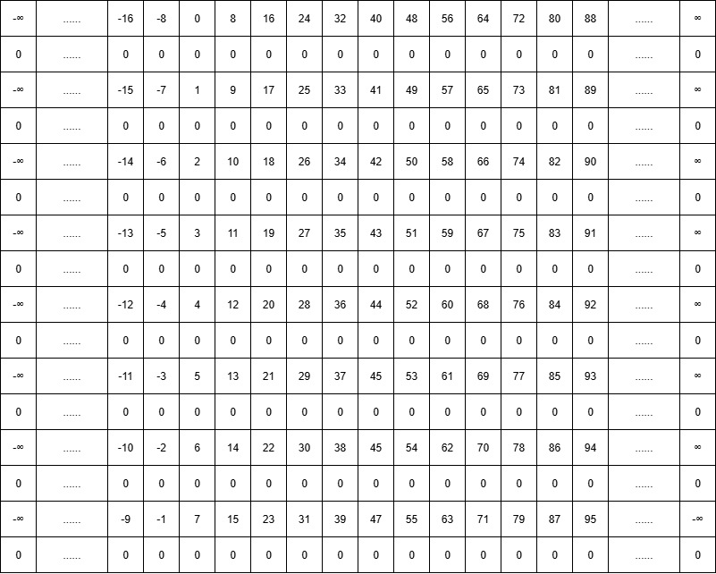
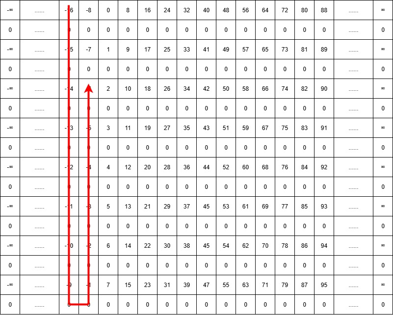
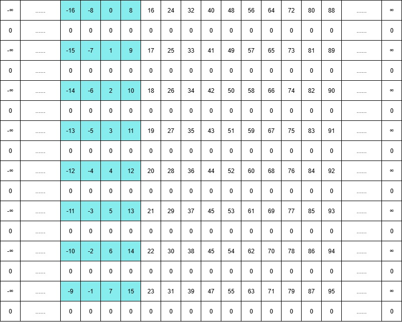
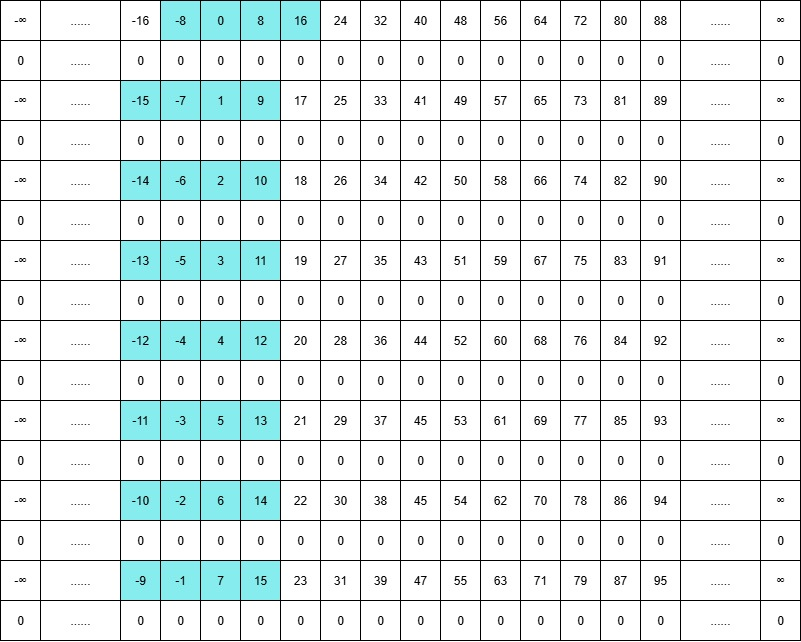
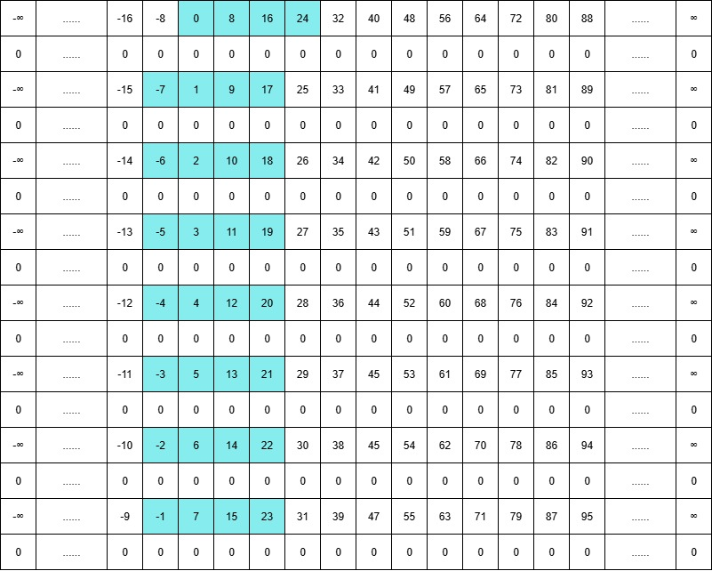
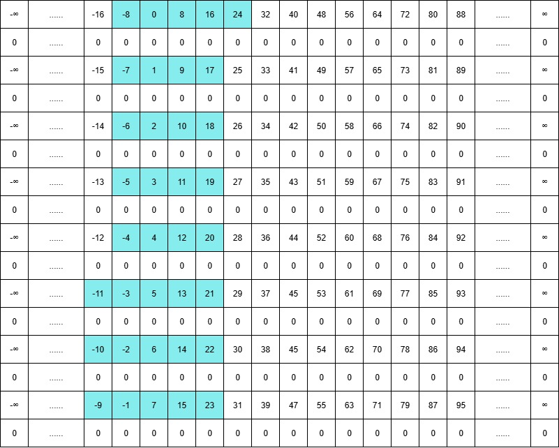

# 2026.8.4

雷达（radar），radar也是缩写，RADAR = RAdio Detection And Ranging（无线电探测与测距）

脉冲信号就是发一会停一会的信号，搞得好神秘，连续波就是一直持续的信号，雷达一般是都是脉冲，要看信号的反馈

脉冲雷达，距离精度与能量冲突

距离分辨率：
$$
\Delta R=c\tau/2
$$
脉冲时间越短分辨率越高，但是此处为什么距离分辨率是脉冲长度的一半还需要根据如何处理回波信号来计算距离的实现来理解

**********************，此处需要补充计算方式

好像是匹配滤波？对于特制的长脉冲，FPGA接收回波是知道特质脉冲属性的，（好像是直接卷积？），

依据信号系统随记的卷积原理来理解：

对于雷达匹配滤波，其h[n]是人为设计的数字滤波器，一般形式常见为：h[n]=s*[N-1-n]，即取发射波形时间反转再取共轭

其中已知的发射波形为s[n]

输入信号，即公式中的x[n]，采用r[n]表示，则r[n]=as[n-n~0~]+w[n]

其中：a为衰减，n~0~为采样延迟，w[n]为噪声

然后就是r[n]与h[n]进行卷积，就是x[n]输入序列与LTI系统冲激响应的卷积，然后就拿到熟悉的y[n]，但是至于为何这个冲激响应能够处理回波拿到需要信息还是需要一些数学推导验证

简单举例验证：

回看原始目标，我们需要将一段被特定的长脉冲的回波进行卷积，然后提取特征，这样既可以避免传输削弱能量，同时又可以通过特征信息提取的方式拿到距离信息，也就是说我们需要先讨论预期卷积结果如何能够拿到距离信息

GPT给出的理论结果是卷积后会得到存在一个波峰的一个序列，波峰位置就包含着延迟信息，下面尝试转化为连续函数推导为何波峰位置就是延迟

首先设回波延迟为**t~0~**，需要求解的值

FPGA驱动发出s(t)

则回波r(t)=s(t-t~0~)(此处忽略衰减和噪声)

匹配滤波器h(t)需要取反再共轭，此处先考虑实数

则h(t)=s(-t)

计算卷积结果
$$
y(t)=r(t)*h(t)
$$

$$
y(t)=\int_{-\infty}^{+\infty}r(\tau)h(t-\tau)d\tau
$$

$$
r(\tau)=s(\tau-t_0)
$$

$$
h(t-\tau)=s(\tau-t)
$$

$$
则y(t)=\int_{}^{}s(\tau-t_0)s(\tau-t)d\tau
$$

$$
变量代换一下令u=\tau-t_0
$$

$$
则y(t)=\int s(u)s(u-(t-t_0))du
$$

$$
令R_s(t-t_0)=\int s(u)s(u-(t-t_0))du
$$

即自相关函数，函数面理解来说，也就是一个信号s移动(t-t~0~)个单位与自己相乘积分，若没有移动，则t=t~0~也就是R~s~(0)最大，如果移动非常多，没有重合之处（脉冲信号仅仅维持一段时间），则结果几乎一直为0，总结来说自相关函数一定是在t=t~0~附近最大，所以只需要测量自相关函数的最大时的t值基本可以判定为回波延迟，同时也可以用这个推导过程理解为何脉冲的长度会影响距离测量精度的原因，此处不详细展开

下面换用实际s(t)推导一些内容：
$$
令s(t)=rect(t/T_p)e^{j2\pi f_ct}
$$
也就是T~p~宽度的矩形脉冲与载波相乘
$$
令\tau=2R(t)/c
$$
其中R(t)并非自相关函数，而是上文通过计算得到的回波延迟对应的物理距离，ppt中出现的式子看似把距离当作已知数，回波延迟当作未知数，只是通过式子表达物理关系，并非是对应的因果关系，而且这种表现似乎很常见
$$
此处的R(t)=R_0-vt,考虑到运动目标
$$
此处的v为径向速度，也就是雷达与目标连线的线速度
$$
然后写出回拨型号：r(t)=\alpha rect((t-\tau)/T_p)e^{j2\pi f_c(t-\tau)} 
$$

$$
可以分离出距离导致的相位变化为e^{-j2\pi f_c\tau}
$$

$$
然后利用\lambda =c/f_c推导\phi
$$

$$
得到\phi=-4\pi R/\lambda
$$

然后回波信号与本振相乘，即消掉f~c~t部分，剩下的部分便是：
$$
Ae^{j\phi (t)}
$$
其中相位是时间相关函数，
$$
\phi(t)=-4(R_0-v_rt)/\lambda
$$

$$
d\phi/dt=4\pi v_r/\lambda=\omega_d
$$

$$
f_d=1/2\pi (d\phi/dt)
$$

$$
即多普勒频率f_d=2v_r/\lambda
$$

也就是说，一切的公式推导都是为了拿到多普勒频率与速度的关系，或者说拿到相位变化与多普勒频率的关系，然后拿到径向速度

其实也可以通过一开始的推导拿到回波时间变化率与c相乘作为径向速度，但是不太靠谱，而且FPGA可以直接测量到的信息是相位，或者说相位变化，然后通过多普勒频率算出径向速度，这个方案靠谱一些。

FPGA计算多普勒频率：由于雷达发射的是一个个脉冲，所以本身就带有单位时间，然后计算每一次的相位，然后得到变化率，然后就能拿到多普勒频率或者说径向速度，

或者直接FFT，然后峰值就是多普勒频率。

系统一般存在两个时间维度，一个是脉冲内部的采样点，也就是快时间，用于测距

另一个是慢时间，也就是不同脉冲之间，用于测多普勒频率，也就是相位。

变频不会丢失有效信息，只是低频与高频的映射，高频用来传播，低频用来处理

下变频是模拟的活，mixer（并非乘法器，而是利用半导体的非线性，这个速率的乘法器数字处理望尘莫及），10*9.9，然后积化和差展开，然后滤波，拿走差的频率信号，

上变频本质是10*9.9，然后也是靠的mixer，然后积化和差，然后滤波

模拟器还是有用的，模拟出回波，实际测试很麻烦，想测个100km/s的飞机，还得搞架飞机来。。。还要模拟噪声巴拉巴拉的


脉冲能量：
$$
E=P\tau
$$
能量低回波会更弱

一般解决思路，直接发长脉冲，在内部加入一些信息，调制频率/相位或者一些其他的处理方法，然后FPGA做匹配滤波，长脉冲转化为短脉冲，可以兼得两者

普通脉冲一般就是矩形脉冲，即s(t)=Arect(t/τ)，就是t的绝对值小于τ/2为A，其余时刻为0，或者叫矩形窗口函数

# 2026.8.5

1. .m验证搞定算法
2. 人来看着搞定的算法搭建好.mdl
3. 验证好之后转为.v
4. 然后.v通过sg转为IP

首先，simulink是sysgen的父类，sysgen是AMD与matlab合作的一个插件，该插件的名字以前叫做sysgen，但是某一版本之后改名为了vitis model composer(a toolbox for simulink)，具体版本节点不知道，目前来看vivado21与25版本确定改名了

simulink也可以自定义一个HDL模型，然后通过本身的HDL coder生成.v，也就是说HDL coder与sysgen与vms(自定义缩写)是平行关系，区别在于后者可以通过AMD特色关键字搜索模型，以及AXI等特色模型，并且更适配AMD芯片。

下面简单整理一下各种器件的用法注意：

仿真系统的时钟吧，一个是采样时钟，一般是gatein设置的时钟，另一个是sg设置的步进时钟，就类似于vivado内部仿真器的工作原理，可以参考时序篇对xsim事件驱动的讨论，但是对于纯simulink的仿真，一个reg的默认延迟是一个采样周期，而且仿真器为时间系统仿真器，存粹计算固定时间点的延迟，而不是对硬件的模拟来完成的仿真，不过效果应该是差不多的，前提是时间刻度不能对差劈

# 2026.8.6

来看看FPGA广为人知的并行处理能力到底有什么应用，老生常谈这个能力，今天第一次真正理解实际应用

举例来说，如果想生成一个4Ghz的信号，但是FPGA时钟不可能跑到4G，现代的处理器内核最高也不敢上5G的频率，所以说FPGA就跑250M就行了，不过250的时序也会比较紧张，但是能跑，下面就需要一个16倍频

这样，对于DDS来说，我们先搞一个4Ghz信号的查找表，然后搞16路DDS，一个周期来说，第一路读取add_0，第二路读add_1,......第三路读add_15，然后传给高速DA（一般都是serder传），然后DA内部能够以4G速率将这十六个数据通过单个通道DA出去，这样就是一个4G的信号，然后下个250M的周期，或者说下个FPGA周期，十六路信号发送add_16,add_17.......add_31，然后给DA，这样就搞出了4G信号，真正的空间换时间。

first：sysgen里面的一些模块的配置和vivado里面对应的IP的配置项基本一致，只不过可能会少时钟相关的内容，因为sysgen和vivado的时钟逻辑不是同一种实现方式，比如常见的dds模块，dds compiler

second：对于reinterpret和convert来说，前者修改了bit的含义，不会修改数据

后者会修改数据格式，

```verilog
//对于reinterpret类似于如下
wire [15:0]a;
wire signed [15:0]b;
assign b=a;
//就是把默认的unsigned格式转化为了signed，仅仅影响仿真
//对于convert作用类似如下：
wire [15:0]a;
wire [11:0]b;
assign b=a;
//直接截断
//或者比如Q1.7->Q3.5,前者代表一位整数七位小数，后者代表转化为3位整数五位小数，不影响bit位数，但是为了保证整数与小数值尽量一致会导致bit的内容发生改变
//还有例如无符号数转有符号数，原则是为了保证理解数值一致而不是bit一致，所以可能会导致修改bit，例如unsigned a = 8'b11111111->signed b,b会变成截断的11111111，值变为-1，或者饱和变成01111111，值变为127
```

现在贴一张GPT的gatewayin配置说明表：

| 配置项          | 作用             | 常见设置                               | FPGA对应理解          |
| --------------- | ---------------- | -------------------------------------- | --------------------- |
| **Output Type** | 定义数据类型大类 | Boolean / Fixed-point / Floating-point | 决定硬件数据如何解释  |
| Boolean         | 单bit逻辑信号    | 0/1                                    | `wire` / `logic`      |
| Fixed-point     | 定点数           | 通信、雷达、DSP最常用                  | 定宽整数 + 隐含小数点 |
| Floating-point  | 浮点数           | 高精度算法                             | IEEE754浮点结构配置项 |

Fixed-point相关：

| 配置项              | 作用         | 例子              | FPGA含义                |
| ------------------- | ------------ | ----------------- | ----------------------- |
| **Arithmetic type** | 是否有符号   | Signed / Unsigned | 决定最高bit是否为符号位 |
| Unsigned            | 无符号数     | 8bit: 0~255       | 所有bit表示数值         |
| Signed (2's comp)   | 补码有符号数 | 8bit: -128~127    | MSB表示符号             |
| **Number of bits**  | 数据宽度     | 8、16、32         | 对应数据线数量          |
| **Binary point**    | 小数点位置   | 16bit、BP=14      | 定义缩放比例            |

Floating-point相关：

| 配置项                   | 作用                |
| ------------------------ | ------------------- |
| Floating-point Precision | 浮点格式选择        |
| Single                   | 单精度32bit         |
| Double                   | 双精度64bit         |
| Custom                   | 自定义指数/尾数宽度 |
| Exponent width           | 指数位宽            |
| Fraction width           | 尾数位宽            |

| 配置项           | 作用               | 例子         |
| ---------------- | ------------------ | ------------ |
| **Quantization** | 降低精度时如何舍入 | 16bit→8bit   |
| Truncate         | 直接截断低位       | 简单但误差大 |
| Round            | 四舍五入           | 精度更高     |

| 配置项        | 作用     | 例子         |
| ------------- | -------- | ------------ |
| **overflow**  |          |              |
| Wrap          | 循环溢出 | 127+1 → -128 |
| Saturate      | 饱和限制 | 200 → 127    |
| Flag as error | 溢出报警 | 仿真检查     |

convert会有延迟，因为有一定数据处理，所以一般是时序逻辑，但是rein本质组合逻辑，甚至综合工具直接不认它，所以没有延迟

from workspace与signal from workspace有使用区别，淦，可恶

前者输入需要timeseries控制，且每个输入点之间会被线性拟合过采样变成mdl输入，后者直接就是走mdl周期一个周期输入一个

# 2026.8.7

对于并行度为par的dds系统，每一路dds相位差可以通过以下公式计算：

定义符号：:
$$
并行度(par),DA采样时钟频率(f_s),FPGAdds工作时钟频率(f_{clk}=f_s/par)
$$

$$
DA输出信号频率(f_{out}^{da}),FPGAdds输出信号频率(f_{out}^{dds})
$$

以上参数一般已知或者说是设计参数

想要计算每一路相位差首先需要知道DA输出信号一个周期多少个采样点

输出信号每一个周期采样点数量等于并行度倍的dds输出信号一个周期的采样点（此处的采样点值可以不为整数，只需保证并行度倍之后即DA输出信号一个周期的采样点为整数即可）：
$$
DA输出信号每一周期采样点个数N_{DA}=par(f_{clk}/f_{out}^{dds})，其中f_{clk}=f_s/par
$$

$$
整理得N_{DA}=f_s/f_{out}^{dds}
$$

$$
则相错的相位差\Delta\Phi=2\pi/N_{DA}
$$

频率控制字的意义：

一般来说dds的配置相位累加器会是32位，也就是每次加1的话，输出信号需要2^32次方次循环一个周期，频率控制字就是控制的每一次加几，也就是说需要2的32次方/频率控制字次循环一个信号周期

之前做的频率控制字不是这样，一般是一个周期的查找表存好，如果存储地址是256，八位，那么地址寄存器可能会创建为16位，频率控制字就是地址寄存器每次增加的值，比如每次增加4，那么地址寄存器需要2^(16-8)/4次才会跳变一次地址，因为地址寄存器的高八位接的存储地址

其实两种方式本质是一致的，只不过第一种把地址查找表起来了，或者说预先存储了一个周期2的32次方个采样点的查找表，或者说如果存储的查找表为2的16次方个值，那么这个32位的寄存器高16位就是地址，后面的十六位和第二种方式的后八位起到了一致的效果，大概是这部分内容被隐藏起来了，对外只需要输入频率控制字就能控制频率

下面计算频率控制字f_r,默认相位累加器为32bit，则为了保证一个周期N~DA~个采样点，频率控制字应为2^32/N~DA~，

对于poff的配置就是移位与加法组合就行

**对于这个给的DDS学习模型，里面的频率控制字f~r~其实是DA输出信号的频率控制字，所以模型里面构建逻辑通过f~r~生成PINC给DDS IP时需要扩大PAR倍，以实现FPGA DDS进行每PAR个点输出一个点，也就是找了PAR个人同时干一件活，不过这件活需要调整一下这PAR个人的位置，错开一点（PAR个人不可能挤在一起，就像如果PAR个DDS挤在一起就会出现DA输出的一个周期会粗糙PAR倍），然后就能实现PAR倍的速度**

对于dds配置，模块配置端口含义如下：

**PINC（Phase Increment）→ 配置输出频率**

**POFF（Phase Offset）→ 配置输出相位**

DDS至此基本结束


# 2026.8.10


DDC初步：

首先，带宽概念，对于调制出来的信号，并不是绝对理想的固定频率的正弦波，会存在在一个固定频率附近的一些频率的信号叠加在一起，称为带宽B。尤其是DA出来的信号会有阶梯，所以经过傅里叶变换会得到一条带宽。

唉，涉及到算法的数学推导永远都离不开欧拉公式，万恶之源，感觉可以换一个理解方式，欧拉公式的虚指数，这个其实是一种广义正弦波，这种正弦波并非平面正弦波，可以形容为弹簧正弦波，或者说一般三维正弦波，但是还是永远摆脱不了j的平方等于-1这个事情，或者可以问，为什么-1的平方等于1，在数学定义上来看，如果仅仅是创造一类数字，不考虑目前定义的特性，从一个暂且忘记j的平方角度来看，或者说仅仅把这个定义作为两类数字交互的桥梁，先不走这个桥梁仅仅在j的世界探讨计算，这样来看，1、-1、j、-j本质不应有任何区别，他们是一样的，从最一开始的负数出现，为什么可以接受负数这一类数字，因为思想中存在正负抵消这个概念，可以很好理解-1+1=0这个事情，但是虚数的出现需要平方这个运算，注定接触时间就会晚一些，如果说1与-1可以代表一维的两个方向，当然j与-j也可以代表第二个维度的两个方向，当然统计来看，这两个维度并无先后顺序，如果不做交互观察，对于j与-j的这个维度，但是这样又会存在bug，因为这个维度的平方计算会跳出这个维度，如果第二个维度的方向或者说单位依旧是实数的话，则并不会互相干扰，因为-1的平方是1，从数值上观察依旧在本身的维度，或者说依旧能在本身的维度找到位置，所以说将虚数这类数字归结到实数维度这一行为本身就是错误的，感觉可以将其归类为平行世界，或者影子世界，这样一来，虚数j在另一个世界扮演着1的角色，在这个影子世界，-j+j=0，依旧是正负抵消，很好理解，不过他们的世界，啊啊啊，写到这里依旧出现bug，因为这个虚数世界的平方计算按照目前的规则依旧会跳出虚数世界，虚数世界的计算不是封闭的，如果按照影子世界的比喻，他们的世界也应该是封闭的，或者说真的存在一个世界他们的基本单位是j？然后他们的j方=j？，换个灵感继续讲呢，这个实数里面的负数，在现实世界是存在事件对应的，我的东西送出去，就代表负数，别人给我在我看来就代表正数，但是虚数这个名词在现实世界几乎很难找到对应的事件，或者说几乎就不存在，这样来看，把虚数当作一个独立的世界本身就是有问题的，因为就像负数一样，如果把负数当作一个独立的世界，但是平方一下就会原形毕露，因为平方之后得到了正数，所以说数学上将负数纳入了数集中，为了数字世界的封闭作为数字的补充，但是仅仅至此依旧存在漏洞，-1开方在数学的定义下没有结果，所以存在了虚数，顺应前代的经验也应存在负虚数这一类，那么是否需要存在虚数的虚数这个概念呢，这样就要涉及到j的开方，也就是谁的平方等于j，那么谁的平方等于j呢，也就是二分之一的神力，也就是说j是可以开方的，也就是说虚数在这个世界的乘除法已经合理，需要验证的运算就是指数对数运算以及三角函数运算，万幸的是，欧拉公式作为了这一个关健桥，这样来看，欧拉公式和j的平方为-1两者对于虚数在数字世界的作用是一致的，但是也有区别，以j的平方=-1这件事情为前提，欧拉公式才能成立，类比负数，复数的乘除法定义之后，也是根据正数的指数对数运算的乘除法规则将正数位置替换为负数之后才得到的运算规律，所以说虚数的存在或者说产生，本质依旧是和负数一样，因为数学运算不够完备而产生的，反过来说就是为了完善数学系统，虚数诞生了，后续的任务就是将虚数在数字世界合理化，但是不幸的是，他并没有像负数那样在现实世界找到显而易见的事件对应，只能以冰冷的数字存在数字世界，唯一的与现实世界的关联仅仅只是j的平方=-1罢了，所以虚数的运算强迫内心默认如此即可，大抵是几乎无法寻找到它的真实意义了吧

我不喜欢复数，因为我似乎永远无法彻底理解它

但是，负数的意义是相反的方向，叙述的意义是通过代数描绘旋转，欧拉公式的意义是代数化计算旋转，应该说是简化旋转计算，因为二维实平面实数坐标也可以表述旋转，或者说通过虚数可以将点的弹簧线的运动过程这一事件表示出来，这一事件弹簧中轴可以作为时间线，虚平面来看是一个正弦波，实平面看来是一个正弦波，或者从存在角度的平面观察依旧可以分解为两个正弦波，不过各自均会包含实数虚数分量，所以我们现在可以回答为什么j的平方=-1，因为没有这个概念欧拉公式就不会成立，欧拉公式不成立，虚数运算就无法代表旋转，虚数也就失去了存在意义

这样重新审视这个符号：
$$
e^{j \omega t}
$$


或者说审视一个弹簧信号在平面上的投影，在三维坐标系中，z为时间轴，x为实数轴，y为虚数轴，将y置零，可以得到实投影，将x置零得到虚投影，如果先认定上述符号代表了弹簧轨迹，且考虑线性空间，那么两者投影之和便可以作为弹簧曲线的方程，（线性空间不考虑二次项存在），通过计算零点可以得到坐标（0（时间点），1（实数轴坐标），0（虚数轴坐标）），那么两分量信号在起点的取值也就不一致，也就是说实轴起点为1，虚轴起点为0，也就是说分别对应cos与sin，这种分解因为分解的结果分别不包含另一个分量也成为正交分解，而时间轴密度与角速度或者频率强相关，以后在提到信号，首先要想弹簧线模型，而不是正弦波形状。

# 2026.8.11&12

DDC中的多项滤波硬件实现原理：

常见的FIR滤波

滑动窗口权重均值

多项滤波：本质是为了迎合并行DDS而诞生的滤波方式，因为输入并不像单路FIR滤波器，而是八路并行输入且存在固定相位差，且需要产生八路并行输出，所以诞生了多项滤波结构

拿I路并行数据矩阵为例：



其中存在十六路信号，不过对于I路信号所有的偶数行均为0，因此可以不考虑计算，在途中的作用是完整呈现原始信号

定义从上往下从第一路信号开始，一直到最后为第16路信号

单路输出信号为如下走向：



因此我们滤波器的系数应该是按照红线方向顺序滑动的，

或者说对于二维矩阵来说，滤波器的滑动窗口，可以称为滑动平面，这个平面的覆盖面积，在进入一个信号时，左上角取消覆盖一个格子，右上角多覆盖一个新的格子，但是当作为八路并行输入时，平面与单路信号存在一致的移动形式，形状不变，均为滑动。

如果采用八路和单一信号一致的滤波器，会出现问题，当新的一路信号到来时，前面的八路信号会被丢掉，但是新一路的录播输出的信号的计算依旧需要被丢掉的八路信号的某些值，例如第一路的输出还需要丢掉的第二路至第八路参与计算，因此需要设计多项滤波系统来解决八路并行滤波八路并行输出系统的需求。

拿第一路输出信号举例：

实现方式：将八路输入，第一路不变，后七路经过DFF延迟一拍，经过挑选过参数的滤波器进行滤波，然后八路滤波器的输出经过均值然后输出即为经过并行多项滤波的第一路输出，下面进行验证，

假设系统总滤波窗口均值个数为64，

不做延迟之前：



也就是每一路滤波器的深度均为4，经过延迟过后的缓存数据如下：



则第一路输出首次需要计算均值的部分为如下图蓝色部分方块：



如此可以很直观的理解多项滤波的结构

但是如果参数并非8的倍数，或者说输入并行度的倍数，无法实现

```
8.11原笔记

对于之前提到过的第一路的实际计算结构，由于后七路相对第一路始终延后一个时钟周期，因此计算序列如蓝色所示，0的部分为了不会产生起义，起点终点如果包含0则将其标蓝（对应窗口长度）

这样的话，如果下一次八路数据到来，整个蓝色部分只需右移即可，计算的正好就是原始信号新一轮的第一分路的下一个滤波信号，由此可见，只需要我们正确将每一路信号的八个滤波器的参数安排好即可，当然也是从总滤波窗口的这73个权重系数中间隔固定距离提取即可，

对于第二路信号，当然就是后六路数据经过一个DFF，以此类推；

总结来说，一开始的八路直接输入滤波输出会导致丢失计算参数，

经过这样DFF处理，可以通过把平面滤波的滑动平面捏造成适合的形状，也就是左上角空白几个空格，右上角突出几个空格，然后进行滑动，即可得到八路的并行输出；

太晚了，此处存疑，似乎长度不是8的倍数无法如此计算
```

下面重新提出一种实现非并行度倍数参数的实现过程



据图，我们首先让滤波平面的最早的一列由下至上包含权重系数数量-1对8的余数即可，因为右上角需要突出一点作为针对输出第一路的适配，在新的一路到来时可以实现非倍数多项滤波

下面是权重系数分配：

对于整数倍数量的权重系数，应将其列为非整数倍的特殊情况，所以首先讨论非整数倍的权重系数应该如何分布来依靠多路实现单路滤波效果，

依照蓝色方块的位置，我们应该将首位权重系数安排在上图中-11的位置，也就是对应系数第一位，此行滤波器参数配置下一个便为1+16即第十七个权重系数，对应在上图-3的位置，以此类推，对于整数倍的，也就是左上角第二个方块应该是首位权重系数，然后以此类推

**问题：设计中的权重系数分配，对于整数倍第一路输出的第一路滤波器，其系数配置的是从系统权重系数的首位然后间隔16获取，从上述理论应该是从第15个开始获取，此处存疑**

# 2026.8.13

出差，没记笔记

# 2026.8.14

$$
x[n]=sin(2\pi f_0 (1s/f_s)n )
$$

$$
t=n(1s/f_s)
$$

其中，f0与t相乘代表经过了多少个周期，与二Π相乘代表经过了多少的角度，因此回整体作为三角函数的自变量

对于t与离散信号，如果离散采样率是fs，那么离散信号的采样时间间隔就是一秒除以fs，那么经过n个采样点也就是经过了两者相乘的时间，再与原始信号频率相乘也就是经过了多少周期，再与二Π相乘就会得到连续信号的离散采样点的变量值，经过函数运算得到离散采样点的值

# 2026.8.17

连续的非周期信号，其CFT为连续的非周期的频谱

连续的周期信号，其CFT为离散非周期的频谱，即上述的频谱离散采样，或者叫做傅里叶级数

离散的非周期序列，做DTFT，得到周期的连续频谱

这是我们期望的，实际计算机只能存储离散频谱，因此

我们将离散的非周期序列，截取一段做DFT，得到周期的离散的频谱，该频谱为上述的离散采样

此时，我们DFT得到的序列对应的并非原始的时间序列，即经过IDFT之后会得到周期性的时间序列，即由于截取一段时间序列，达到了傅里叶级数的效果

如果函数是周期性的，则其DTFT/IDTFT均为离散的；如果函数是离散的，则其DTFT/IDTFT均为周期性的。

有限DFT再IDFT得到无限&周期

即对于计算机做DFT来说，一切输入序列，经过DFT之后已经被认定为无限长度的周期信号了

对于离散序列，DTFT才是傅里叶变换而DFT则是傅里叶级数

DFT之所以出现“循环”，根源就在于它把有限长序列放进了一个周期性的离散时间世界里。

所有变换中无论是变换还是逆变换，是否周期仅与是否离散决定，是否离散仅与是否周期决定（不全对）

即：任何变换过程，如果输入序列为周期，则变换结果必为离散，如果非周期，则变换结果必连续。

任何变换过程中，如果输入序列为离散，则变化结果比周期，下一句不适用

离散必周期，周期必离散

# 2026.8.18

利用卷积定理解释离散必周期

卷积定理：
$$
h[k]\ast x[k]->DFT->H[M]\cdot X[M]->IDFT->h[k]\ast x[k]
$$

$$
H[M]\cdot X[M]->DFT->h[k]\ast x[k]->IDFT->H[M]\cdot X[M]
$$


即时域卷积的DFT等于频域的乘积，反之亦然

此处我们将时域的序列视为连续信号x与周期单位冲激响应的乘积，

即
$$
x(m)\sum_{k=-\infty}^{k=+\infty}\delta[m-k]
$$

两者相乘得到等效离散采样序列

前者FT频谱为一条带，后者DFT频谱为原型的频率冲激，且冲激间隔为采样间隔倒数，即采样频率

则两者乘积的频谱为上述两类频谱卷积，即得到周期的离散频谱，且周期为采样频率

即离散序列频谱必周期的原理，

**乘以j再乘以j相当于乘了-1，也就是先逆时针旋转90°再逆时针旋转90°，就是-1，这个理解没毛**

**也就是说，虚数的来源是两次旋转九十度的过程，但是复数世界将这个过程无限细分，允许任意角度的旋转，也就诞生了一个存在角度与幅度的复数世界，**

**再独立观察虚数世界与实数世界，他们在数学运算上都不是封闭的，因为虚数平方为实数，负数开方为虚数，因此纯实数世界是不封闭的，虚数世界也是，因此我们可以在现实世界询问，我傍边存在几个苹果，我们可以说4j个苹果，因为四个苹果存在我的左边（面向实轴正方向），我对这个苹果的一切平面移动操作均可以以一个虚数乘法来代表这一过程，而虚数与实数交互的特性能保证这一乘法的结果能够正确代表操作的结果与数字运算的结果是一致的，而欧拉公式的存在揭示了复数运算与角度和幅值的关系，同时也大幅简化了复数运算的复杂度，至此为止，我认为实数与虚数应该称为量数与度数，或者说两者并无区分，应该统一称为复数，因为一个复数的实部无法独立代表幅值也无法独立代表方位，虚部也是，因此两者仅仅在计算特性上存在区分，在世界的实际含义上并无区分，也并无特殊指代，而是复数作为两者的统一代表，**

**当然我们也可以采用纯实数作为第二个坐标轴，但是这个如果想描述方位以及方位变化数学运算十分麻烦，因此复数这个二维平面才被定义为数字的基底**

**一个正向旋转的弹簧波与一个反向旋转的弹簧波相加，思考旋转过程，他们的虚部一直是相反的，实部一直是同号的，这也就意味着两个转向相反的复信号之和为一个纯实信号，这也就意味着为何欧拉公式实部是偶函数cos，虚部是奇函数sin**

**cos信号代表着两个旋转方向相反的复指数信号之和**

**负频率信号，对于实部不会有任何影响，不过虚部则是相反的转向，即一对转向不同的弹簧波，如果叠加，则正向旋转的正频率会被反向旋转的负频率抵消，结果只剩实部**

# 2026.8.19


LO = Local Oscillator = 本地振荡器 / 本振

## DDC总结：

$$
\begin{align}
输入信号：&\\
x(t)&=Acos(2\pi f_{in}+\phi)\\
\\
本振产生两&路信号：\\
LO_I(t)&=cos(2\pi f_{lo}t)\\
LO_Q(t)&=sin(2\pi f_{lo}t)\\
\\
第一路混频&：\\
x_I(t)&=Acos(2\pi f_{in}t+\phi)cos(2\pi f_{lo}t)\\
\\
三角公式：&cosAcosB=1/2[cos(A-B)+cos(A+B)]\\
\\
代入三角公&式：\\
x_I(t)&=A/2[cos((2\pi f_{in}t+\phi)-2\pi f_{lo}t)+cos((2\pi f_{in}t+\phi)+2\pi f_{lo}t)]\\
&=A/2cos[2\pi (f_{in}-f_{lo})t+\phi]+A/2cos[2\pi(f_{in}+f_{lo})t+\phi]\\
低通滤波得&到：\\
y_I(t)&=A/2cos[2\pi (f_{in}-f_{lo})t+\phi]\\
\\
\\
第二路混频&：\\
x_I(t)&=Acos(2\pi f_{in}t+\phi)sin(2\pi f_{lo}t)\\
\\
三角公式：&cosAsinB=1/2[sin(A+B)-sin(A-B)]\\
\\
代入三角公&式：\\
x_Q(t)&=A/2[sin((2\pi f_{in}t+\phi)+2\pi f_{lo}t)-sin((2\pi f_{in}t+\phi)-2\pi f_{lo}t)]\\
&=A/2sin[2\pi (f_{in}+f_{lo})t+\phi]-A/2sin[2\pi(f_{in}-f_{lo})t+\phi]\\
低通滤波得&到：\\
y_Q(t)&=A/2sin[2\pi (f_{in}-f_{lo})t+\phi]\\
\end{align}
$$

当本振频率等于输入频带中值时可将输入信号搬入零频带，即基带，并且可以获得输入信号的幅值与相位

实际实现时：

```存疑，应该没问题了
首先进行正交混频，即无乘法的正交混频，采用1/4原始信号频率的cos进行相乘，即1，0，-1，0，sin同理，可以得到I,Q两路信号，当然目前的采样率依旧是原始采样率，不过由于间隔为零，所以同时也是相当于原始采样率一半采样率得到的信号经过二倍内插得到的信号，等效经过内插后得到原始采样率的IQ信号，然后根据内插对频谱的影响需要经过低通滤波，且此低通滤波器对单路信号称为插值多相滤波器，对于FPGA的多路并行信号，该插值多相滤波器还需要设计为插值多相并行滤波器来适应FPGA的并行结构。
```


## DUC总结：

$$
\begin{align}
两路输入：&\\
x_I(t)&=Acos(2\pi f_{in}t+\phi)\\
x_Q(t)&=Asin(2\pi f_{in}t+\phi)\\
本振依旧：&\\
LO_I(t)&=cos(2\pi f_{lo}t)\\
LO_Q(t)&=sin(2\pi f_{lo}t)\\
第一路混频&：\\
x_1(t)&=Acos(2\pi f_{in}t+\phi)cos(2\pi f_{lo}t)\\
\\
三角公式：&cosAcosB=1/2[cos(A-B)+cos(A+B)]\\
\\
代入三角公&式：\\
x_1(t)&=A/2cos[2\pi (f_{in}-f_{lo})t+\phi]+A/2cos[2\pi(f_{in}+f_{lo})t+\phi]\\
第二路混频&：\\
x_2(t)&=Asin(2\pi f_{in}t+\phi)sin(2\pi f_{lo}t)\\
\\
三角公式：&sinAsinB=1/2[cos(A-B)-cos(A+B)]\\
\\
代入三角公&式：\\
x_2(t)&=A/2cos[2\pi (f_{in}-f_{lo})t+\phi]-A/2cos[2\pi(f_{in}+f_{lo})t+\phi]\\
两路相减：&\\
y(t)&=x_1(t)-x_2(t)\\
&=Acos[2\pi(f_{in}+f_{lo})t+\phi]\\
\end{align}
$$


从而实现上变频

## DIFM（数字瞬时测频法）

Digital Instantaneous Frequency Measurement
$$
\begin{align}
输入信号&：\\
s_I(t)&=Acos(2\pi f_0t+\phi_0)\\
s_Q(t)&=Asin(2\pi f_0t+\phi_0)\\
采样后：&\\
s_I(n)&=Acos(2\pi f_0nT_s+\phi_0)\\
s_Q(n)&=Asin(2\pi f_0nT_s+\phi_0)\\
延迟k个&采样点：\\
s_I&(n-k)=Acos[2\pi f_0nT_s-2\pi f_0kT_s+\phi_0]\\
s_Q&(n-k)=Asin[2\pi f_0nT_s-2\pi f_0kT_s+\phi_0]\\
\\
三角公式&：\\
&cosAcosB=1/2[cos(A-B)+cos(A+B)]\\
&sinAsinB=1/2[cos(A-B)-cos(A+B)]\\
&sinAcosB=1/2[sin(A+B)+sin(A-B)]\\
&cosAsinB=1/2[sin(A+B)-sin(A-B)]\\
&cosAcosB+sinAsinB=1/2[cos(A-B)+cos(A+B)]+1/2[cos(A-B)-cos(A+B)]\\
&cosAcosB+sinAsinB=cos(A-B)\\
&sinAcosB+cosAsinB=1/2[sin(A+B)+sin(A-B)]-1/2[sin(A+B)-sin(A-B)]\\
&sinAcosB-cosAsinB=sin(A-B)\\
\\
key:&\\
&cosAcosB+sinAsinB=cos(A-B)\\
&sinAcosB-cosAsinB=sin(A-B)\\
\\
\\
构造两路&信号满足key式:\\
x(n)&=s_I(n)s_I(n-k)+s_Q(n)s_Q(n-k)\\
y(n)&=s_Q(n)s_I(n-k)-s_I(n)s_Q(n-k)\\
x(n)&=A^2/2cos(\Delta \phi)+A^2/2cos(2\theta-\Delta \phi)+A^2/2cos(\Delta \phi)-A^2/2cos(2\theta-\Delta \phi)\\
y(n)&=A^2/2sin(2\theta-\Delta\phi)+A^2/2sin(\Delta \phi)-(A^2/2sin(2\theta-\Delta\phi)-A^2/2sin(\Delta \phi))\\
x(n)&=A^2cos(\Delta \phi)\\
y(n)&=A^2sin(\Delta \phi)\\
其中：原&始相位\theta=2\pi f_0 nT_s+\phi_0,延迟相位\Delta \phi=2\pi f_0kT_s\\
\\
得到的信&号需要进行累加进一步消除之前的高频分量\\
\\
\\
&{y(n)\over x(n)}={A^2sin(\Delta \phi)\over A^2cos(\Delta \phi)}\\
&{y(n)\over x(n)}=tan(\Delta \phi)\\
得到：\\
&\Delta\phi=arctan({y(n)\over x(n)})\\
由\Delta& \phi=2\pi f_0kT_s可得：\\
f_0&={f_s\Delta\phi\over2\pi k}\\
\\
\\
最后还需&要判断x，y的符号进一步判断相位处于哪一个象限
\end{align}
$$


将输入实信号看作两路共轭复信号相加，对数学公式不做质疑，这个等号是可以画的，然后将两路复信号与一个本振复信号相乘，通过数学公式来看是一个常量与二倍旋转的复信号之和，

也就是说DDC的混频，本质是cos+jsin与一个一对共轭复信号之和的信号相乘，从复数角度看，就是共轭信号之一与cos+jsin逆向抵消得到常量，另一侧同向叠加得到二倍旋转速率，对于1/4采样率混频，舍弃混频信号的0点，得到1/2抽取的复信号，从数学实数的角度看，混频的输入实信号分别于sin和cos相乘，然后滤波，得到ACOSphi和ASINphi，对于实数解释，两个信号是独立的，从数值上观察可以发现两路信号是输入实信号对应的幅值和经过下变频后的sin和cos，但是从复信号的角度来看，得到的结果是一个复平面旋转的三维信号，在实轴和虚轴的投影代表了对应实信号的两路信号，

前置：对复数的一切数学运算保持认可

|      | 过程/观察域                                | 实输入       | 实相干                                                      | 复输入         | 复相干                           |
| ---- | ------------------------------------------ | ------------ | ----------------------------------------------------------- | -------------- | -------------------------------- |
|      | 输入                                       | Acos(n+\phi) | 一路sin一路cos                                              | 一对共轭复信号 | cos+jsin                         |
|      | 正交分解或者说混频或者说实信号进入复信号域 | Acos(n+\phi) | 一路sin×Acos(n+\phi)    一路cos×Acos(n+\phi)       相加关系 | 一对共轭复信号 | 一对正向旋转相乘一对反向旋转相乘 |
|      | 滤波                                       |              | 两路分别滤波，就是实信号处理                                |                | 实际实现和实信号一致             |


书里突然开始写复信号了，但我的 ADC 明明进来的是一串实数，复信号到底从哪冒出来的？

怎么具体实现对复信号的处理？

对于实数处理，我们可以人为将信号经过双路处理，得到想要的混频滤波效果

当然我们可以将输入信号当作复信号，只不过虚部为0的复信号，或者说是一对共轭的复信号之和，其实与所谓的本振复信号相乘，理论上是需要进行两次相乘得到两路复信号输出，即输入实部与复信号相乘和输入虚部与复信号相乘，然后得到的两个双路信号输出相加就是最后的混频复信号，不过虚部为0，直接用输入信号与混频复信号相乘即可，所以只有两路输出，没有相加的过程

或者说复信号其实就是广义90°相位差双路处理

“实信号就是复信号，只不过虚部为 0”还有一个更深的意义

这实际上意味着：

“进入复信号域”不一定意味着你获得了新的物理信息。

输入：

x+j0

只有一个实数自由度。

经过复混频：

(x+j0)(cosθ+jsinθ)

得到：

I+jQ

看起来现在有两个数：

I,Q

但它们并不是凭空增加了信息。

因为：

I=xcosθ

Q=xsinθ

它们来自**同一个 x**。

真正增加的是：

我们把原本一维实轴上的信号，用一个旋转参考系重新表示成二维坐标。


对实信号不做任何影响变成一个虚部不为0的复信号是不可能的，想用复信号处理法则处理实信号唯一方案就是将实信号认作一个虚部为0的复信号

# 2026.8.20&21

尝试与复信号做个了断

## 实信号与复信号

$$
输入实信号：Acos(\omega n+\phi),记\theta=\omega n+\phi
$$

$$
\begin{array}{c|l|l|l}
\begin{array}{l}
\end{array}
&
\begin{array}{l}
指数表达
\end{array}
&
\begin{array}{l}
共轭复数表达
\end{array}
&
\begin{array}{l}
复数表达
\end{array}
\\
\hline

\begin{array}{l}
实信号
\end{array}
&
\begin{array}{l}
A/2\cdot e^{j\theta}\\
+A/2\cdot e^{-j\theta}
\end{array}
&
\begin{array}{l}
(A/2\cdot cos\theta\\
+j\cdot A/2\cdot sin\theta)\\
+(A/2\cdot cos\theta\\
-j\cdot A/2\cdot sin\theta)
\end{array}
&
\begin{array}{l}
A\cdot cos\theta+j\cdot0
\end{array}
\\
\hline

\begin{array}{l}
解释\uparrow
\end{array}
&
\begin{array}{l}
数学表达
\end{array}
&
\begin{array}{l}
过渡表达，\\
数学表达的另一种方式，\\
对数学表达\\
和硬件表达进行链接
\end{array}
&
\begin{array}{l}
硬件表达
\end{array}
\\
\hline

\begin{array}{l}
混频输入
\end{array}
&
\begin{array}{l}
e^{-j\omega n}
\end{array}
&
\begin{array}{l}
cos\omega n-j\cdot sin\omega n\\
与复数表达一致
\end{array}
&
\begin{array}{l}
cos\omega n-j\cdot sin\omega n
\end{array}
\\
\hline

\begin{array}{l}
混频结果
\end{array}
&
\begin{array}{l}
A/2\cdot e^{j\phi}\\
+A/2\cdot e^{-j(2\theta-\phi)}
\end{array}
&
\begin{array}{l}
经过复杂的相乘得到：\\
(A/2\cdot cos\phi\\
+j\cdot A/2\cdot sin\phi)\\
+(A/2\cdot cos(2\theta-\phi)\\
-j\cdot A/2\cdot sin(2\theta-\phi))
\end{array}
&
\begin{array}{l}
相乘后通过\\
三角变换可以得到\\
A/2(cos\phi\\
+cos(2\theta-\phi))\\
+-j\cdot A/2(sin\phi\\
+sin(2\theta-\phi))
\end{array}
\\
\hline

\begin{array}{l}
解释\uparrow
\end{array}
&
\begin{array}{l}
共轭复数\\
表达式的指数表达\\
分别是低频\\
复分量与\\
低频复分量
\end{array}
&
\begin{array}{l}
与指数表达完全对应
\end{array}
&
\begin{array}{l}
可以看到此处的\\
实部是共轭复数一栏\\
两部分的实部抽取之和\\
与虚部抽取之和
\end{array}
\\
\hline

\begin{array}{l}
滤波
\end{array}
&
\begin{array}{l}
直接滤掉高频指\\
数部分，数学概念，\\
不可能硬件\\
直接滤复指数
\end{array}
&
\begin{array}{l}
将共轭乘积结果的\\
两部分的高频信号\\
全部滤掉
\end{array}
&
\begin{array}{l}
实部与虚部分别滤波，\\
当作实际数字处理即可
\end{array}
\\
\end{array}
$$


复信号分析提供指导方法，如果仅仅依赖实信号分析，必须要想到分别乘以sin与cos经过三角变换并且分别滤波才能拿到低频的完整信号，而不是其中的一个分量，但是通过复信号分析，即通过指数表达式与复滤波可以直接就能得到完整的低频分量，即同时拿到低频分量的实部与虚部，当然这个低频分量并不是指原始信号的低频分量，而是复混频之后的低频分量，若是指原始信号的低频分量，那这个低频分量连虚部都没有，同时最右侧的硬件表达就是对应了其具体实现方式，而这种具体的实现方式又会反过来体现实信号分析必须要想到的与sin和cos相乘与分别滤波才可以拿到完整的低频分量，而不是低频分量的一个投影，或者说仅仅拿到低频低频分量的实部与虚部之一，即开头所说的复信号分析提供指导方法

图形描述：

对于实信号，可以看作两条旋转方向相反的弹簧波之和，两者在复平面上的投影为旋转方向相反的连个圆圈线，旋转速度一致，在实轴与时间轴平面的投影是完全一致的，都是幅值为实信号幅值一半的余弦波，但是两个弹簧波在虚轴与时间轴平面上的投影为正弦波与-正弦波，当然实信号与这两个信号的关系是线性的，满足后续一些LTI系统的处理规则，这些内容在硬件上不需要特殊表现，依旧是一列实信号即可，即原始的ACOS

对于混频，即两列弹簧波，后续统称一对共轭复信号，两列共轭复信号分别于本振复信号相乘，此处认可数学运算，分别得到两列新的复信号，一列为低频复信号，一列为高频复信号，两者在实轴与时间轴平面上的投影分别为低频cos与高频cos，在虚轴与时间轴平面上的投影为低频sin和高频sin，将\phi视为正值，则两路复信号在复平面上的投影依旧是一样大小的圆圈线，旋转方向依旧一致，不过前者转速明显下降，后者转速明显接近翻倍

对于硬件过程，此处与上述分析出现分歧，因为硬件不会像中列表格那样真的进行两路共轭复信号相乘再相加，而是先相加再相乘，相加之后虚部为0，在于混频复信号相乘，得到单个复信号，将这个复信号进行数学上的三角分解可以得到上述分析的一对共轭复信号，不过实际硬件的体现形式，也就是输出的一对IQ信号，I路则是上述共轭复信号混频结果的慢速复信号的实部与快速复信号的实部之和，Q路则是其虚部之和，也就是说复信号数学分析的过程与硬件实现过程存在歧义，或者数学分析复信号过程以另一种方式存在于硬件当中，这一点在后续的滤波会更有体现

对于滤波，数学复信号分析，将高速旋转的复指数滤掉，不过这是复滤波，不存在十分直接的复滤波器，因此在硬件上体现便是IQ滤波，上述提到过I路则是上述共轭复信号混频结果的慢速复信号的实部与快速复信号的实部之和，Q路则是其虚部之和，将两路信号当作实信号滤波，也就是进行一般FIR滤波，将会将IQ的高频分量全部滤掉，也就实现了和复滤波器一致的效果。


## 实信号的傅里叶级数与变换

后续讨论的一切信号默认离散周期信号

一切的讨论的前提：

1. 认可实数下的傅里叶级数，认可欧拉公式，前者的数学证明不做解释，后者可以通过泰勒展开进行验证
2. 因为傅里叶变换对象为周期无限长的实连续信号，但是由于计算机采集特性与存储的局限，计算机只能处理一段离散的信号，而不是无限长的连续实信号的采样点
3. DFT处理一段实离散信号，得到的结果，隐含在数学运算中的重要的一点是已经将该段离散信号进行了周期延拓，即DFT处理的其实是一个周期信号

前提：对一段实信号进行周期延拓，然后进行傅里叶展开（实数域），可以拿到结论，任意一段实信号可以分解为无数实余弦波之和，对于线性系统，可以将任意实信号当作一般余弦信号分析，或者说只要知道系统对任意一个余弦分量怎么处理，就可以通过线性叠加得到系统对整个信号的处理结果

因此，将一个实信号进行表格中的指数表达，然后对两部分分别进行傅里叶变换，我们会发现，任意实信号的某一频率分量的傅里叶变换结果必然会出现正负对称的两条频率幅值响应带，且相位角相反，即：
$$
\theta与-\theta导致的\phi与-\phi在其中起到作用
$$
实数傅里叶展开是针对实数信号且定义域关于零点对称的，但是傅里叶变换对实数处理的定义域是从n=0开始的，频谱图会出现一个相位偏移，这就是傅里叶变换后的频谱图从0开始的原因，且幅度响应依旧关于中间频率对称，相位依旧关于中心频率负对称

下述是进行实数信号傅里叶展开新理解方式的基础：

对复指数的傅里叶变换，得到的强度就是复指数前面的系数，分为实部与虚部展开，即两者的平方之和再开方，也就是实际实现的计算方式，

对于数学的体现方式，将傅里叶变换的结果视为复数，通过复指数来看，两者结果就是系数一致复指数角相反，看作虚实展开就是实部一致，虚部相反，即共轭

DFT为何基底要覆盖一个周期，假设待测信号是包含了我期待的频率分量，我用反旋相乘对其影响是在所有点上都是1，但是对于一个与反旋基底频率并不相同的结果，相乘再累加之后结果为0，也就是原始信号的其他频率对该频率的结果不会产生影响，而且累加结果是原始信号该频率分量强度的采样点倍

### 实数傅里叶展开：一切的源头

实数的DFS：
$$
x[n]
=
\frac{a_0}{2}
+
\sum_k
\left[
a_k\cos\left(\frac{2\pi kn}{N}\right)
+
b_k\sin\left(\frac{2\pi kn}{N}\right)
\right]
$$
其中N为采样点数，n为时域索引，k为频域索引

在DFS中，n才是真正的自变量，因为左侧依旧是时域信号，右侧求和的每一个加数依旧是时域信号，只不过每一个加数都是某一频率下的信号

下面利用欧拉公式将上述实信号进行展开：

欧拉公式：（依旧万恶之源）
$$
\cos\theta
=
\frac{e^{j\theta}+e^{-j\theta}}{2}
$$

$$
\sin\theta
=
\frac{e^{j\theta}-e^{-j\theta}}{2j}
$$

优化观感：令


$$
\theta=\frac{2\pi kn}{N}
$$
带入得到：
$$
a_k
\frac{e^{j\theta}+e^{-j\theta}}{2}
+
b_k
\frac{e^{j\theta}-e^{-j\theta}}{2j}
$$
整理得到：
$$
\begin{aligned}
a_k\cos\theta+b_k\sin\theta
={}&
\frac{a_k}{2}
\left(e^{j\theta}+e^{-j\theta}\right)
-
\frac{jb_k}{2}
\left(e^{j\theta}-e^{-j\theta}\right)
\end{aligned}
$$
合并后：
$$
\begin{aligned}
a_k\cos\theta+b_k\sin\theta
={}&
\frac{a_k}{2}
\left(e^{j\theta}+e^{-j\theta}\right)
-
\frac{jb_k}{2}
\left(e^{j\theta}-e^{-j\theta}\right)
\end{aligned}
$$
定义DFS系数：
$$
\boxed{
C_k=\frac{a_k-jb_k}{2}
}\\
\boxed{
C_k^*
=
\frac{a_k+jb_k}{2}
}
$$
同时替换：
$$
\boxed{
a_k\cos\frac{2\pi kn}{N}
+
b_k\sin\frac{2\pi kn}{N}
=
C_ke^{j\frac{2\pi kn}{N}}
+
C_k^*e^{-j\frac{2\pi kn}{N}}
}
$$
处理DC项：
$$
\boxed{
C_0=\frac{a_0}{2}
}
$$
得到复数展开的DFS形式：
$$
\boxed{
x[n]
=
C_0+
\sum_k
\left[
C_ke^{j\frac{2\pi kn}{N}}
+
C_k^*e^{-j\frac{2\pi kn}{N}}
\right]
}
$$


我们拿取原始信号的第k各频率分量进行分析：
$$
x_k[n]
=
C_k e^{j\frac{2\pi kn}{N}}
+
C_k^*e^{-j\frac{2\pi kn}{N}}
$$
下面我们研究该信号的DFT：
$$
X[m]
=
\sum_{n=0}^{N-1}
x_k[n]e^{-j\frac{2\pi mn}{N}}
$$
其中m代表DFT结果的频率索引

带入后得到：
$$
X[m]
=
\sum_{n=0}^{N-1}
\left[
C_k e^{j\frac{2\pi kn}{N}}
+
C_k^*e^{-j\frac{2\pi kn}{N}}
\right]
e^{-j\frac{2\pi mn}{N}}
$$
展开为两个求和项：
$$
X[m]
=
C_k
\sum_{n=0}^{N-1}
e^{j\frac{2\pi(k-m)n}{N}}
+
C_k^*
\sum_{n=0}^{N-1}
e^{-j\frac{2\pi(k+m)n}{N}}
$$
补充一个公式，正交性公式：
$$
\sum_{n=0}^{N-1}
e^{j\frac{2\pi rn}{N}}
=
\begin{cases}
N,&r=0\\
0,&r\ne0
\end{cases}
$$
公式含义：求和信号可以视作复平面与时间轴构成的空间内的弹簧波，或者直接通过欧拉公式展开为I+JQ的形式也可以，就是说明在一个周期内的余弦信号的均匀间隔求和为0

采用冲击函数的写法：换个写法，后续的讨论没有这个需要，还是看上述公式
$$
\sum_{n=0}^{N-1}
e^{j\frac{2\pi rn}{N}}
=
N\delta[r]
$$
下面分析正指数项：
$$
C_k e^{j\frac{2\pi(k-m)n}{N}}
$$
求和遍历n从0至N-1,，寻找非零项对应的m值，即m=k（埋下伏笔），代表着最原始输入的实信号经过DFT之后存在频率m=k这个索引代表的频率的强度分量，当m=k对应的另一个负指数项结果根据正交性公式为0，此时的强度结果为：

注意此时结果为复数，理论来说复数的模代表原始实信号在该频率下的实分量的幅值，复数的角度代表其相位，如果想实际验证需要通过DFS求得$a_k与b_k$的过程寻找系数$C_k$的来源进一步验证上述结果
$$
C_k
\sum_{n=0}^{N-1}1
=
NC_k
$$
分析负指数项：
$$
C_k^*
e^{-j\frac{2\pi kn}{N}}
e^{-j\frac{2\pi mn}{N}}
=
C_k^*
e^{-j\frac{2\pi(k+m)n}{N}}
$$
此时我们发现，如果希望正交性公式的r为0，我们的m需要等于-k，注意，此处是DFT结果在0~最大正频率的频域上中心对称的原因，并非频谱出现负频率的原因，下面将会分析负频率出现的原因

下面思考，如果m必须为正数，需要取什么值能保证r为0，或者说等效为0，这里需要用到指数a与指数$a+2\pi$是一样的结果，即：
$$
C_k^*
e^{-j\frac{2\pi(k+m)n}{N}}=C_k^*
e^{-j\frac{2\pi(k+m+zN)n}{N}}
$$
式中z取任意整数，因为n为整数遍历，求和时相位相差一圈等效不变

此时令r为0，可以得到m的通解：
$$
m=-zN-k,等效m=zN-k
$$
当然还没有结束，此处的全部通解想象在坐标轴的位置，一般情况下是不会出现关于y轴对称的点，此时我们需要计算正指数项的通解：
$$
m=zN+k
$$
两m通解是关于y轴对称的，此时负指数这一侧得到的强度值为：
$$
C_k^*
\sum_{n=0}^{N-1}1
=
NC_k^*
$$
此处就可以看出正负指数对应的信号强度大小一致，相位角相反，如果反映在关于y轴对称最近的两点来看就是对称强度一致，相位角相反


由于索引m一般从0开始取正数，或者说实际硬件计算输出索引一般是先输出m=0，也就会出现先将数学频谱图上距离y轴最近的点先输出，也就是对于上述正指数通解z为0时的结果，然后才会输出负指数通解z为1的结果
$$
\begin{array}{c|c}
\text{DFS中的分量}&\text{DFT输出位置}\\
\hline
C_k e^{j\frac{2\pi kn}{N}}&X[k]=NC_k\\[4pt]
C_k^*e^{-j\frac{2\pi kn}{N}}&X[N-k]=NC_k^*
\end{array}
$$
最后反推一下DFS系数：
$$
C_k=\frac{X[k]}{N}\\
C_k^*=\frac{X[N-k]}{N}
$$ {$$}
至此可以总结出两点：

1. 对于实际应用，输入源头永远是实信号，对实信号进行DFT，若想理解透彻可以将其进行复指数展开，即一对反向旋转的弹簧波
2. 感性理解DFT，是将原始信号的不同频率分量的强度与相位分析得到，DFS可以看作另一种对DFT的验证：DFT会先假设原始信号包含不同频率的分量，用反向旋转的复指数信号与其分别相加相乘，对于同频率的，指数消掉变成1，对于不同频率的，先假设该段信号分解出来得到的不同频率分量均为完整周期，利用正交性，两者相乘相加的结果依旧为0，因此DFT可以概述为以下表达：假设原始的一段信号包含一些不同频率完整周期的信号，用不同频率反向旋转的信号与其分别相乘再相加，非同频累加结果为0，同向同频累加结果依旧为0，只有同频反旋信号相乘相加会累积先来结果，而DFS正是验证DFT假设的前提，即任意一段实信号均由一些列谐波之和构成


