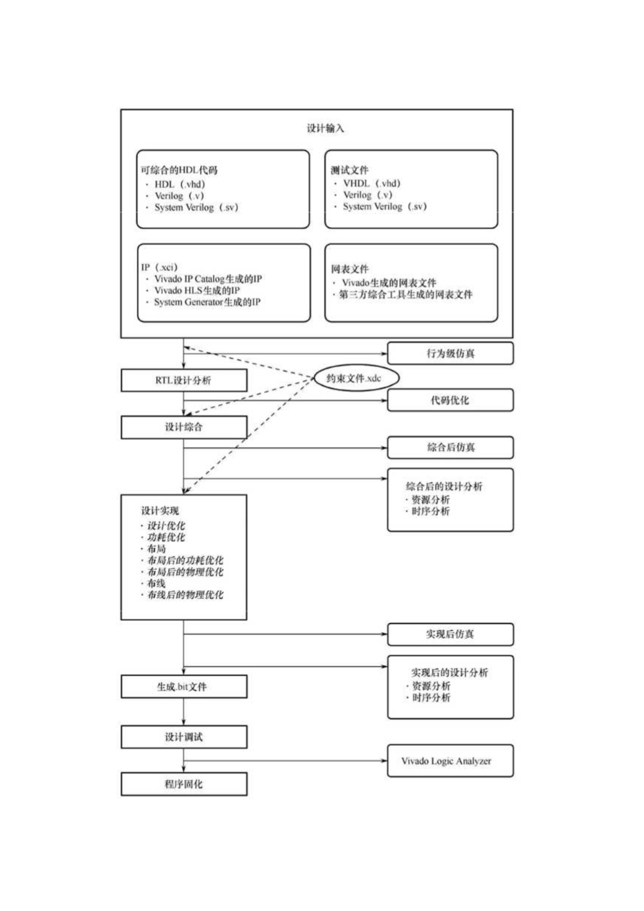
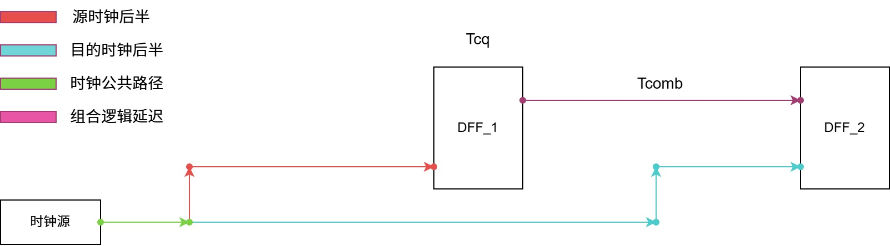
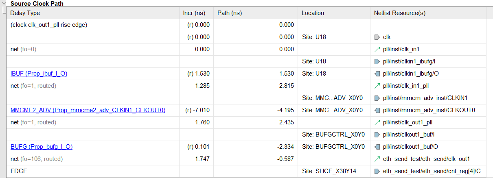
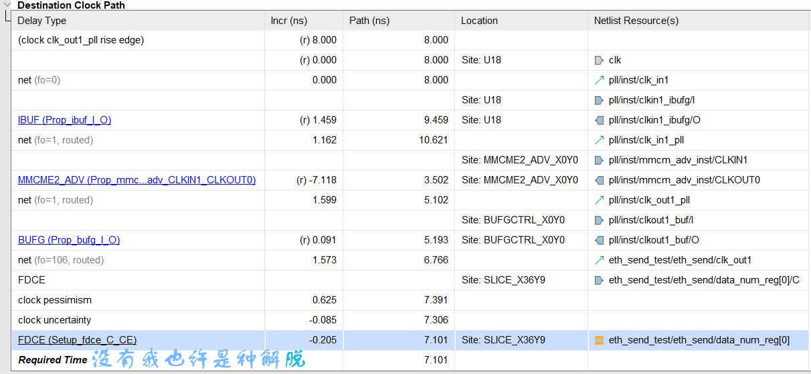
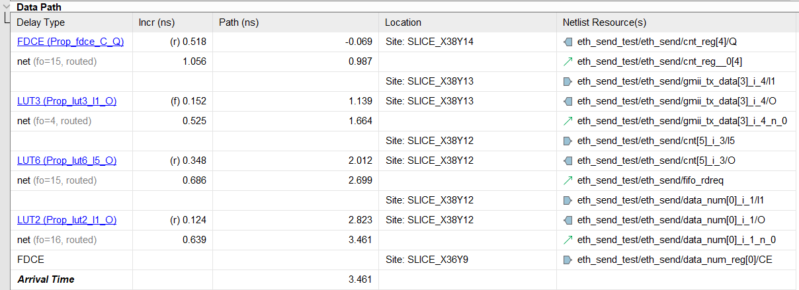
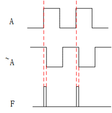
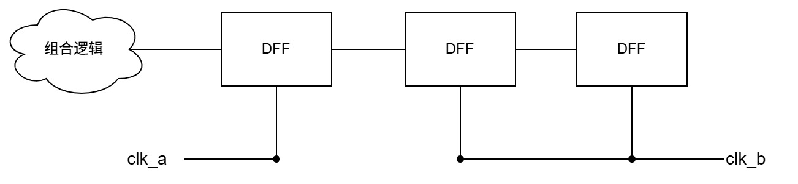

# **时序篇**




## **时序（基本时序、STA（Xilinx）、CDC处理）**

### **1.基本时序知识**

#### **1.1 深入理解综合工具与仿真器眼中的阻塞赋值与非阻塞赋值**

阻塞赋值：”=“表示，组合逻辑，输入变化更新驱动；

非阻塞赋值：”\<=“表示，时序逻辑，时钟有效沿更新驱动；

仿真器眼中的景色：

delta（阿拉伯字母Δ） cycle：

在事件驱动仿真器中（modelsim/vivado）中，仿真时间不连续，而是一系列事件调度点，而一个delta cycle的含义就是一个仿真时间点仿真器内部进行一个花费0时间的计算步骤，也就是说在一次触发点，时间不动，仿真器会先处理在这个触发点被触发的所有事件，把所有的赋值更新传播完毕，直到没有新的事件，再等待下一个触发点。

触发点：也就是触发计算的条件，一般包括always后面的敏感事件列表（比如时序逻辑的时钟有效沿和异步复位，以及组合逻辑的输入，包括assign和always组合逻辑块），以及initial一次性事件列表

计算步骤：纯组合逻辑事件的触发没什么好说的，算完就完事了，着重说明一下混合逻辑的计算顺序，

想要涉及到混合逻辑事件触发，触发条件必须是有效时钟沿

delta cycle阶段1：active阶段，计算并立刻更新所有的组合逻辑值，计算非阻塞赋值右侧的值并且将赋值事件挂起至NBA（no-blocking assignment）

delta cycle阶段2：NBA，提交非阻塞赋值

所有的NBA事件同时进行进行赋值

delta cycle阶段3：active更新阶段，彻底计算所有由阶段二带来的新的组合逻辑事件

按照这个逻辑可以正确理解所有的赋值计算

综合工具眼中：

阻塞赋值就是纯LUT+布线资源搭建的组合逻辑（bitstream文件就是这些对应ram查找表要存入的值），非阻塞赋值就是DFF

#### **1.2 同步与异步**

同步时钟：同源即可，即相位和频率有着稳定明确的相对关系，比如输入参考时钟和PLL/MMCM/BUFG输出的频率与相位都有变化的时钟也是同步时钟

异步时钟：非同源时钟，即使频率一致也无法肯定相位关系

同步时钟域下STA只需分析tsu与th，异步时钟域需要进行CDC处理

### **2.STA（静态时序分析）**

#### **2.1 tsu与th**

DFF由主从锁存器构成，时钟有效沿来临：前门关、后门开，前门关之前需要tsu来保证内部寄存值迅速收敛，关闭中需要th来保证DFF不会被一个模拟信号驱动收敛，不满足任意情况都会导致DFF进入亚稳态。

正常情况下：一个稳定处于数字阈值的信号驱动下一级DFF时能够使下一级DFF迅速收敛值驱动值，如果被一个模拟信号驱动就会进入了亚稳态。（如果面试时需要连贯说明亚稳态的话可以加一句”进入亚稳态之后“然后继续讲述下面的内容）

亚稳态：DFF寄存值暂时停留在一个处于0/1之间的模拟信号，随后会不可预测的向任意一个方向收敛。

如果驱动值不变，亚稳态的收敛趋势大概率是不会发生异常的（可以结合后面的单bit二级同步）

这里说明一下二级同步的作用：

二级同步确实会极大的降低第二级DFF出现亚稳态的概率，但是如果第一级DFF的收敛值出现了异常，下一级DFF的寄存值也是会出现异常的，所以说二级同步在很大程度上阻止亚稳态的传播，但是无法处理数据异常的问题。

相关术语

| 英文名                       | 中文意思                | 工程口语化理解                                               | 来源                                                         |
| ---------------------------- | ----------------------- | ------------------------------------------------------------ | ------------------------------------------------------------ |
| Clock Skew                   | 时钟偏移                | 不同寄存器的时钟到的早晚不一样，像接力赛有人提前跑，有人晚出发 | 时钟树布局路由延迟                                           |
| Clock Jitter                 | 时钟抖动                | 时钟质量不高导致时钟边沿到来的实际与理想的随机性或者周期性误差 | 晶振本身噪声PLL/MMCM抖动电源噪声/温度波动走线干扰（尤其是高速系统） |
| Setup Time                   | 建立时间                | 数据必须提前站好队，否则采样错                               |                                                              |
| Hold Time                    | 保持时间                | 采样完了还得站一会儿，别急着走                               |                                                              |
| Setup Violation              | 建立时间违例            | 数据跑得太慢，还没站好队时钟就采了                           |                                                              |
| Hold Violation               | 保持时间违例            | 数据跑得太快，采样完还没等够就跑了                           |                                                              |
| Positive Skew                | 正偏移                  | 第二级时钟到得更晚（Setup 友好，Hold 危险）                  |                                                              |
| Negative Skew                | 负偏移                  | 第二级时钟到得更早（Hold 友好，Setup 危险）                  |                                                              |
| Tcq                          | 寄存器时钟到输出延迟    | 时钟一来，寄存器吐出数据的时间                               |                                                              |
| Tcomb                        | 组合逻辑延迟            | 数据经过门电路/布线花的时间                                  |                                                              |
| Tpd                          | 传播延迟                | 总延迟，含寄存器+组合逻辑+布线                               |                                                              |
| Slack                        | 时序裕量                | 离违例还差多少时间（正的=安全，负的=危险）                   |                                                              |
| Critical Path                | 临界路径                | 整个设计中最慢的那条数据路，决定最大频率                     |                                                              |
| WNS (Worst Negative Slack)   | 最差负裕量              | 最严重的 setup 问题，负得越大越危险                          |                                                              |
| TNS (Total Negative Slack)   | 总负裕量                | 所有路径负 slack 的总和，量化时序问题规模                    |                                                              |
| Unconstrained Path           | 未约束路径              | Vivado 不知道这条路要多快跑（没写约束）                      |                                                              |
| False Path                   | 假路径                  | 时序分析可以忽略的路径（比如异步复位）                       |                                                              |
| Multicycle Path              | 多周期路径              | 允许这条路径跑多个时钟周期再采样                             |                                                              |
| Metastability                | 亚稳态                  | 数据卡在“0/1之间的尴尬区”不确定                              |                                                              |
| capture_edge_time            | 源采样沿                |                                                              |                                                              |
| destination_clock_path_delay | 时钟源到第二级DFF的延迟 |                                                              |                                                              |
| launch_edge_time             | 源发射沿                |                                                              |                                                              |
| source_clock_path_delay      | 时钟源到第一级DFF的延迟 |                                                              |                                                              |
| data_path_delay              | 数据路径延迟            | 包含tcq和tcomb和布线延迟                                     |                                                              |
| clock_uncertainty            | 时钟不确定度            |                                                              |                                                              |
| MAX data_arrival_skew        | 最大数据到达skew        | 多个数据路径到达同一组寄存器的最大延迟与最小延迟之差         |                                                              |

#### **2.2 vivado STA全面分析**

##### **（1）sta的总体框架**

目的：静态计算所有被约束的路径在最好/最坏情况下是否满足时序（su为max-delay，h相反）

输出slack、WNS/TNS等

路径分析：reg to reg、input to reg（pad to reg）、reg to output（reg to pad）

##### **（2）核心公式与分析流程**

这部分需要对时序与寄存器的tsu/th有一定的理解会很好看懂，如果对时序相关的内容完全不理解还是不好理解的

时序分析的关键在于是否能够保证第二级寄存器的tsu与th

Reg to reg示意图



set up（max delay）：

data_required_time(set up)=capture_edge_time+destination_clock_path_delay-clock_uncertainty-set_up_time

data_arrived_time(set up)=launch_edge_time+source_clock_path_delay+data_path_delay

tsu_slack=data_required_time(set up)-data_arrived_time(set up)=period-tcq-tcomb-tsu-(uncertainty)+clock_skew

hold （min delay）：

data_required_time(hold)=capture_edge_time+destination_clock_path_delay+clock_uncertainty+hold_time

data_arrived_time(hold)=launch_edge_time+source_clock_path_delay+data_path_delay

th_slack=data_arrived_time(hold)-data_required_time(hold)=source_clock_path_delay+data_path_delay-（destination_clock_path_delay+clock_uncertainty+hold_time

| 注释                                                 |                                                              |
| ---------------------------------------------------- | ------------------------------------------------------------ |
| **data_required_time**                               | 这里最好翻译为数据被取得的时间，代表数据被寄存的时间，等于捕捉沿时间（相对发射沿晚一个周期），然后加上目的时钟路径延迟，减去时钟不确定度（因为是slack_tsu的计算需要保证最严苛），然后再减去tsu，保证采到稳定的数据 |
| destination_clock_path_delay/source_clock_path_delay | 目的时钟路径与源时钟路径：时钟从同一个源出发，有一段重合路径，然后分出一条驱动第一级寄存器，另一条继续布线驱动下一级寄存器，两者之差为clock_skew，时钟偏移 |
| data_arrived_time                                    | 数据到达时间，也就是从发射沿开始，数据多久到达下一级寄存器的输入 |

注：说明一下STA分析工具选择launch沿与capture沿的逻辑

对于直接布线：tsu下的launch_edge_time任意选择，capture_edge_time会选择相邻的下一个边沿，而th下的launch_edge_time与capture_edge_time则会选择同一个边沿

对于同一个源时钟与经过时钟管理单元移相后的时钟分别作为上下级DFF的时钟来说：

无论正偏还是负偏，STA工具在任意选定launch_edge后会检测时钟路径下最近的下一个有效沿，比如正偏30°后的时钟被作为时钟路径的下一级DFF的驱动时钟，下一个有效沿就是30°后的这个时钟沿，所以在单沿触发的情况下如果有移相需求一般都会采用负偏一个较小的度数

**终极规律就是在多选择的情况下总会选择对tsu最严苛的时序条件做STA分析**

**这边拿一个vivado的时序报告作为解说例子(reg to reg)：**

一张时序报告有些长，分块截取解释：

TSU:

source_clock_path

源时钟路径和上文的含义一致，起始时间点为0，中间经过了net（布线延迟），过了一个IBUF，过了一个MMCM，然后经过一个BUFG（接入全局时钟网络），最后经过net接入第一级DFF（FDCE，其实就是D触发器的原语）



destination_clock_path

目的时钟路径有一些出入，它将发射沿与寄存沿之差，也就是一个周期包含在内了，也就是起始时间点为8ns（本路径驱动时钟的一个周期-\>125M），先后的经过就不说了，最后到达第二级寄存器的时间为最后的require time也就是采样时间

最后相对源时钟路径会多出时钟补偿和时钟不确定度两项，其中时钟不确定度为工具内部的模型，也就是器件本身进行计算的不确定度，其正负的选择，或者存在位置总是会使最终的余量小的方向发展，也就是保证更苛刻的时序分析环境，保证实际的时序安全，**时钟补偿可以参考后文的解析，同时也是结果有一定偏差的原因**

最后一项看上去是直接穿过了第二级寄存器，实际是减去了tsu



data_path

从一上来就是过DFF的延迟，也就是Tcq，然后后面的都属于Tcomd，也就是逻辑延迟，为什么过DFF后增量0.518ns之后的结果为负值：0.518就是该计算过程中的Tcq模型的延迟，为什么经过这个增量之后还是负值，因为起始点要相对发射沿，之前选择的0点并不是发射沿，而是源时钟起点，所以此处的初值应该是一个负值，也就是相对相对源时钟起点的数据路径延迟要小一些延迟的含义，可以看到源时钟路径延迟为-0.587，直接以此为起点，经过0.518的Tcq之后正好为-0.069



总结来说源时钟路径计算结果为数据路径的起点，目的时钟路径延迟为**安全**采样时间点的计算，两者之差为slack_tsu，也就是建立时间余量

Th的计算就不赘述了，主要区别就是采用的模型不同，一般选择最短延迟使时序环境更加苛刻，另一个差异点为目的时钟路径的起点为0，而不是时钟周期，也就是Th的含义，采样时间会延迟一个周期，数据会保持一个周期，抵消掉了，工具在此处进行这个操作隐含了这个意义

##### **（3）vivado如何选用时钟路径/网表延迟**

底层原则：延迟模型选用总是为了模拟最严苛的时序条件（时间余量最小）

tsu：源时钟延迟（Source Clock Delay, SCD）选择最大模型，目的时钟延迟（Destination Clock Delay, DCD）选择最小，数据延迟（Data Path Delay，包括Tcq、Tcomb、Tpd）选择最大模型

th：与tsu完全相反，懒得码字了

##### **（4）时钟偏移（clock skew）与时钟不确定度（clock uncertainty）**

clock skew：SCD-DCD

clock uncertainty：包含时钟抖动（clock jitter）、MMCM/PLL误差、人为添加不确定约束

STA工具在tsu中减去clock uncertainty在th中加上都是为了使时序分析更加严苛

##### **（5）时钟悲观度**

STA工具在计算SCD与DCD时分别采用MAX和MIN（tsu中），如果源时钟与目的时钟在物理上存在一段重合的路径，即common clock path，这会造成over-pessimism

vivado会检测最后公共节点（common node）并在时序分析的最终阶段进行时钟补偿记入timing报表

CPR补偿取决于common node，在综合，布线前和布局后common node的位置也会发生变化，CPR的补偿值也会跟随变化，换言之CPR只能补偿common node之前的重复值

依旧满足终极规律，只不过还是会对有十足把握的过分苛刻进行补偿

##### **（6）常用时序路径类型**

reg to reg:芯片内部分析，前文已详细展开

input to reg ：外部输入约束

output to reg：内部输出约束

async_path：片内异步分析

对于IO约束，先介绍同步方式

系统同步：几乎已经淘汰，整个板卡或者系统共同采用外部时钟，例如板上晶振通过走线驱动所有的时序芯片

源同步：芯片交互时主设备提供数据和与数据同步的时钟通过板级布线传输给从设备，适合相对较短的布线传输，能满足较高带宽的需求场景，对布线的要求很高，最常见的PC主板上的DDR内存，一些中低速ADDA芯片

高速串行总线：芯片交互时只有数据线，线速率可达Gb数量级，接收方采用CDR时钟恢复技术提取同步时钟并转化为并行数据流，适合较长的数据传输，带宽很高但是不如源同步，采用差分传输，抗干扰性相对较高，常见的如PC主板的pcie总线，高速ADDA接口，10G以太网（光纤接口），SATA，USB等

IO约束是基于源同步的数据与时钟的板级走线延迟来约束的

以input to reg为例，外部提供时钟与同步的16为并行数据线，16根数据线中相对时钟到达芯片物理管脚的最大和最小延迟分别为max input delay和min input delay，这两个参数是STA分析工具与布局布线工具不知道的，需要人为给出相关约束参数来进行布局布线和STA分析

常见时钟类型：

| 时钟类型                 | 定义                                               | 使用建议                                                     |
| ------------------------ | -------------------------------------------------- | ------------------------------------------------------------ |
| 全局时钟 (Global Clock)  | 所有逻辑共用一个时钟源，通过 FPGA 全局时钟网络驱动 | 建议尽量使用全局时钟                                         |
| 局部时钟 (Local Clock)   | 仅部分逻辑使用的时钟                               | 按需使用，减少时钟网络压力                                   |
| 门控时钟 (Gated Clock)   | 用逻辑门控制时钟开启/关闭                          | 不推荐在 RTL 里直接用组合逻辑门控时钟，应使用 enable 信号 + 寄存器，而不是门控真实时钟 |
| 行波时钟（ripple clock） | 将翻转的寄存器当作时钟使用                         | 不推荐使用，传播延迟不稳定，容易引起呀问题                   |

async path相关术语

| 类别       | 术语                              | 含义                                                      | 在 Vivado STA 中的作用 / 约束方法                            |
| ---------- | --------------------------------- | --------------------------------------------------------- | ------------------------------------------------------------ |
| 基本 STA   | Arrival Time                      | 数据沿到达采样点的实际时间（= 发射时钟沿 + 数据路径延迟） | report_timing 中显示，工具自动计算                           |
|            | Required Time                     | 数据必须到达的最晚时间（= 采样时钟沿 – setup margin）     | 工具自动计算，受 create_clock / set_input_delay / set_output_delay 等影响 |
|            | Slack                             | Required Time – Arrival Time，表示时序裕量                | Slack < 0 报违例；Slack > 0 表示满足                         |
|            | Setup Time (tSU)                  | DFF 在采样沿之前数据必须稳定的时间                        | 用于 setup check，库模型定义                                 |
|            | Hold Time (tH)                    | DFF 在采样沿之后数据必须保持的时间                        | 用于 hold check                                              |
|            | Recovery Time                     | 异步控制信号（如 reset）释放到时钟采样沿之间的最小间隔    | Vivado 会做 recovery check；必要时用 set_false_path -to [get_pins rst_reg/D] 屏蔽 |
|            | Removal Time                      | 异步控制信号撤销后必须保持的时间                          | 与 recovery 成对出现，Vivado 会报告 violation                |
| 异步时钟域 | Asynchronous Clock                | 无固定相位/频率关系的时钟                                 | set_clock_groups -asynchronous 指定                          |
|            | CDC (Clock Domain Crossing)       | 信号跨不同时钟域传输                                      | 需依赖同步电路（2FF / FIFO / Handshake）                     |
|            | False Path                        | 功能上无意义的路径，工具默认会分析                        | set_false_path -from [get_clocks A] -to [get_clocks B]       |
|            | Multicycle Path                   | 功能允许数据多周期到达                                    | set_multicycle_path N -setup/-hold                           |
|            | Pessimism                         | STA 工具在分析不确定时钟关系时采用最坏情况假设            | Vivado 内置，常用 set_clock_groups 或 false_path 消除        |
| 亚稳态相关 | Metastability                     | 触发器在 setup/hold 违反时进入的中间态                    | 无法避免，只能降低概率                                       |
|            | MTBF (Mean Time Between Failures) | 平均故障间隔时间，用于评估亚稳态影响                      | 依赖同步电路设计、工艺、频率计算                             |
|            | Synchronization                   | 使用电路结构降低亚稳态传播风险                            | 常用 2FF、Handshake、Gray code FIFO                          |
| 跨时钟电路 | 2-FF Synchronizer                 | 串联两个寄存器同步单比特信号                              | 最常见的 CDC 手段                                            |
|            | Handshake                         | req/ack 信号跨域交互，保证数据一致                        | 常用于低速控制信号跨域                                       |
|            | Gray Code                         | 相邻码只有 1 位不同                                       | 异步 FIFO 指针同步                                           |
|            | Async FIFO                        | 用 Gray code + 双口存储器解决跨域数据传输                 | Vivado 提供成熟 IP                                           |
| 信号完整性 | Glitch                            | 组合逻辑延迟差导致的瞬态毛刺                              | 跨域前必须寄存去除毛刺                                       |
|            | Asynchronous Reset                | 不依赖时钟的复位信号                                      | Vivado 默认做 recovery/removal 检查，常屏蔽路径              |

##### **（7）常用时序约束**

先说明一下多时钟约束：

主时钟：常常为外部晶振通过pin进入FPGA内部经过create_clock后作为主时钟，STA工具通过这个时钟切入推导后续的派生时钟。

派生时钟：PLL/MMCM/BUFG输出时钟，所有的派生时钟都要有create_generated_clock约束

寄存器/逻辑自造时钟：不好，尽量别用

输出时钟：做好IO约束

注：主时钟最好只有1个，也就是只有一句create_clock约束，如果需要两个时钟，外部输入了两个时钟来使用，如果确定没有CDC，需要明确进行set_clock_groups -asynchronous -group {clkA} -group {clkB}约束告知STA工具两个时钟完全独立，如果有CDC，则需要进行相关CDC处理

多时钟约束参考表格：

| 场景                                                         | 时钟关系 | 跨域方式                                    | 约束写法                                                     | 说明                                                         |
| ------------------------------------------------------------ | -------- | ------------------------------------------- | ------------------------------------------------------------ | ------------------------------------------------------------ |
| 1. 两个都由同一个主时钟派生（如 100 MHz 主时钟 → 分频 50 MHz，PLL 倍频 200 MHz） | 相关时钟 | RTL 同步逻辑（比如 enable、FSM）            | create_clock + create_generated_clock，不要异步声明          | Vivado 知道时钟关系，可以做 setup/hold 检查                  |
| 2. 一个主时钟，一个是它的派生时钟（比如 clk 和 clk/2）       | 相关时钟 | 用 Verilog 逻辑跨域（比如直接用 flop 打拍） | create_generated_clock，不要异步声明                         | 工具能分析，STA有效                                          |
| 3. 一个主时钟，一个派生时钟（比如 clk 和 clk/2）             | 相关时钟 | 用 FIFO / RAM 跨域                          | 时钟仍 create_generated_clock，但跨 FIFO/RAM 的路径要 set_false_path 或 set_clock_groups -asynchronous | 因为 FIFO/RAM 本身已经是安全 CDC 电路，不需要 STA            |
| 4. 两个完全独立主时钟（比如外部给你两个不同源头的时钟）      | 独立时钟 | 用 RTL 跨域（双打拍、握手协议）             | set_clock_groups -asynchronous -group {clkA} -group {clkB}   | 工具不做检查，靠你自己 RTL 保证或者不加异步约束，让STA工具进行基本的跨时钟域检测，初步排查漏洞 |
| 5. 两个完全独立主时钟                                        | 独立时钟 | 用 FIFO / RAM 跨域                          | set_clock_groups -asynchronous                               | 同上，STA 不分析，安全由 FIFO 电路保证                       |

同步路径：

| 约束类别                 | 约束命令                    | 主要作用                                                    | 应用场景 / 示例                                              |
| ------------------------ | --------------------------- | ----------------------------------------------------------- | ------------------------------------------------------------ |
| 时钟定义                 | create_clock                | 定义输入主时钟的周期、占空比                                | create_clock -period 10 -name sys_clk [get_ports clk]        |
|                          | create_generated_clock      | 定义由 MMCM/PLL、分频器产生的派生时钟                       | create_generated_clock -source [get_pins mmcm/CLKIN] -divide_by 2 [get_pins mmcm/CLKOUT] |
|                          | set_clock_uncertainty       | 设置时钟抖动/偏差                                           | set_clock_uncertainty 0.2 [get_clocks sys_clk]               |
|                          | set_clock_groups -exclusive | 指定时钟组互斥（同域不同分支）                              | 派生时钟，非同时激活                                         |
| 寄存器到寄存器 (reg→reg) | （自动分析）                | 定义好时钟后，Vivado 自动对同域寄存器路径做 setup/hold 检查 | 默认行为，无需额外约束                                       |
| 输入到寄存器 (io→reg)    | set_input_delay             | 指定外部数据相对参考时钟的到达时间（max=setup，min=hold）   | set_input_delay -clock [get_clocks sys_clk] -max 3.0 [get_ports din] |
| 寄存器到输出 (reg→io)    | set_output_delay            | 指定 FPGA 输出数据相对参考时钟的要求                        | set_output_delay -clock [get_clocks sys_clk] -max 4.0 [get_ports dout] |
| 多周期路径               | set_multicycle_path         | 放宽路径时序要求，允许跨多个周期                            | set_multicycle_path 2 -setup -from A -to B                   |
| 例外路径                 | set_false_path              | 忽略不需要 STA 的路径                                       | 调试逻辑 / 测试寄存器 / 异步复位                             |
| 虚拟时钟                 | create_clock（不绑定端口）  | 建模外部设备时钟，用于 IO 时序约束                          | create_clock -period 8 -name virt_clk + IO delay             |

异步路径：

| 约束类别              | 约束命令                                               | 主要作用                                                     | 应用场景 / 示例                                              |
| --------------------- | ------------------------------------------------------ | ------------------------------------------------------------ | ------------------------------------------------------------ |
| 异步时钟分组          | set_clock_groups -asynchronous                         | 指定两个（或多个）时钟域无固定相位/频率关系，禁止 STA 对其交叉路径做 setup/hold 分析 | set_clock_groups -asynchronous -group {clkA} -group {clkB}   |
| 例外路径：忽略分析    | set_false_path                                         | 指定 STA 忽略特定跨域路径（不做时序检查）                    | 用于 CDC 同步寄存器链 set_false_path -from [get_cells sync_ff1] -to [get_cells sync_ff2] |
| 最大/最小延迟限制     | set_max_delay / set_min_delay                          | 对异步控制/握手信号加上松散的时序要求，防止路径过长          | set_max_delay 20 -from [get_ports async_req] -to [get_cells sync_logic/*] |
| 多周期路径            | set_multicycle_path                                    | 当异步域交互信号通过握手协议时，可人为放宽要求               | set_multicycle_path 2 -setup -from [get_cells req_reg] -to [get_cells ack_reg] |
| Recovery/Removal 检查 | （Vivado 默认进行）可用 set_false_path 屏蔽            | 用于异步复位/置位信号，要求在时钟沿到来前后满足 recovery/removal 时间 | 若复位不参与 STA：set_false_path -to [get_pins rst_reg/D]    |
| 虚拟时钟约束          | create_clock（虚拟时钟）+ IO 延时约束                  | 对跨异步域的接口建模                                         | 如 DDR/跨 FPGA 异步接口时常用                                |
| 输入输出例外          | set_input_delay / set_output_delay 配合 set_false_path | 外部异步接口建模 + 禁止 STA 报告伪路径                       | set_input_delay -clock virt_clk ... + set_false_path         |

##### **（8）时序违例处理方案**

常见做法，如果是局部组合逻辑过长可以采用流水线处理，或者调用相关IP进行合理化处理

如果是大面积时序出现错位，那必然是需要时钟管理单元进行相位调整，典型案例可以参考协议篇以太网协议下的黄子案例解读

### **间章 竞争与冒险**

多路组合逻辑由于走线延迟不同导致下一级信号出现异常脉冲的情况称为竞争与冒险，或者说产生毛刺

毛刺：电平稳定期间突然出现短暂翻转称为毛刺，竞争与冒险是毛刺的来源之一



回沟与台阶：

回沟指边沿中间掉下去一下，爬升中突然凹陷，常见于阻抗不匹配或串扰

台阶指爬升出现阶梯状，常见于驱动能力不足/过冲以及分布电容导致

数据有效宽度：非模拟范围，或者说判断为01逻辑的电平持续时间

数据信号要保证稳定宽度，避免毛刺

时钟信号更苛刻，边沿必须单调无回沟和台阶

### **3.CDC（跨时钟域处理）**

#### **3.1单bit处理**

##### **（1）二级同步：**

适合慢时钟域到快时钟域的传播，只能在很大程度上阻止亚稳态的传播，还是有概率出现短暂数据异常。

必须极力阻止亚稳态的传播，对于单bit来说即使亚稳态的收敛值并不符合预期，由于出现异常的情况很大概率都是bit翻转导致的，所以即使出现异常也只是单bit信号传播有不同的时延而已，但是对于多bit来说，如果多位数据同时出现亚稳态，则会导致脏数据的产生，这是要极力阻止的，所以涉及到多bit跨时钟域传输时async_fifo中采用的gray码是十分典型的案例

注：组合逻辑竞争冒险产生的毛刺可能会被clk_b采样到，需要源时钟域采用DFF吸收毛刺，二级同步的第一级输入端一定不要是第一个时钟域的组合逻辑，一定是直接对第一个时钟域驱动的DFF的直接取值，如果需要对接组合逻辑也一定要先过一个第一个时钟域的DFF



图中的clk_a时钟域下的组合逻辑不可以直接驱动clk_b时钟域下的第一级DFF（竞争与冒险会带来毛刺），需要先进入clk_a下的一级DFF才可以进行二级同步

二级同步对亚稳态的抑制效果：第二级寄存器在数学上已经极大的降低了亚稳态传播的概率，最具性价比，有相关公式，不做展开了

##### **（2）脉冲同步器：**

类似于握手信号，快时钟域的信号慢时钟大概率无法采集，所以需要快时钟域将信号进行脉冲展宽，二级同步至慢时钟域，慢时钟域反馈一个信号，经过二级同步进入快时钟域，快时钟在脉冲拉高后必须保持稳定等待慢时钟的反馈

##### **（3）握手对处理：**

快-\>慢/慢-\>快都可以，类似于AXI的握手信号

##### **（4）异步复位同步释放：**

```verilog
//功能：异步复位同步释放
    always @(posedge clk or negedge rst_async_n)
    begin
        if(!rst_async_n)begin
            //异步复位：当外部复位信号有效时，立即将两个寄存器复位
            {rst_reg2,rst_reg1}<=2'b00;
        end
        else
        begin
            {rst_reg2,rst_reg1}<={rst_reg1,1'b1};
            //同步释放：当外部复位解除后，信号逐级传递
        end
    end
    //第二个寄存器的输出就是同步后的复位信号
    assign rst_sync_n=rst_reg2;
```

复位信号往往是超多扇出，如果复位解除时进入了亚稳态，可能会导致系统无法做到同时解除复位（同时进入工作状态）导致系统错误

##### **（5）复位策略（补充说明）**

常见同步复位异步复位以及前文的异步复位同步释放

终极目标就是要保证启动复位与解除复位时如果所有寄存器并未同时触发（亚稳态的锅）不会导致系统异常

#### **3.2多bit处理**

##### **（1）少量信号传输**

少量信号传输可以采用握手的方式传输，降低fifo资源压力。

##### **（2）async_fifo**

gray码与bin码（n位）

bin-\>gray：

```verilog
//功能：二进制码转格雷码
integer i;
assign gary[n]=bin[n];
for(i=0;i<n;i=i+1)
begin
    assign gray[i]=bin[i]^bin[i+1];
end
//或者下面的方式
assign gray[n-1:0]=bin[n-1:0]^(bin[n-1:0>>1]);
```

gray-\>bin:

```verilog
//功能：格雷码转二进制码
integer i;
for(i=0;i<n;i=i+1)
begin
    assign bin[i]=^gray[n:i];
end
//gray->bin用一句话实现不现实，bin的每一位都需要最高位到这一位的归约异或值
//归约异或是一对bit一对bit计算的，不是看所有的bit来得到最后逻辑结果的，且所有按位逻辑都是一次一次来的
//只不过与和或的逻辑结果会有特别点所有才会有简便计算方式，而且对于1个bit的归约异或结果是本身
```

小问题：如何在gray码域+1，一般来说都是转为二进制+1然后再转回来，直接+1很麻烦

```verilog
//功能：async_fifo io
    //wr
    input                           i_wclk    ,
    input                           i_wrstn   ,
    input                           i_wren    ,
    input  [WIDTH-1:0]              i_wdata   ,
    //rd
    input                           i_rclk    ,
    input                           i_rrstn   ,
    input                           i_rden    ,
    output [WIDTH-1:0]              o_rdata   ,

    output                          o_full    ,
    output                          o_empty
```


```verilog
//功能：定义读写指针和读写地址：读写指针比读写地址宽一位，用于进行空满判断
  reg [clogb2(DEPTH-1)    :0]       r_wrptr     ; //[6:0]写指针
  reg [clogb2(DEPTH-1)    :0]       r_rdptr     ; //[6:0]读指针
  wire[clogb2(DEPTH-1)-1  :0]       w_wraddr    ; //[5:0]写地址
  wire[clogb2(DEPTH-1)-1  :0]       w_rdaddr    ; //[5:0]读地址

  assign   w_wraddr = r_wrptr[clogb2(DEPTH-1)-1  :0] ;
  assign   w_rdaddr = r_rdptr[clogb2(DEPTH-1)-1  :0] ;
```

读使能&不空读指针+1，写使能&不满写指针+1

读写指针转gray码（组合逻辑转/时序逻辑转都可以，看时序要求）

对gray码读/写指针分别进行二级同步到写/读时钟域进行满/空判断（绿色字体顺序严格对齐）

关键说明满空判断：

```verilog
//功能：空满判断  
  //在rd_clk下产生的信号
  assign  o_empty = (w_rdptr_gray == r_wrptr_gray_d1);

  //在wr_clk下产生的信号
  assign  o_full  = (w_wrptr_gray == {~r_rdptr_gray_d1[clogb2(DEPTH-1):clogb2(DEPTH-1)-1],r_rdptr_gray_d1[clogb2(DEPTH-1)-2:0]}) ;
```

空标志：对应bin读写指针完全一致（最高位也要一样才表明在同一圈），转为gray码之后特征gray读写指针完全一致

满标志：对应bin读写读写指针最高位相反，其余位一致，由于gray码最高位与bin码永远是一致的，所以满判断条件之一为gray码最高位相反，由于gray码次高位是由bin码最高位和次高为异或得来的，所以bin码最高位取反时，gray码的次高位也会取反，剩下的位bin码没变，gray码自然也就不变，所以才有了上面的满判断逻辑

最后调用双端口RAM，注意读使能为fifo读使能&（！empty），写使能为fifo写使能&（！full）

分析读写指针覆盖问题：

读/空判断：当fifo空（已稳定）时，空有效，此时必须不可读取（包括ram的设计，即使读有效也不会读取），当写入一次后，写指针发生变化，通过gray码传递至读时钟域，有一定的延迟，之后进行读取是不会出现异常情况的，延迟报不空

写/满判断：当fifo满（已稳定）时，满有效，同上文判断，会出现延迟报不满的情况

总结：gray码二级同步将多bit亚稳态脏数据问题转化为了单bit的延迟，同时二级同步延迟还可以保证读写指针不会覆盖的问题（延迟报不空，延迟报不满）

最后进行极端情况讨论：

如果已经满了（假设时写指针追赶上了读指针，也就是说当前地址正在等待读取），进行一次读取，读指针刚开始进行变化同时将这个这个地址存储的数据开始驱动目的寄存器，在读指针整个亚稳态的过度区间，假设写时钟十分十分的快，迅速完成了二级同步，并且亚稳态的收敛第一次就收敛出来了更新后的读指针并给出不满的判断然后在当前地址的数据正在驱动目的寄存器的时候迅速的进行了数据写任务，这会导致读取的数据出现异常吧

这种情况首先就需要在th时间（0.5ns级别）内写时钟至少要完成4个周期，这样求写时钟要接近10Ghz，有点太变态了

其实也可以牺牲容量避免这种情况，比如空满判断时预留一个或两个地址，更提前报满报空。

最后附一份异步fifo的实现代码（同步fifo自己写去）

```verilog
//功能：async_fifo实现
module async_fifo #(
    parameter DEPTH = 64 , //0--63  6bit[5:0]
    parameter WIDTH = 16
  )(
    //wr
    input                           i_wclk    ,
    input                           i_wrstn   ,
    input                           i_wren    ,
    input  [WIDTH-1:0]              i_wdata   ,
    //rd
    input                           i_rclk    ,
    input                           i_rrstn   ,
    input                           i_rden    ,
    output [WIDTH-1:0]              o_rdata   ,

    output                          o_full    ,
    output                          o_empty
  );

  reg [clogb2(DEPTH-1)    :0]       r_wrptr     ; //[6:0]写指针
  reg [clogb2(DEPTH-1)    :0]       r_rdptr     ; //[6:0]读指针
  wire[clogb2(DEPTH-1)-1  :0]       w_wraddr    ; //[5:0]写地址
  wire[clogb2(DEPTH-1)-1  :0]       w_rdaddr    ; //[5:0]读地址

  assign   w_wraddr = r_wrptr[clogb2(DEPTH-1)-1  :0] ;
  assign   w_rdaddr = r_rdptr[clogb2(DEPTH-1)-1  :0] ;

  always @(posedge i_wclk or negedge i_wrstn)
  begin
    if(!i_wrstn)
      r_wrptr   <=  'd0 ;
    else if(i_wren && !o_full)
      r_wrptr   <=  r_wrptr + 1'b1 ;
    else
      r_wrptr   <=  r_wrptr ;
  end

  always @(posedge i_rclk or negedge i_rrstn)
  begin
    if(!i_rrstn)
      r_rdptr   <=  'd0 ;
    else if(i_rden && !o_empty)
      r_rdptr   <=  r_rdptr + 1'b1 ;
    else
      r_rdptr   <=  r_rdptr ;
  end

  //使用时序逻辑转化成格雷码，降低组合逻辑延迟
  //有利于综合之后时钟跑的更快
  wire [clogb2(DEPTH-1)    :0]       w_wrptr_gray     ;//格雷码写指针
  wire [clogb2(DEPTH-1)    :0]       w_rdptr_gray     ;//格雷码读指针

  assign w_wrptr_gray = r_wrptr ^ (r_wrptr>>1);
  assign w_rdptr_gray = r_rdptr ^ (r_rdptr>>1);

  /*
  always @(posedge i_wclk or negedge i_wrstn) begin
      if(!i_wrstn)
          r_wrptr_gray  <=  'd0 ;
      else 
          r_wrptr_gray  <=  r_wrptr ^ (r_wrptr>>1);
  end
   
  always @(posedge i_rclk or negedge i_rrstn) begin
      if(!i_rrstn)
          r_rdptr_gray  <=  'd0 ;
      else 
          r_rdptr_gray  <=  r_rdptr ^ (r_rdptr>>1);
  end
  */

  //单bit跨时钟域CDC
  reg [clogb2(DEPTH-1)    :0]       r_rdptr_gray_d0     ;
  reg [clogb2(DEPTH-1)    :0]       r_rdptr_gray_d1     ;//写时钟域下的读指针
  always @(posedge i_wclk or negedge i_wrstn)
  begin
    if(!i_wrstn)
    begin
      r_rdptr_gray_d0  <=  'd0 ;
      r_rdptr_gray_d1  <=  'd0 ;
    end
    else
    begin
      r_rdptr_gray_d0  <=  w_rdptr_gray    ;
      r_rdptr_gray_d1  <=  r_rdptr_gray_d0 ;
    end
  end

  reg [clogb2(DEPTH-1)    :0]       r_wrptr_gray_d0     ;
  reg [clogb2(DEPTH-1)    :0]       r_wrptr_gray_d1     ;//读时钟域下的写指针
  always @(posedge i_rclk or negedge i_rrstn)
  begin
    if(!i_rrstn)
    begin
      r_wrptr_gray_d0  <=  'd0 ;
      r_wrptr_gray_d1  <=  'd0 ;
    end
    else
    begin
      r_wrptr_gray_d0  <=  w_wrptr_gray    ;
      r_wrptr_gray_d1  <=  r_wrptr_gray_d0 ;
    end
  end

  //在rd_clk下产生的信号
  assign  o_empty = (w_rdptr_gray == r_wrptr_gray_d1);

  //在wr_clk下产生的信号
  assign  o_full  = (w_wrptr_gray == {~r_rdptr_gray_d1[clogb2(DEPTH-1):clogb2(DEPTH-1)-1],r_rdptr_gray_d1[clogb2(DEPTH-1)-2:0]}) ;

  ram #(
        .DATA_WIDTH (WIDTH) ,
        .DATA_DEPTH (DEPTH)
      )
      u_ram(
        .i_wrclk ( i_wclk   ),
        .i_wrstn ( i_wrstn  ),
        .i_wren  ( ~o_full  && i_wren   ),
        .i_waddr ( w_wraddr ),
        .i_wdata ( i_wdata  ),
        .i_rdclk ( i_rclk   ),
        .i_rdrstn( i_rrstn  ),
        .i_rden  ( ~o_empty && i_rden   ),
        .i_raddr ( w_rdaddr ),
        .o_rdata ( o_rdata  )
      );

  function integer clogb2(input integer number);
    begin
      for(clogb2 = 0 ; number > 0 ; clogb2 = clogb2 + 1 )
        number = number >> 1;
    end
  endfunction

endmodule

```

#### **fifo深度计算**

理论来说严格遵守fifo空满标志位是完全不会出现fifo异常的，但是如果出现fifo空满标志位反复出现时，读写端必须反复停下手头的工作，会严重降低效率，所以选择合适的fifo深度是为了尽量降低空满情况，提高效率

实际计算：深度...
