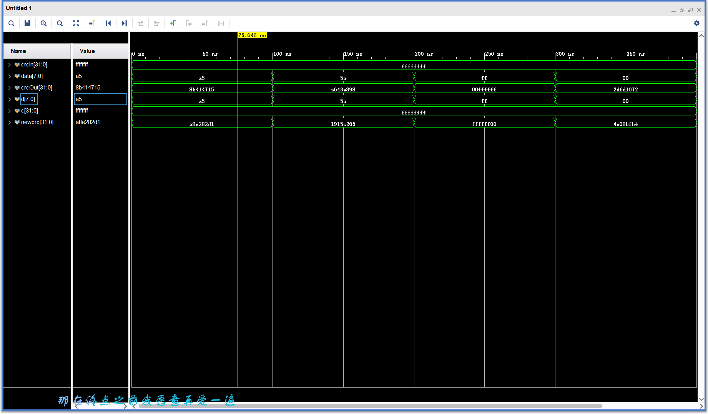
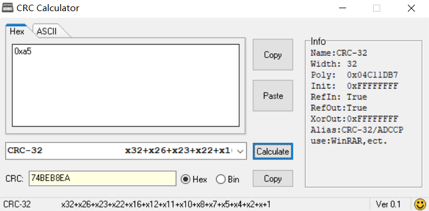
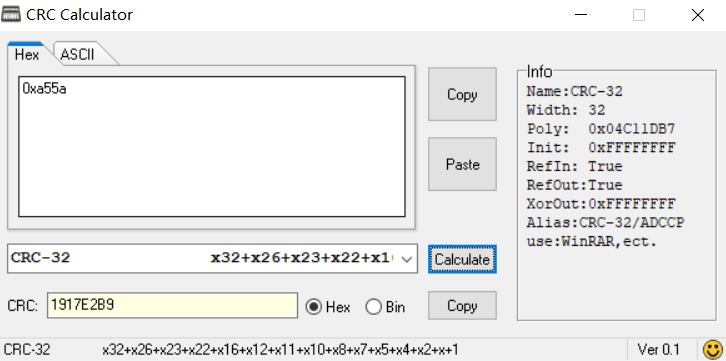
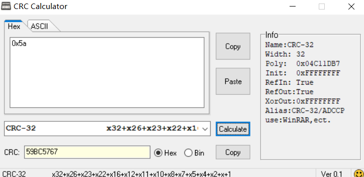
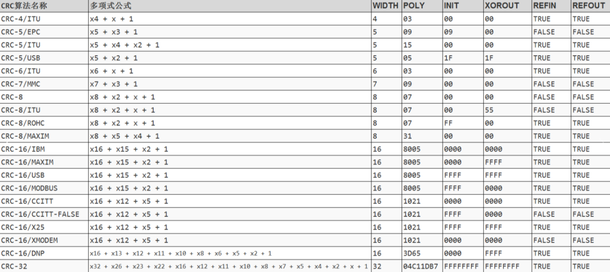

# **算法篇**

前言：本篇CRC算法为初代笔者纯手工完成，内容很干货，也可能会有一些错误，希望后面的人如果有幸看到这里发现错误希望可以联系管理员进行沟通改正或者评论都可以，保持一个开源互助精神，除CRC内容都是初代笔者在做笔试题目时遇到的一些总结

## **功率分贝关系**

数字调制解调的基带就是01，频带是转化成数字波形的信号

**dB 的基本概念**

**dB 不是一个绝对单位**，而是一种 **相对比值的对数表示**。

用途：把功率、电压、电流、增益等的比值表示成一个方便比较的数值，特别适合处理跨越好几个数量级的情况。

**功率比表示**

对于功率：

dB=10⋅log10(P1/P2)

-   P2：输出功率
-   P1：输入功率
-   如果 P2=P1，则比值 = 1，dB = 0（表示没有变化）。
-   如果 P2=2P1，则 dB ≈ 3 dB（功率翻倍）。
-   如果 P2=0.5P1，则 dB ≈ -3 dB（功率减半）。

**电压或电流比表示**

当阻抗相同（例如 50Ω 系统）时，功率与电压平方成正比：

P∝V2

因此：

dB=20⋅log10(V1/V2)

同理电流也适用：

dB=20⋅log10(I1/I2)

例子：

-   电压放大 10 倍：20⋅log10(10)=20dB
-   电压减小到 0.1 倍：20⋅log10(0.1)=−20dB

**常见绝对 dB 单位**

有时 dB 会对应一个 **绝对参考值**：

-   **dBm**：相对 1 mW 的功率， PdBm=10⋅log10(1mWP)

例如：1 mW = 0 dBm，10 mW ≈ 10 dBm，100 mW ≈ 20 dBm。

-   **dBW**：相对 1 W 的功率。
-   **dBV**：相对 1 V 的电压。
1.  **常用近似记忆**
-   **功率翻倍 ≈ +3 dB**
-   **功率减半 ≈ -3 dB**
-   **电压翻倍 ≈ +6 dB**
-   **电压减半 ≈ -6 dB**
-   **10 倍功率 ≈ +10 dB**
-   **10 倍电压 ≈ +20 dB**

## **Ethernet_CRC循环冗余校验（整章内容还有问题，楼主正在和CRC算法fight，2025.10.15）**

这部分有些复杂，但是十分重要

注：**全反射**为数据bit全部高低位颠倒，**字节内反射**为一串数据每一个字节顺序不变，字节内高低位颠倒

注：首先声明Ethernet每一帧的数据bitstream格式：

以太网传输为高速串行数据流（有时钟与控制信号，目前和一般来说的高速串行传输不做区别），可以将网线想象为一条（实际为×2×4等等配置）单根单bit宽度的传输线（方便思考crc计算），不考虑前导码与分隔符，crc计算对象只针对DMAC、SMAC、length/type、payload（帧负载或者说数据负载），**定义左侧为先上网顺序和高位**，则网线上bitstream数据段顺序为**上述顺序**，数据段顺序（也就是字段顺序）不变，数据段内**每一个字节**顺序不变，每一个**字节内反射**，**要对这一条bit线顺序有很清晰的认识！！！相关原因可以参考协议篇内容**

举个例子：如果我发送了0xabcd12，则网线上bit流为：1101_0101_1011_0011_0100_1000(byte顺序不变，byte内bit颠倒)

引入**CRC计算规则**：首先定义除数**多项式**，IEEE规定Ethernet标准多项式为0x04C11DB7（反射多项式0xEDB88320），对上述bitstream进行crc计算，定义**33**位crc计算寄存器，bitstream最高位首先从crc寄存器最低位压入（压入指整体左移，新bit填补最低位）crc_reg，当bitstream最高位压入crc_reg第32位时注意，当下一个数据压入后，判断新的crc_reg第33位是否为1，若为1，则后32位与标准多项式进行异或，并且将结果更新crc_reg寄存器等待下一个bit压入，如果为0则不做任何处理等待下一个bit压入，当处理完所有bit后还需要压入32个0参与计算，最终crc_reg的低32位就是crc32的校验结果，根据IEEE规定，crc校验结果跟随在数据字段后方称为FCS（frame check sequence）字段

介绍**数学CRC计算**：对于上述bitstream，将其末尾添加32个0（crc规则，我觉得是为了处理小于32bit的数据不好做计算的原因，这种解释并不准确严格，可以自行搜索数学上的解释，本人实在搞不来了，后面的异或矩阵已经够爆炸了），将标准多项式33bit（显式表明第33位），0x1_04C11DB7，将其最高位对齐bitstream最高位，然后判断bitstream最高位是否为1进行异或，为1异或后更新bitstream，并且寻找下一个最高非0位对齐异或更新，直到最高非0位小于等于32，如果标准多项式的33位是0的话，找到最高非0位后，异或结果依旧是1，直接锁死，也就是上述为何最高位必为1的原因

两种计算方式数学等价，前者为crc_reg滑动，后者为多项式滑动

最后附一条链接，很形象的展现crc计算过程，注意：与1异或等于取反，与0异或等于没变，这个规律有助于理解视频，在线链接-\>[直观理解CRC计算_哔哩哔哩](https://www.bilibili.com/video/BV1V4411Z7VA?)，飞书云链接-\>[直观理解CRC计算_飞书云](https://nankai.feishu.cn/file/NH2ubNNO7o9vqnx7js7cdTyenMf)

说明计算方式定义：将手算定义为输入一串bitstream，末尾添加32个0后将33位多项式从最高位对齐开始一直处理到结束得到的结果为手算定义

**发送端**

介绍Ethernet发送方CRC模块与流程

首先说明一点，IEEE规定的EthernetCRC32计算规则并不是单纯的手算，对于网线上的bitstream（字节内反射），这是需要进行处理的原始数据，根据IEEE要求，对于Ethernet传输需要将这个bitstream全反射，然后与全F进行异或（全F异或也就是全取反），得到的新bitstream后末尾添加32个0，手算一边，得到的32位crc结果，需要全反射然后与全F进行异或，得到的结果就是网线上的CRC校验值。

说明网线上的CRC byte顺序和bit顺序：经过处理后的32位数据从最低位依次开始跟随在最后，最后一个bit为最高位，也就是全反射跟随，例如最终计算得出的crc结果为：0xabcdef11，则网线上的先后顺序为：1000_1000_1111_0111_1011_0011_1101_0101（直接跟在网线bitstream后方）

```verilog
////////////////////////////////////////////////////////////////////////////////
// Copyright (C) 1999-2008 Easics NV.
// This source file may be used and distributed without restriction
// provided that this copyright statement is not removed from the file
// and that any derivative work contains the original copyright notice
// and the associated disclaimer.
//
// THIS SOURCE FILE IS PROVIDED "AS IS" AND WITHOUT ANY EXPRESS
// OR IMPLIED WARRANTIES, INCLUDING, WITHOUT LIMITATION, THE IMPLIED
// WARRANTIES OF MERCHANTIBILITY AND FITNESS FOR A PARTICULAR PURPOSE.
//
// Purpose : synthesizable CRC function
//   * polynomial: x^32 + x^26 + x^23 + x^22 + x^16 + x^12 + x^11 + x^10 + x^8 + x^7 + x^5 + x^4 + x^2 + x^1 + 1
//   * data width: 8
//
// Info : tools@easics.be
//        http://www.easics.com
////////////////////////////////////////////////////////////////////////////////

////////////////////////////////////////////////////////////////////////////////
//中文注释：
//该模块中的异或矩阵函数为上述easics公司在线工具直接生成的
//该模块的输入数据先后顺序为：正常字段顺序、字段内正常byte顺序、byte内未反射顺序
//该模块一次计算8bit的输入的crc计算结果，依次计算完所有Ethernet数据流
//
////////////////////////////////////////////////////////////////////////////////
module crc32_d8
  (
    input           clk         ,
    input           reset_p     ,

    input    [7:0]  data        ,
    input           crc_init    ,
    input           crc_en      ,
    output   [31:0] crc_result
  );

  wire   [7:0]   data_i;
  reg    [31:0]  crc_result_o;

  assign data_i = {data[ 0],data[ 1],data[ 2],data[ 3], data[ 4],data[ 5],data[ 6],data[ 7]};

  assign crc_result = ~{crc_result_o[00],crc_result_o[01],crc_result_o[02],crc_result_o[03],crc_result_o[04],crc_result_o[05],crc_result_o[06],crc_result_o[07],
                        crc_result_o[08],crc_result_o[09],crc_result_o[10],crc_result_o[11],crc_result_o[12],crc_result_o[13],crc_result_o[14],crc_result_o[15],
                        crc_result_o[16],crc_result_o[17],crc_result_o[18],crc_result_o[19],crc_result_o[20],crc_result_o[21],crc_result_o[22],crc_result_o[23],
                        crc_result_o[24],crc_result_o[25],crc_result_o[26],crc_result_o[27],crc_result_o[28],crc_result_o[29],crc_result_o[30],crc_result_o[31]};

  always @(posedge clk or posedge reset_p)
  begin
    if(reset_p)
      crc_result_o <= 32'hffff_ffff;
    else if(crc_init)
      crc_result_o <= 32'hffff_ffff;
    else if(crc_en)
      crc_result_o <= nextCRC32_D8( data_i, crc_result_o);
    else
      crc_result_o <= crc_result_o;
  end

  // polynomial: x^32 + x^26 + x^23 + x^22 + x^16 + x^12 + x^11 + x^10 + x^8 + x^7 + x^5 + x^4 + x^2 + x^1 + 1
  // data width: 8
  // convention: the first serial bit is D[7]
  function [31:0] nextCRC32_D8;

    input [7:0] Data;
    input [31:0] crc;
    reg [7:0] d;
    reg [31:0] c;
    reg [31:0] newcrc;
    begin
      d = Data;
      c = crc;

      newcrc[0] =  d[6] ^ d[0] ^ c[24] ^ c[30];
      newcrc[1] =  d[7] ^ d[6] ^ d[1] ^ d[0] ^ c[24] ^ c[25] ^ c[30] ^ c[31];
      newcrc[2] =  d[7] ^ d[6] ^ d[2] ^ d[1] ^ d[0] ^ c[24] ^ c[25] ^ c[26] ^ c[30] ^ c[31];
      newcrc[3] =  d[7] ^ d[3] ^ d[2] ^ d[1] ^ c[25] ^ c[26] ^ c[27] ^ c[31];
      newcrc[4] =  d[6] ^ d[4] ^ d[3] ^ d[2] ^ d[0] ^ c[24] ^ c[26] ^ c[27] ^ c[28] ^ c[30];
      newcrc[5] =  d[7] ^ d[6] ^ d[5] ^ d[4] ^ d[3] ^ d[1] ^ d[0] ^ c[24] ^ c[25] ^ c[27] ^ c[28] ^ c[29] ^ c[30] ^ c[31];
      newcrc[6] =  d[7] ^ d[6] ^ d[5] ^ d[4] ^ d[2] ^ d[1] ^ c[25] ^ c[26] ^ c[28] ^ c[29] ^ c[30] ^ c[31];
      newcrc[7] =  d[7] ^ d[5] ^ d[3] ^ d[2] ^ d[0] ^ c[24] ^ c[26] ^ c[27] ^ c[29] ^ c[31];
      newcrc[8] =  d[4] ^ d[3] ^ d[1] ^ d[0] ^ c[0] ^ c[24] ^ c[25] ^ c[27] ^ c[28];
      newcrc[9] =  d[5] ^ d[4] ^ d[2] ^ d[1] ^ c[1] ^ c[25] ^ c[26] ^ c[28] ^ c[29];
      newcrc[10] = d[5] ^ d[3] ^ d[2] ^ d[0] ^ c[2] ^ c[24] ^ c[26] ^ c[27] ^ c[29];
      newcrc[11] = d[4] ^ d[3] ^ d[1] ^ d[0] ^ c[3] ^ c[24] ^ c[25] ^ c[27] ^ c[28];
      newcrc[12] = d[6] ^ d[5] ^ d[4] ^ d[2] ^ d[1] ^ d[0] ^ c[4] ^ c[24] ^ c[25] ^ c[26] ^ c[28] ^ c[29] ^ c[30];
      newcrc[13] = d[7] ^ d[6] ^ d[5] ^ d[3] ^ d[2] ^ d[1] ^ c[5] ^ c[25] ^ c[26] ^ c[27] ^ c[29] ^ c[30] ^ c[31];
      newcrc[14] = d[7] ^ d[6] ^ d[4] ^ d[3] ^ d[2] ^ c[6] ^ c[26] ^ c[27] ^ c[28] ^ c[30] ^ c[31];
      newcrc[15] = d[7] ^ d[5] ^ d[4] ^ d[3] ^ c[7] ^ c[27] ^ c[28] ^ c[29] ^ c[31];
      newcrc[16] = d[5] ^ d[4] ^ d[0] ^ c[8] ^ c[24] ^ c[28] ^ c[29];
      newcrc[17] = d[6] ^ d[5] ^ d[1] ^ c[9] ^ c[25] ^ c[29] ^ c[30];
      newcrc[18] = d[7] ^ d[6] ^ d[2] ^ c[10] ^ c[26] ^ c[30] ^ c[31];
      newcrc[19] = d[7] ^ d[3] ^ c[11] ^ c[27] ^ c[31];
      newcrc[20] = d[4] ^ c[12] ^ c[28];
      newcrc[21] = d[5] ^ c[13] ^ c[29];
      newcrc[22] = d[0] ^ c[14] ^ c[24];
      newcrc[23] = d[6] ^ d[1] ^ d[0] ^ c[15] ^ c[24] ^ c[25] ^ c[30];
      newcrc[24] = d[7] ^ d[2] ^ d[1] ^ c[16] ^ c[25] ^ c[26] ^ c[31];
      newcrc[25] = d[3] ^ d[2] ^ c[17] ^ c[26] ^ c[27];
      newcrc[26] = d[6] ^ d[4] ^ d[3] ^ d[0] ^ c[18] ^ c[24] ^ c[27] ^ c[28] ^ c[30];
      newcrc[27] = d[7] ^ d[5] ^ d[4] ^ d[1] ^ c[19] ^ c[25] ^ c[28] ^ c[29] ^ c[31];
      newcrc[28] = d[6] ^ d[5] ^ d[2] ^ c[20] ^ c[26] ^ c[29] ^ c[30];
      newcrc[29] = d[7] ^ d[6] ^ d[3] ^ c[21] ^ c[27] ^ c[30] ^ c[31];
      newcrc[30] = d[7] ^ d[4] ^ c[22] ^ c[28] ^ c[31];
      newcrc[31] = d[5] ^ c[23] ^ c[29];
      nextCRC32_D8 = newcrc;
    end
  endfunction

endmodule

```


first：发送方将所有需要进行CRC32计算的数据送入CRC计算单元，CRC计算单元可以设计为串行处理也可以设计为多bit同时处理，面向Ethernet绝大多数都是8bit并行处理的方式，根据上方模块来说，送入的数据为byte内未反射，为了迎合网线bitstream顺序，模块内首先对每一字节进行取反

second：取反后的数据进行下方的异或矩阵进行计算，异或矩阵的处理逻辑很诡异，举例来说，如果我要发送的数据为0x12_34_56_78_9a（0001_0010_0011_0100_0101_0110_0111_1000_1001_1010），送入模块的字节先后为0x12、0x34、0x56、0x78、0x9a，经过字节内反射后先后输入异或矩阵的为：0x48、0x2c、0x6a、0x1e、0x59，整串数据流为0100_1000_0010_1100_0110_1010_0001_1110_0101_1001，将这串bit一个byte一个byte输入异或矩阵的结果与将这串bit进行全反射后与全F异或后，末尾添加32个0进行手算的结果是一致的，所以根据IEEE要求要对这个结果进行全反射与全F异或（全取反），然后先上传最低字节（以太网PHY会将送入的字节的低位先送入网线），最后上传最高字节，保证网线上的crc最终结果是全反射跟随的

十六进制数取反反射对应关系：

0\<-\>f,1\<-\>e,2\<-\>d............7\<-\>8很神奇，对应的两个数之和一直为15

提出疑问：异或矩阵怎么来的？（上述模块中）

首先我讲一下自己感觉到比较奇怪的点：按照手算的逻辑来说（矩阵的来源肯定也是最基本的手算逻辑），我要处理一个32bit的原始数据，我需要将其全反射再与全F异或，得到的结果后面添加32个0，然后手算一边，得到和矩阵一样的结果（模块中对输入进行了字节反射，手算不考虑，比如我模块中输入为0x12345678，输入矩阵的为0x89abcde，我需要手算的是将0x89abcde全反射再与全F异或，后面添加32个0进行模2除法的结果），因为要全反射，所以新进来8bit之后想要完成计算的话，这八个bit要放入最高位，这也就导致我必须要将这40个bit全算一边，之前的结果没有任何意义了，但是异或矩阵的原crc结果寄存确是上一个8bit计算完的结果，此处和手算逻辑出现了很难对应的部分

为了解决这个问题，首先引入feedback反馈crc算法，

feedback：将crc结果寄存器（只需要32bit）初始化一个初值（应该是0xFFFFFFFF），然后判断bitstream的每一个输入

输入bit与目前最高位进行异或，如果结果为1，则feedback记录为1，整体左移移位（默认值填充，不是输入bit），移位后，如果feedback=1则整体与标准多项式异或，结果更新，如果feedback=0，不做任何处理等待下一个bit

这种算法后面称为feedback算法，理论上来说是和手算在数学上是等价的，但是我自己“真”手算了一下两者的结果，似乎并不一致，有些奇怪，存疑，继续按照一致处理，

为了得到8bit并行输入的异或矩阵，首先先推导1bit输入的矩阵

因为上述模块中的源网址已经被别的公司收购了，说白了就是在线工具用不了了，我这边只能通过一个GitHub上的开源项目生成了1bit、2bit、8bit的模块函数，生成的只有采用反射多项式的模块

此处先介绍反射多项式的用途，反射多项式是指标准多项式的全反射，形象一些理解，对于标准多项式，对齐最左侧进行手算（也可以叫做模2除法），对于反射多项式，会对输入bitstream对齐最低位，然后判断最低位是否为1，依次左移进行手算，此时需要将最高位添加32个0，如果输入输入数据以及其全反射分别进行上述两种计算方式，得到的结果也应该是全反射的关系，其实就是一个镜像，我把输入数据左右颠倒，多项式左右颠倒，计算顺序左右颠倒，得到的结果也是左右颠倒的，反射多项式存在的原因在于IEEE规定以太网的bitstream进行crc计算前需要全反射这一步，但是详细内容暂且不谈，先推导1bit基于反射多项式的异或矩阵

GitHub CRC计算工具仓库链接-\>[CRC生成工具](https://github.com/mbuesch/crcgen)

```verilog
// vim: ts=4 sw=4 expandtab

// THIS IS GENERATED VERILOG CODE.
// https://bues.ch/h/crcgen
// 
// This code is Public Domain.
// Permission to use, copy, modify, and/or distribute this software for any
// purpose with or without fee is hereby granted.
// 
// THE SOFTWARE IS PROVIDED "AS IS" AND THE AUTHOR DISCLAIMS ALL WARRANTIES
// WITH REGARD TO THIS SOFTWARE INCLUDING ALL IMPLIED WARRANTIES OF
// MERCHANTABILITY AND FITNESS. IN NO EVENT SHALL THE AUTHOR BE LIABLE FOR ANY
// SPECIAL, DIRECT, INDIRECT, OR CONSEQUENTIAL DAMAGES OR ANY DAMAGES WHATSOEVER
// RESULTING FROM LOSS OF USE, DATA OR PROFITS, WHETHER IN AN ACTION OF CONTRACT,
// NEGLIGENCE OR OTHER TORTIOUS ACTION, ARISING OUT OF OR IN CONNECTION WITH THE
// USE OR PERFORMANCE OF THIS SOFTWARE.

`ifndef CRC_V_
`define CRC_V_

// CRC polynomial coefficients: x^32 + x^26 + x^23 + x^22 + x^16 + x^12 + x^11 + x^10 + x^8 + x^7 + x^5 + x^4 + x^2 + x + 1
//                              0xEDB88320 (hex)
// CRC width:                   32 bits
// CRC shift direction:         right (little endian)
// Input word width:            1 bits

module crc (
    input [31:0] crcIn,
    input [0:0] data,
    output [31:0] crcOut
);
    assign crcOut[0] = crcIn[1];
    assign crcOut[1] = crcIn[2];
    assign crcOut[2] = crcIn[3];
    assign crcOut[3] = crcIn[4];
    assign crcOut[4] = crcIn[5];
    assign crcOut[5] = crcIn[0] ^ crcIn[6] ^ data[0];
    assign crcOut[6] = crcIn[7];
    assign crcOut[7] = crcIn[8];
    assign crcOut[8] = crcIn[0] ^ crcIn[9] ^ data[0];
    assign crcOut[9] = crcIn[0] ^ crcIn[10] ^ data[0];
    assign crcOut[10] = crcIn[11];
    assign crcOut[11] = crcIn[12];
    assign crcOut[12] = crcIn[13];
    assign crcOut[13] = crcIn[14];
    assign crcOut[14] = crcIn[15];
    assign crcOut[15] = crcIn[0] ^ crcIn[16] ^ data[0];
    assign crcOut[16] = crcIn[17];
    assign crcOut[17] = crcIn[18];
    assign crcOut[18] = crcIn[19];
    assign crcOut[19] = crcIn[0] ^ crcIn[20] ^ data[0];
    assign crcOut[20] = crcIn[0] ^ crcIn[21] ^ data[0];
    assign crcOut[21] = crcIn[0] ^ crcIn[22] ^ data[0];
    assign crcOut[22] = crcIn[23];
    assign crcOut[23] = crcIn[0] ^ crcIn[24] ^ data[0];
    assign crcOut[24] = crcIn[0] ^ crcIn[25] ^ data[0];
    assign crcOut[25] = crcIn[26];
    assign crcOut[26] = crcIn[0] ^ crcIn[27] ^ data[0];
    assign crcOut[27] = crcIn[0] ^ crcIn[28] ^ data[0];
    assign crcOut[28] = crcIn[29];
    assign crcOut[29] = crcIn[0] ^ crcIn[30] ^ data[0];
    assign crcOut[30] = crcIn[0] ^ crcIn[31] ^ data[0];
    assign crcOut[31] = crcIn[0] ^ data[0];//右移填默认值0，与0异或等于什么也没做，所以省略了^0这个步骤
endmodule

`endif // CRC_V_
```

上面的模块是一次输入1bit的crc计算单元，详细剖析与反射多项式的关系0xEDB88320

首先我们先分析一个问题：异或矩阵的输入是输入bit和源crc结果，输出是新crc结果，对于手算来说只知道这两个输入是无法算出crc结果的，必须要有对应的多项式，但是异或矩阵却不需要这个，也就是说异或矩阵将多项式这一信息融到了矩阵里面

前提：对于异或运算，任何bit与1异或相当于取反，与0异或相当于不变

对于feedback算法，是否进行异或的条件是crcIn[0] \^ data[0]是否为1，**因为是反射多项式，所以要判断最低位并且是右移**

我们对齐反射多项式和crcIn，按照feedback计算规则首先要整体右移，所以等式两边的crcOut和crcIn的所以是错位的，移位后需要判断crcIn[0] \^ data[0]进行异或，且异或对象是反射多项式，此处我们发现，如果对应位的反射多项式为0的话无论是否异或结果都是不变的，如果为1的话，判断crcIn[0] \^ data[0]是否为1进行与1的异或与直接与crcIn[0] \^ data[0]进行异或是等价的，这样上面的矩阵我们就能发现由上至下等式右侧没有crcIn[0] \^ data[0]的记为0，反之记为1可以得到（从低位开始记录）1110_1101_1011_1000_1000_0011_0010_0000与反射多项式吻合，至此我们得到了一位矩阵，对于八位矩阵只需要将这个矩阵八次移位“相乘”就能得到，下面直接给出对应的八位矩阵，详细过程可以自行验证

```verilog
// vim: ts=4 sw=4 expandtab

// THIS IS GENERATED VERILOG CODE.
// https://bues.ch/h/crcgen
//
// This code is Public Domain.
// Permission to use, copy, modify, and/or distribute this software for any
// purpose with or without fee is hereby granted.
//
// THE SOFTWARE IS PROVIDED "AS IS" AND THE AUTHOR DISCLAIMS ALL WARRANTIES
// WITH REGARD TO THIS SOFTWARE INCLUDING ALL IMPLIED WARRANTIES OF
// MERCHANTABILITY AND FITNESS. IN NO EVENT SHALL THE AUTHOR BE LIABLE FOR ANY
// SPECIAL, DIRECT, INDIRECT, OR CONSEQUENTIAL DAMAGES OR ANY DAMAGES WHATSOEVER
// RESULTING FROM LOSS OF USE, DATA OR PROFITS, WHETHER IN AN ACTION OF CONTRACT,
// NEGLIGENCE OR OTHER TORTIOUS ACTION, ARISING OUT OF OR IN CONNECTION WITH THE
// USE OR PERFORMANCE OF THIS SOFTWARE.

`ifndef CRC_8_V_
`define CRC_8_V_

        // CRC polynomial coefficients: x^32 + x^26 + x^23 + x^22 + x^16 + x^12 + x^11 + x^10 + x^8 + x^7 + x^5 + x^4 + x^2 + x + 1
        //                              0xEDB88320 (hex)
        // CRC width:                   32 bits
        // CRC shift direction:         right (little endian)
        // Input word width:            8 bits

        module crc_8 (
            input [31:0] crcIn,
            input [7:0] data,
            output [31:0] crcOut
          );
          assign crcOut[0] = crcIn[2] ^ crcIn[8] ^ data[2];
          assign crcOut[1] = crcIn[0] ^ crcIn[3] ^ crcIn[9] ^ data[0] ^ data[3];
          assign crcOut[2] = crcIn[0] ^ crcIn[1] ^ crcIn[4] ^ crcIn[10] ^ data[0] ^ data[1] ^ data[4];
          assign crcOut[3] = crcIn[1] ^ crcIn[2] ^ crcIn[5] ^ crcIn[11] ^ data[1] ^ data[2] ^ data[5];
          assign crcOut[4] = crcIn[0] ^ crcIn[2] ^ crcIn[3] ^ crcIn[6] ^ crcIn[12] ^ data[0] ^ data[2] ^ data[3] ^ data[6];
          assign crcOut[5] = crcIn[1] ^ crcIn[3] ^ crcIn[4] ^ crcIn[7] ^ crcIn[13] ^ data[1] ^ data[3] ^ data[4] ^ data[7];
          assign crcOut[6] = crcIn[4] ^ crcIn[5] ^ crcIn[14] ^ data[4] ^ data[5];
          assign crcOut[7] = crcIn[0] ^ crcIn[5] ^ crcIn[6] ^ crcIn[15] ^ data[0] ^ data[5] ^ data[6];
          assign crcOut[8] = crcIn[1] ^ crcIn[6] ^ crcIn[7] ^ crcIn[16] ^ data[1] ^ data[6] ^ data[7];
          assign crcOut[9] = crcIn[7] ^ crcIn[17] ^ data[7];
          assign crcOut[10] = crcIn[2] ^ crcIn[18] ^ data[2];
          assign crcOut[11] = crcIn[3] ^ crcIn[19] ^ data[3];
          assign crcOut[12] = crcIn[0] ^ crcIn[4] ^ crcIn[20] ^ data[0] ^ data[4];
          assign crcOut[13] = crcIn[0] ^ crcIn[1] ^ crcIn[5] ^ crcIn[21] ^ data[0] ^ data[1] ^ data[5];
          assign crcOut[14] = crcIn[1] ^ crcIn[2] ^ crcIn[6] ^ crcIn[22] ^ data[1] ^ data[2] ^ data[6];
          assign crcOut[15] = crcIn[2] ^ crcIn[3] ^ crcIn[7] ^ crcIn[23] ^ data[2] ^ data[3] ^ data[7];
          assign crcOut[16] = crcIn[0] ^ crcIn[2] ^ crcIn[3] ^ crcIn[4] ^ crcIn[24] ^ data[0] ^ data[2] ^ data[3] ^ data[4];
          assign crcOut[17] = crcIn[0] ^ crcIn[1] ^ crcIn[3] ^ crcIn[4] ^ crcIn[5] ^ crcIn[25] ^ data[0] ^ data[1] ^ data[3] ^ data[4] ^ data[5];
          assign crcOut[18] = crcIn[0] ^ crcIn[1] ^ crcIn[2] ^ crcIn[4] ^ crcIn[5] ^ crcIn[6] ^ crcIn[26] ^ data[0] ^ data[1] ^ data[2] ^ data[4] ^ data[5] ^ data[6];
          assign crcOut[19] = crcIn[1] ^ crcIn[2] ^ crcIn[3] ^ crcIn[5] ^ crcIn[6] ^ crcIn[7] ^ crcIn[27] ^ data[1] ^ data[2] ^ data[3] ^ data[5] ^ data[6] ^ data[7];
          assign crcOut[20] = crcIn[3] ^ crcIn[4] ^ crcIn[6] ^ crcIn[7] ^ crcIn[28] ^ data[3] ^ data[4] ^ data[6] ^ data[7];
          assign crcOut[21] = crcIn[2] ^ crcIn[4] ^ crcIn[5] ^ crcIn[7] ^ crcIn[29] ^ data[2] ^ data[4] ^ data[5] ^ data[7];
          assign crcOut[22] = crcIn[2] ^ crcIn[3] ^ crcIn[5] ^ crcIn[6] ^ crcIn[30] ^ data[2] ^ data[3] ^ data[5] ^ data[6];
          assign crcOut[23] = crcIn[3] ^ crcIn[4] ^ crcIn[6] ^ crcIn[7] ^ crcIn[31] ^ data[3] ^ data[4] ^ data[6] ^ data[7];
          assign crcOut[24] = crcIn[0] ^ crcIn[2] ^ crcIn[4] ^ crcIn[5] ^ crcIn[7] ^ data[0] ^ data[2] ^ data[4] ^ data[5] ^ data[7];
          assign crcOut[25] = crcIn[0] ^ crcIn[1] ^ crcIn[2] ^ crcIn[3] ^ crcIn[5] ^ crcIn[6] ^ data[0] ^ data[1] ^ data[2] ^ data[3] ^ data[5] ^ data[6];
          assign crcOut[26] = crcIn[0] ^ crcIn[1] ^ crcIn[2] ^ crcIn[3] ^ crcIn[4] ^ crcIn[6] ^ crcIn[7] ^ data[0] ^ data[1] ^ data[2] ^ data[3] ^ data[4] ^ data[6] ^ data[7];
          assign crcOut[27] = crcIn[1] ^ crcIn[3] ^ crcIn[4] ^ crcIn[5] ^ crcIn[7] ^ data[1] ^ data[3] ^ data[4] ^ data[5] ^ data[7];
          assign crcOut[28] = crcIn[0] ^ crcIn[4] ^ crcIn[5] ^ crcIn[6] ^ data[0] ^ data[4] ^ data[5] ^ data[6];
          assign crcOut[29] = crcIn[0] ^ crcIn[1] ^ crcIn[5] ^ crcIn[6] ^ crcIn[7] ^ data[0] ^ data[1] ^ data[5] ^ data[6] ^ data[7];
          assign crcOut[30] = crcIn[0] ^ crcIn[1] ^ crcIn[6] ^ crcIn[7] ^ data[0] ^ data[1] ^ data[6] ^ data[7];
          assign crcOut[31] = crcIn[1] ^ crcIn[7] ^ data[1] ^ data[7];
        endmodule

`endif // CRC_8_V_

```

下面我们需要验证这个八位矩阵和上方已经被“资本做局”的公司生成的矩阵的结果是否互为反射

下面是对应的测试模块和TB

```verilog
`timescale 1ns / 1ps
/////////////////////////////////////////////////
//测试模块
//此处为两个异或矩阵的结果计算模块
//先后为原矩阵和反射矩阵
//只关注单词8bit的结果，因为没有将输出crc反馈回输入crc，所以超过8bit的结果都是与计算工具无法一致的
/////////////////////////////////////////////////
module crc_8 (
    input [31:0] crcIn,
    input [7:0] data,
    output [31:0] crcOut,
    
    input [7:0] d,
    input [31:0] c,
    output  reg [31:0] newcrc
  );
  assign crcOut[0] = crcIn[2] ^ crcIn[8] ^ data[2];
  assign crcOut[1] = crcIn[0] ^ crcIn[3] ^ crcIn[9] ^ data[0] ^ data[3];
  assign crcOut[2] = crcIn[0] ^ crcIn[1] ^ crcIn[4] ^ crcIn[10] ^ data[0] ^ data[1] ^ data[4];
  assign crcOut[3] = crcIn[1] ^ crcIn[2] ^ crcIn[5] ^ crcIn[11] ^ data[1] ^ data[2] ^ data[5];
  assign crcOut[4] = crcIn[0] ^ crcIn[2] ^ crcIn[3] ^ crcIn[6] ^ crcIn[12] ^ data[0] ^ data[2] ^ data[3] ^ data[6];
  assign crcOut[5] = crcIn[1] ^ crcIn[3] ^ crcIn[4] ^ crcIn[7] ^ crcIn[13] ^ data[1] ^ data[3] ^ data[4] ^ data[7];
  assign crcOut[6] = crcIn[4] ^ crcIn[5] ^ crcIn[14] ^ data[4] ^ data[5];
  assign crcOut[7] = crcIn[0] ^ crcIn[5] ^ crcIn[6] ^ crcIn[15] ^ data[0] ^ data[5] ^ data[6];
  assign crcOut[8] = crcIn[1] ^ crcIn[6] ^ crcIn[7] ^ crcIn[16] ^ data[1] ^ data[6] ^ data[7];
  assign crcOut[9] = crcIn[7] ^ crcIn[17] ^ data[7];
  assign crcOut[10] = crcIn[2] ^ crcIn[18] ^ data[2];
  assign crcOut[11] = crcIn[3] ^ crcIn[19] ^ data[3];
  assign crcOut[12] = crcIn[0] ^ crcIn[4] ^ crcIn[20] ^ data[0] ^ data[4];
  assign crcOut[13] = crcIn[0] ^ crcIn[1] ^ crcIn[5] ^ crcIn[21] ^ data[0] ^ data[1] ^ data[5];
  assign crcOut[14] = crcIn[1] ^ crcIn[2] ^ crcIn[6] ^ crcIn[22] ^ data[1] ^ data[2] ^ data[6];
  assign crcOut[15] = crcIn[2] ^ crcIn[3] ^ crcIn[7] ^ crcIn[23] ^ data[2] ^ data[3] ^ data[7];
  assign crcOut[16] = crcIn[0] ^ crcIn[2] ^ crcIn[3] ^ crcIn[4] ^ crcIn[24] ^ data[0] ^ data[2] ^ data[3] ^ data[4];
  assign crcOut[17] = crcIn[0] ^ crcIn[1] ^ crcIn[3] ^ crcIn[4] ^ crcIn[5] ^ crcIn[25] ^ data[0] ^ data[1] ^ data[3] ^ data[4] ^ data[5];
  assign crcOut[18] = crcIn[0] ^ crcIn[1] ^ crcIn[2] ^ crcIn[4] ^ crcIn[5] ^ crcIn[6] ^ crcIn[26] ^ data[0] ^ data[1] ^ data[2] ^ data[4] ^ data[5] ^ data[6];
  assign crcOut[19] = crcIn[1] ^ crcIn[2] ^ crcIn[3] ^ crcIn[5] ^ crcIn[6] ^ crcIn[7] ^ crcIn[27] ^ data[1] ^ data[2] ^ data[3] ^ data[5] ^ data[6] ^ data[7];
  assign crcOut[20] = crcIn[3] ^ crcIn[4] ^ crcIn[6] ^ crcIn[7] ^ crcIn[28] ^ data[3] ^ data[4] ^ data[6] ^ data[7];
  assign crcOut[21] = crcIn[2] ^ crcIn[4] ^ crcIn[5] ^ crcIn[7] ^ crcIn[29] ^ data[2] ^ data[4] ^ data[5] ^ data[7];
  assign crcOut[22] = crcIn[2] ^ crcIn[3] ^ crcIn[5] ^ crcIn[6] ^ crcIn[30] ^ data[2] ^ data[3] ^ data[5] ^ data[6];
  assign crcOut[23] = crcIn[3] ^ crcIn[4] ^ crcIn[6] ^ crcIn[7] ^ crcIn[31] ^ data[3] ^ data[4] ^ data[6] ^ data[7];
  assign crcOut[24] = crcIn[0] ^ crcIn[2] ^ crcIn[4] ^ crcIn[5] ^ crcIn[7] ^ data[0] ^ data[2] ^ data[4] ^ data[5] ^ data[7];
  assign crcOut[25] = crcIn[0] ^ crcIn[1] ^ crcIn[2] ^ crcIn[3] ^ crcIn[5] ^ crcIn[6] ^ data[0] ^ data[1] ^ data[2] ^ data[3] ^ data[5] ^ data[6];
  assign crcOut[26] = crcIn[0] ^ crcIn[1] ^ crcIn[2] ^ crcIn[3] ^ crcIn[4] ^ crcIn[6] ^ crcIn[7] ^ data[0] ^ data[1] ^ data[2] ^ data[3] ^ data[4] ^ data[6] ^ data[7];
  assign crcOut[27] = crcIn[1] ^ crcIn[3] ^ crcIn[4] ^ crcIn[5] ^ crcIn[7] ^ data[1] ^ data[3] ^ data[4] ^ data[5] ^ data[7];
  assign crcOut[28] = crcIn[0] ^ crcIn[4] ^ crcIn[5] ^ crcIn[6] ^ data[0] ^ data[4] ^ data[5] ^ data[6];
  assign crcOut[29] = crcIn[0] ^ crcIn[1] ^ crcIn[5] ^ crcIn[6] ^ crcIn[7] ^ data[0] ^ data[1] ^ data[5] ^ data[6] ^ data[7];
  assign crcOut[30] = crcIn[0] ^ crcIn[1] ^ crcIn[6] ^ crcIn[7] ^ data[0] ^ data[1] ^ data[6] ^ data[7];
  assign crcOut[31] = crcIn[1] ^ crcIn[7] ^ data[1] ^ data[7];

  always@(*)
  begin
    newcrc[0] =  d[6] ^ d[0] ^ c[24] ^ c[30];
    newcrc[1] =  d[7] ^ d[6] ^ d[1] ^ d[0] ^ c[24] ^ c[25] ^ c[30] ^ c[31];
    newcrc[2] =  d[7] ^ d[6] ^ d[2] ^ d[1] ^ d[0] ^ c[24] ^ c[25] ^ c[26] ^ c[30] ^ c[31];
    newcrc[3] =  d[7] ^ d[3] ^ d[2] ^ d[1] ^ c[25] ^ c[26] ^ c[27] ^ c[31];
    newcrc[4] =  d[6] ^ d[4] ^ d[3] ^ d[2] ^ d[0] ^ c[24] ^ c[26] ^ c[27] ^ c[28] ^ c[30];
    newcrc[5] =  d[7] ^ d[6] ^ d[5] ^ d[4] ^ d[3] ^ d[1] ^ d[0] ^ c[24] ^ c[25] ^ c[27] ^ c[28] ^ c[29] ^ c[30] ^ c[31];
    newcrc[6] =  d[7] ^ d[6] ^ d[5] ^ d[4] ^ d[2] ^ d[1] ^ c[25] ^ c[26] ^ c[28] ^ c[29] ^ c[30] ^ c[31];
    newcrc[7] =  d[7] ^ d[5] ^ d[3] ^ d[2] ^ d[0] ^ c[24] ^ c[26] ^ c[27] ^ c[29] ^ c[31];
    newcrc[8] =  d[4] ^ d[3] ^ d[1] ^ d[0] ^ c[0] ^ c[24] ^ c[25] ^ c[27] ^ c[28];
    newcrc[9] =  d[5] ^ d[4] ^ d[2] ^ d[1] ^ c[1] ^ c[25] ^ c[26] ^ c[28] ^ c[29];
    newcrc[10] = d[5] ^ d[3] ^ d[2] ^ d[0] ^ c[2] ^ c[24] ^ c[26] ^ c[27] ^ c[29];
    newcrc[11] = d[4] ^ d[3] ^ d[1] ^ d[0] ^ c[3] ^ c[24] ^ c[25] ^ c[27] ^ c[28];
    newcrc[12] = d[6] ^ d[5] ^ d[4] ^ d[2] ^ d[1] ^ d[0] ^ c[4] ^ c[24] ^ c[25] ^ c[26] ^ c[28] ^ c[29] ^ c[30];
    newcrc[13] = d[7] ^ d[6] ^ d[5] ^ d[3] ^ d[2] ^ d[1] ^ c[5] ^ c[25] ^ c[26] ^ c[27] ^ c[29] ^ c[30] ^ c[31];
    newcrc[14] = d[7] ^ d[6] ^ d[4] ^ d[3] ^ d[2] ^ c[6] ^ c[26] ^ c[27] ^ c[28] ^ c[30] ^ c[31];
    newcrc[15] = d[7] ^ d[5] ^ d[4] ^ d[3] ^ c[7] ^ c[27] ^ c[28] ^ c[29] ^ c[31];
    newcrc[16] = d[5] ^ d[4] ^ d[0] ^ c[8] ^ c[24] ^ c[28] ^ c[29];
    newcrc[17] = d[6] ^ d[5] ^ d[1] ^ c[9] ^ c[25] ^ c[29] ^ c[30];
    newcrc[18] = d[7] ^ d[6] ^ d[2] ^ c[10] ^ c[26] ^ c[30] ^ c[31];
    newcrc[19] = d[7] ^ d[3] ^ c[11] ^ c[27] ^ c[31];
    newcrc[20] = d[4] ^ c[12] ^ c[28];
    newcrc[21] = d[5] ^ c[13] ^ c[29];
    newcrc[22] = d[0] ^ c[14] ^ c[24];
    newcrc[23] = d[6] ^ d[1] ^ d[0] ^ c[15] ^ c[24] ^ c[25] ^ c[30];
    newcrc[24] = d[7] ^ d[2] ^ d[1] ^ c[16] ^ c[25] ^ c[26] ^ c[31];
    newcrc[25] = d[3] ^ d[2] ^ c[17] ^ c[26] ^ c[27];
    newcrc[26] = d[6] ^ d[4] ^ d[3] ^ d[0] ^ c[18] ^ c[24] ^ c[27] ^ c[28] ^ c[30];
    newcrc[27] = d[7] ^ d[5] ^ d[4] ^ d[1] ^ c[19] ^ c[25] ^ c[28] ^ c[29] ^ c[31];
    newcrc[28] = d[6] ^ d[5] ^ d[2] ^ c[20] ^ c[26] ^ c[29] ^ c[30];
    newcrc[29] = d[7] ^ d[6] ^ d[3] ^ c[21] ^ c[27] ^ c[30] ^ c[31];
    newcrc[30] = d[7] ^ d[4] ^ c[22] ^ c[28] ^ c[31];
    newcrc[31] = d[5] ^ c[23] ^ c[29];

  end
endmodule

// `endif // CRC_8_V_

```

```verilog
`timescale 1ns / 1ps
//tb
module crc_8_tb;

  // Parameters

  //Ports
  reg [31:0] crcIn;
  reg [7:0] data;
  wire [31:0] crcOut;
  reg [7:0] d;
  reg [31:0] c;
  wire [31:0] newcrc;

  crc_8  crc_8_inst (
           .crcIn(crcIn),
           .data(data),
           .crcOut(crcOut),
           .d(d),
           .c(c),
           .newcrc(newcrc)
         );

  //always #5  clk = ! clk ;
  initial
  begin
    // Initialize Inputs
    crcIn = 32'hFFFFFFFF;
    data = 8'hA5;
    d = 8'hA5;
    c = 32'hFFFFFFFF;

    // Wait 100 ns for global reset to finish
    #100;

    // Add stimulus here
    // crcIn = crcOut;
    data = 8'h5A;
    d = 8'h5A;
    // c = newcrc;

    #100;

    // crcIn = crcOut;
    data = 8'hFF;
    d = 8'hFF;
    // c = newcrc;

    #100;

    // crcIn = crcOut;
    data = 8'h00;
    d = 8'h00;
    // c = newcrc;

    #100;

    $stop;
  end
endmodule

```


结果：



可以自行分析结果，newcrc的值与crcOut的关系是互为全反射的，这边贴出小工具计算结果



小软件的计算结果是完全符合IEEE标准的结果，可以看右侧对输入输出做了什么处理，对于仿真中crcOut来说与全F反射就能得到一致结果，对于newcrc需要全反射再与全F异或才可以，可以自行验证，同样也贴出对0xa55a的计算结果



可以发现结果和仿真中的结果是无法对应上的，也就是之前说的crc结果并未进行反馈的原因，再贴出0x5a的单独计算结果



这个结果是可以和仿真的0x5a处的结果对应上的

ok到此为止我们总结一下两个矩阵在IEEE-Ethernet规范中的作用，对于正常的传输流程，我们正常要进行传输的bitstream，上网后需要字节内反射，但是字段和字段内字节顺序是不变的，然后我们需要对这一串bitstream进行全反射与全F异或，然后添加32个0手算一边crc，得到的结果需要再全反射与全F异或后得到标准结果，然后需要使其再次全反射跟随到数据流后方

对于异或矩阵，我们需要正常将bitstream输入，可以输入正常字节（未进行字节内反射），然后到crc计算单元内部进行字节内反射（像最开始的标准多项式矩阵计算单元一样），反射后送入异或矩阵，然后对结果进行全反射，再与全F异或，输出最终的CRC结果，对于反射多项式异或矩阵只需要与全F异或就能得到等价的结果，最终的等价结果需要调整发送顺序让最低bit先上网

**接收端**

**注：**

解析一下小软件右侧的info的含义

width就是crc计算的多项式的最高次幂

poly就是采用的多项式

init就是crc寄存器的初值（而且输入字节要和它异或）

refin就是是否对输入全反射

refout就是是否对输出全反射

xorout：输出crc结果需要和这个异或

讲一下crc多项式，对于32位的标准多项式，数学上来说poly=省略最高位 1 后，如 CRC32 的多项式表示为𝑥32 + 𝑥26 + 𝑥23 + 𝑥22 + 𝑥16 + 𝑥12 + 𝑥11 + 𝑥10 + 𝑥8 + 𝑥7 + 𝑥5 + 𝑥4 + 𝑥2 + 𝑥 + 1 ，二进制系数为 1_0000_0100_1100_0001_0001_1101_1011_0111，省略最高位后多项式的值转换成十六进制为 0x04C11DB7。

而且crc不仅仅只有32位的校验，这里附上小软件可以自己了解不同的校验方式[CRC计算软件](https://nankai.feishu.cn/file/IRtzbRnhCoRKvzx6FzYcbvhnnub)

附一张表格：



**📌 扩展总结（常见笔试考点）**

-   **校验码**：HASH、奇偶校验、CRC、BIP → 只能发现错误。
-   **纠错码**：FEC（RS、LDPC、Turbo）、汉明码 → 能发现并修正错误。

## **奇偶校验**

**定义**

-   **奇校验 (Odd parity)**：数据中 **1 的个数为奇数**

如果原数据中 1 的个数是偶数 → 校验位置为 1，使总数变为奇数

如果原数据中 1 的个数是奇数 → 校验位置为 0，使总数保持奇数

-   **偶校验 (Even parity)**：数据中 **1 的个数为偶数**

如果原数据中 1 的个数是偶数 → 校验位置为 0

如果原数据中 1 的个数是奇数 → 校验位置为 1

**举例**

| 数据位 | 1 的个数 | 奇校验位 | 总 1 的个数 |
| ------ | -------- | -------- | ----------- |
| 1010   | 2        | 1        | 3 (奇数)    |
| 1110   | 3        | 0        | 3 (奇数)    |

-   可以看到，**奇校验总保证包括校验位在内的 1 的个数是奇数**

💡 口诀记忆：

**奇校验 → 总 1 数奇数；偶校验 → 总 1 数偶数**

## **线性卷积**

**1.线性卷积的数学计算过程**

**定义**：对于两个离散序列

x[n],h[n]

它们的 **线性卷积** 定义为：

y[n]=(x∗h)[n]=k=−∞∑∞x[k]⋅h[n−k]

-   其中 x[n] 可以理解为输入信号（例如采样后的数据流），
-   h[n] 可以理解为系统的冲激响应（例如 FIR 滤波器的系数）。

**离散情况下的实际运算：**

-   如果 x[n] 长度是 N，
-   h[n] 长度是 M，
-   那么卷积结果 y[n] 的长度是 N+M−1。

**例子**：设

x[n]={1,2,3},h[n]={4,5}

卷积结果：

-   y[0]=1⋅4=4
-   y[1]=1⋅5+2⋅4=5+8=13
-   y[2]=2⋅5+3⋅4=10+12=22
-   y[3]=3⋅5=15

所以：

y={4,13,22,15}

这就是最直观的“滑窗相乘再求和”的过程。

**2.在线性卷积中的 FPGA 算法应用**

在 FPGA 中，**线性卷积最典型的应用就是 FIR 滤波器**，因为 FIR 的输出公式就是一个卷积：

y[n]=k=0∑M−1h[k]⋅x[n−k]

**2.1 实现思路**

-   **直接卷积实现（MAC 结构）**

用移位寄存器存储最近的输入样本 x[n]，

将其与固定的系数 h[k] 相乘，

然后加法树求和。

这就是最常见的 **FIR 滤波器硬件结构**。

-   **重叠保存 / 重叠相加（FFT 方式）**

当 x[n] 序列特别长时，直接做卷积代价太高。

FPGA 中常用 **FFT 加速卷积**（利用卷积定理：时域卷积 = 频域乘法）。

算法流程：

输入信号分段（overlap-save 或 overlap-add 方法）；

对每段做 FFT；

与滤波器系数的 FFT 相乘；

做 IFFT 得到卷积段结果；

拼接各段。

优势：当滤波器阶数很大时，FFT 方法比直接乘加更节省资源。

-   **流水线优化**

FPGA 可以把 MAC（乘-加）做成深流水，保证高时钟频率。

或者展开多个乘法器并行计算，实现更高吞吐量。

**2.2 在 FPGA 中的实际应用场景**

-   **FIR 滤波**（低通/带通/高通）
-   **匹配滤波器**（通信中常用，例如 PSK 信号解调）
-   **相关器**（卷积和相关差一个时间反转，但在硬件实现上类似）
-   **信道均衡**（本质上也是 FIR 卷积）
-   **语音/图像处理**（边缘检测卷积核、滤波等）

**2.3小结**

-   数学上：线性卷积 = “滑动相乘 + 求和”，结果长度 = N+M−1。
-   FPGA 上：卷积主要通过 **FIR 结构** 或 **FFT 加速卷积** 来实现。
-   应用上：通信里的滤波、均衡、匹配，信号处理里的滤波、相关，图像里的卷积核，几乎都能归结到 **线性卷积**。

## **加法器和编码器**

**加法器 (Adder)**

**半加器（Half Adder, HA）**

-   **功能**：实现两个 1 位二进制数相加。
-   输入：A, B
-   输出：

**和 (Sum) = A ⊕ B**

**进位 (Carry) = A · B**

-   逻辑电路：一个 XOR 门 + 一个 AND 门
-   特点：**没有输入进位**。

**全加器（Full Adder, FA）**

-   **功能**：实现三个 1 位二进制数相加（A、B、Cin）。
-   输入：A, B, Cin
-   输出：

**和 (Sum) = A ⊕ B ⊕ Cin**

**进位 (Cout) = (A·B) + (Cin·(A⊕B))**

-   逻辑电路：

可以用 **两个半加器 + 一个 OR 门** 实现：

第一个半加器：A + B

第二个半加器：Sum1 + Cin

最后 Carry = C1 OR C2

**其他加法器**

**(1) 串行加法器 (Ripple-Carry Adder, RCA)**

-   用 n 个全加器级联，形成 n 位加法。
-   缺点：进位需要逐级传播，延时大（O(n)）。

**(2) 超前进位加法器 (Carry Lookahead Adder, CLA)**

-   通过并行计算进位信号，加快速度。
-   延时：O(log n)。

**(3) 进位保存加法器 (Carry Save Adder, CSA)**

-   在乘法器、MAC 中用，避免立即传播进位，先保存下来。

**(4) 并行前缀加法器 (Kogge-Stone, Brent-Kung 等)**

-   高速结构，适合 FPGA/ASIC。

**编码器 (Encoder)**

**普通编码器**

-   功能：把 **2\^n 输入** 转换为 **n 位二进制输出**。
-   例子：4 输入 → 2 输出

I0 I1 I2 I3 → Y1 Y0

I0=1 → 00

I1=1 → 01

I2=1 → 10

I3=1 → 11

⚠️ 问题：如果多个输入同时为 1，输出不确定。

**优先编码器 (Priority Encoder)**

-   在普通编码器基础上，增加 **优先级规则**。
-   若多个输入为 1，输出最高优先级的那个。
-   常见形式：8→3 优先编码器（8 个输入，3 位输出）。

例子（假设 I7 最高优先级）：

-   I7=1，不管其他输入 → 输出 = 111
-   I6=1 且 I7=0 → 输出 = 110
-   I0=1 且 I7\~I1=0 → 输出 = 000

## ECC
