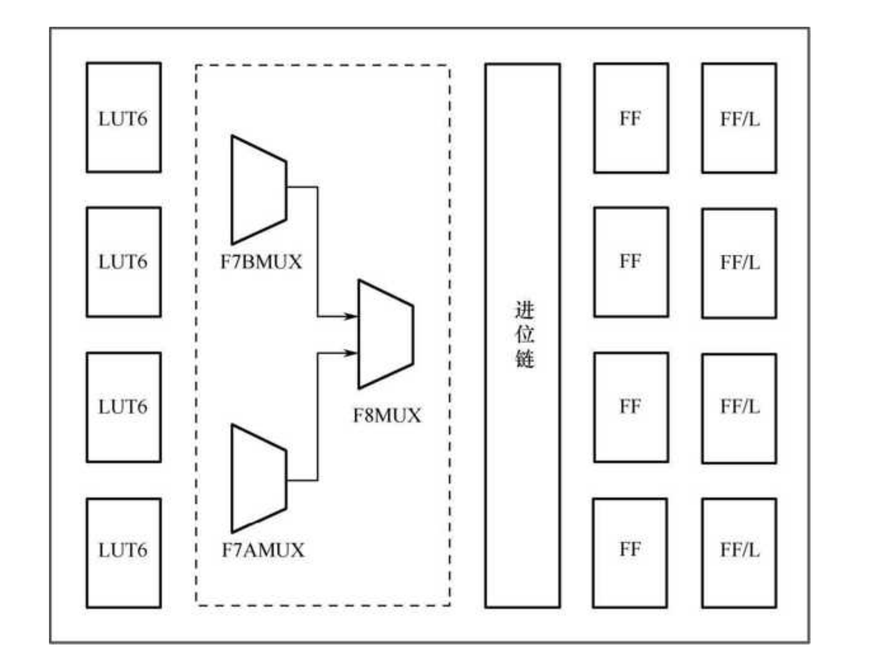
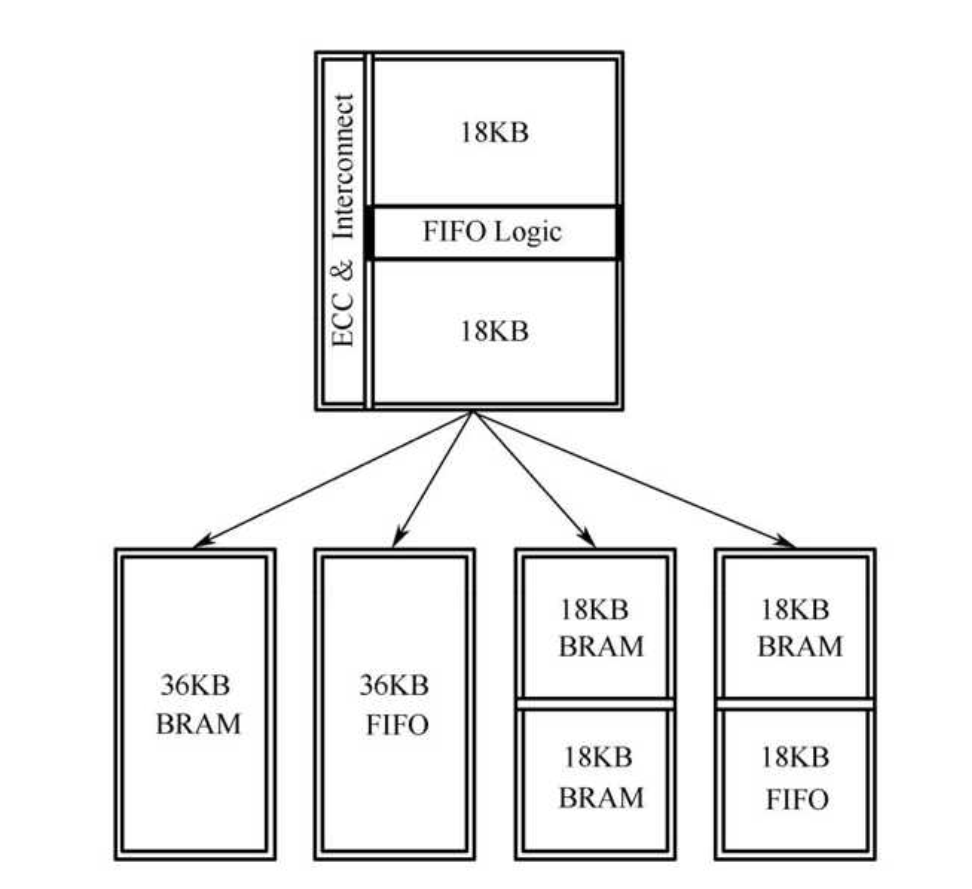

# **资源篇**

## **初识FPGA**

什么是FPGA：FPGA，全称为field programmable gate array ，中文名为现场可编程逻辑门阵列，是一种可以根据需求灵活重构的全能数字芯片，理论上可以实现任何数字逻辑。

FPGA与CPLD的差异：后文FPGA内部资源/布线资源这一部分会说明

注：FPGA内部fabric、dsp、ram、等资源理论都可以达到100%使用率（有点逆天），只要时序能够收敛，不过IOB资源是不可以使用到100%，因为还有一些特定的管脚不是面向设计使用的，以及一些设计限制比如

一些IO 需要保留作电源/地/配置/时钟专用；

差分 IO 必须成对使用；

某些 IO Bank 电压冲突限制；

## **FPGA内部资源（Xilinx）有机体对比举例**

### **1.逻辑资源 血肉与细胞 动态调整结构**

#### **1.1 基本逻辑单元：lut（查找表）**

现代7系列、U/U+系列基本的LUT都是LUT6（6输入查找表）

可以实现任意6输入函数、分布式RAM、或者移位寄存器，还可以配置为两片LUT5，共享5输入

lut6：数级筛选

```
I0 → 2:1 MUX
I1 → 4:1 MUX
I2 → 8:1 MUX
I3 → 16:1 MUX
I4 → 32:1 MUX
I5 → 64:1 MUX
```

或者

```
64 SRAM bits
   ↓
32 个 //2:1 MUX (I0)
   ↓
16 个 //2:1 MUX (I1)
   ↓
8 个 //2:1 MUX (I2)
   ↓
4 个 //2:1 MUX (I3)
   ↓
2 个 //2:1 MUX (I4)
   ↓
1 个 //2:1 MUX (I5)
```

lut6的六输入本质为地址线，通过控制读取地址的值来控制实现目标逻辑

所以这么来看FPGA芯片内部很大一部分组成结构都是SRAM，用来存储lut的配置值

在XilinxFPGA中90%以上的晶体管都是用来做SRAM，不仅仅是用户存储数据的资源更多用来配置逻辑

#### **1.2 MUXF 更大规模组合逻辑（可在slice内部构建）**

首先说明MUXF的概念，说白了就是一个专用的二选一选择器，但是在7系列FPGA中，存在如下资源位置关系图



此处的F7AMUX/F7BMUX/F8MUX，本质都是二选一选择器，前缀的含义是使用后能够实现类似于LUT7/LUT8的功能，通过位置不难发现，两个LUT6的输出通过MUXF7可以变成一个等效于LUT7的逻辑块，进而通过MUXF8实现等价于LUT8的功能，此处是为了折中提高资源利用率，既可以方便小型组合逻辑的实现，又可以时刻集合完成相对大型的组合逻辑，

或者说

```
LUT6 = 真正的逻辑计算单元
MUXF7 = LUT 扩展器
MUXF8 = LUT 再扩展器
```

LUT6本身就是一层组合逻辑层

MUXF7-\>2\*LUT6，两个LUT6级联，多包含一层组合逻辑

MUXF8-\>2\*LUT7，再多包含一层组合逻辑

MUXF9-\>2\*MUX8，U/U+特有的

注：这里简单说明一下FPGA自动实现逻辑的过程，拿lut6举例，这六个输入端可以实现一个任意的6输入的函数，比如y=f（A/B/C/D/E/F）,这六个变量作为输入对一块64bit的rom进行寻址输出对应y值，以此实现任意组合逻辑，如果支持lut6拆分为2\*lut5，需要1bit来控制选择哪一个lut5函数，也就是片选，可以实现两个5输入的组合逻辑函数，但是不可以同时选通，下一步再实现时序逻辑就需要将slice内部的dff的位置考虑在内了，可能会有些复杂，相关工作完全可以交给综合工具来完成，我认为作为逻辑工程师不需要更进一步的了解，投入与收益不成正比，只需要分析好综合工具输出的时序数据就可以应对绝大多数的场景

#### **1.3 slice（逻辑簇）**

7系列：每个slice包含4\*lut6+8\*dff等，支持MUXF8**（2的（8-6）次方=4 lut）**

U：每个CLB包含8\*lut6+16\*dff等，支持MUXF9**（9的含义就是2的（9-6）次方=8 lut）**

slice包含LUT、DFF、进位逻辑链、MUX

slice分为slicel（lut）和slicem（memory），前者只能实现逻辑，后者可以还可以用来构成分布式ram或移位寄存器

slicel与slicem的功能差别，构成结构完全一致，只不过slicem的配置SRAM不仅仅在配置时支持写入，在上电后依旧可以由其他逻辑控制写入，也就是说给FPGA逻辑留下了可控接口，所以可以用来形成RAM而且十分方便实现移位寄存器，一个lut6就可以实现32bit移位寄存器

对于7/U系列每个CLB均包含两个slice，

分为slicel+slicem（clbm）与2*slicel（clbl）两个种类可以实现组合逻辑、时序逻辑、分布式ram

或者说7系列如此，但是U系列每个CLB包含一个slice，但是一个slice相当于两个7系列的slice资源，而且内部包含一个MUXF9，相当于两片7系列slice打通

注：“免费DFF”，对于slicem来说，其配置sram是逻辑可控的，一个lut6配备64bit的sram，我们将0~31级联，然后时钟控制一个DFF驱动bit0，然后时钟作为32个bit的写入控制信号，就可以形成效果等效于32个DFF级联的情况，再通过lut32可以控制任意的延迟

DFF与SRAM基本单元对比：

| 对比项               | DFF（Slice寄存器）               | SRAM cell（LUT内部）    |
| -------------------- | -------------------------------- | ----------------------- |
| 基本结构             | 主从锁存器（master-slave latch） | 交叉反相器（6T SRAM）   |
| 晶体管数量           | ≈20+                             | ≈6                      |
| 是否直接受时钟驱动   | 是                               | 否                      |
| 时钟作用             | 决定采样时刻                     | 只用于控制写入电路      |
| 写入方式             | 时钟边沿采样 D                   | wordline + bitline 写入 |
| 输出更新方式         | 只在时钟边沿更新                 | 写入后立即稳定          |
| 输出类型             | 同步输出                         | 通常为组合输出          |
| 读取路径             | Q 直接输出                       | SRAM → MUX → OUT        |
| 典型延迟             | tCQ（clock→Q）                   | tLUT（MUX读取延迟）     |
| 控制信号             | CLK / CE / RESET / SET 等        | 通常只有写使能          |
| 数据保持             | 时钟控制                         | 静态锁存                |
| 面积                 | 较大                             | 很小                    |
| 适合用途             | pipeline、状态机                 | LUT、ROM、RAM、SRL      |
| 在 FPGA 中的数量比例 | 相对较少                         | 极多                    |

首先由于lut6本质由双lut5构成，而且移位寄存器64bit相对32bit延迟更大，实际需求不大，而且似乎只设计了32bit的移位寄存器网络，所以一个lut6只可以实现一个32bit shiftreg（存疑）或者说两片lut5的sram之间不存在shift网络，所以第31bit无法传递到32bit。这个shift网络应该是实际的电线。

进位链：进位链用于实现加法和减法运算，进位链中包含2输入异或门，异或运算是假发中必不可少的运算。

7系列的每个slice包含的八个寄存器，其中四个只能配置为边沿敏感的D触发器，另外四个还可以配置为电平敏感的锁存器，后者被配置为锁存器时前者无法被使用

当均作为DFF使用时，他们的使能CE，复位/置位R/S，时钟CLK是共享的，将{CE,R/S,CLK}称为控制集，**在设计时控制集的种类越少越好，可以提高资源的利用率**

通过R/S端口的配置可以实现四种DFF，复位/置位端口高有效，当采取低有效时需要额外的逻辑资源

| 原语（Primitive） | 功能描述           | 原语（Primitive） | 功能描述           |
| :---------------- | :----------------- | :---------------- | :----------------- |
| FDCE              | 同步使能，异步复位 | FDRE              | 同步使能，同步复位 |
| FDPE              | 同步使能，异步置位 | FDSE              | 同步使能，同步置位 |

定义寄存器时可以直接定义初值，比如reg aaa = 0；这种定义会令其上电后以及仿真初值为0，但是寄存器一般都有rst复位，上板一般不需要这个

U系列的每个CLB中的16个FF均可配置为DFF或者锁存器，16个分为两组，依旧是类似于两个7系列slice，一组内只要设置为锁存器则整组都只能用作锁存器，而且上下半的控制集各自独立，而且R/S控制高低有效均支持，不需要额外逻辑实现，比如异步DFF会直接映射为FDCE，而在7系列中需要额外的lut资源实现翻转

#### 1.4 可配置逻辑块（CLB）

每个CLB由多个（常见为4个或2个）slice和附加逻辑构成，

附加逻辑包含 进位、mux、控制（复位、时钟、置位、使能等）等等资源

### **2.存储资源**

#### **2.1分布式RAM**

由逻辑资源（slice的lut与dff）实现的分布式ram

优点：布局位置灵活逻辑延迟低、可以自定义使用

缺点：功耗高、消耗lut资源、容量有限

#### **2.2块ram**

BRAM18K（基本单位）经常合并为BRAM36K

BRAM并联使用，也就是数据线相并，地址线复用，这样不会引入新的组合逻辑

对于级联使用需要多一根地址线对两块BRAM进行片选，会引入一层组合逻辑

7系列BRAM（RAMB36E1），每块均为36KB，两个独立的18KB BRAM（RAMB18E1）构成



由于中间FIFO逻辑为双RAMB18E1共享，所以一块RAMB36E1无法实现两个独立的18KB FIFO

对于U系列，称为RAMB36E2与RAMB18E1，与7系列区别在于U系列每列BRAM有设计专用走线，构造更大存储空间时不需要消耗额外CLB并且降低布线拥挤获得更好的时序，而且二代RAM设计了sleep端口，当一段时间RAM未被使用可以设置为睡眠状态（sleep=1），此模式下RAM内数据不变，唤醒时需要占用两个时钟周期。

RAM与ROM与FIFO以及ILA IP的配置都会消耗BRAM

RAM IP的配置模式：

单口RAM ：同步读写，地址线数据线复用

伪双口RAM ：一个端口只读，一个端口只写，可以异步

真双口RAM：读写完全独立，类似于有地址的FIFO

优点：不占用逻辑资源、功耗低、能够通过IP配置安全处理异步读写

缺点：布局位置固定、粒度大不宜用作小单位存储、延迟通常大于一个周期

### **3.硬核资源 重要器官**

包括：块ram、dsp、serdes+GTX/、内存控制器

#### **3.1 块ram**

前文讲述过 

#### **3.2 dsp资源**

肌肉组织 完成高强度计算

未来展开

常见的DSP48E1、U/U+系列的DSP48E2、versal系列的DSP58

#### **3.3 serdes 敏捷神经感知**

serdes是通用的串行收发器，只要是串并转换都可以称之为serdes，可以分为高速serdes和低速serdes

对于高速串行收发器来说，映射到Xilinx器件硬核就是GTP/GTX/GTH等，GTP是高速serdes硬核实现，集成了高速serdes+CDR时钟恢复技术+PCS编码解码功能

#### **3.4 内存控制器 没想出来**

A7、K7的内存控制器IP都是以软核的形式实现的，一些高端系列的内存控制是以硬核的形式存在于片内的

以及pcie core来说常常也是以硬核的形式存在的，一边对接高速收发器（GTH等），另一面向用户提供AXI-STREAM接口（最常见）

### **4.布线资源骨架、血管**

#### **4.1局部布线**

临近CLB连接 毛细血管

#### **4.2长布线**

远处逻辑互联 大动脉

#### **4.3专用布线**

dsp级联、bram级联、时钟树布线，神经中枢通道，不走公共血管网络

### **5.IO资源 神经感官接口**

FPGA物理IO管脚常被称为Pad（详情可以查看芯片封装章节）

#### **5.1 IOB （IO Block）**

每一个IO引脚后面都有一个IOB，支持输入、输出、差分、双向、三态控制

可以配置电平标准（LVCMOS、LVDS、SSTL、HSTL）、驱动强度、上拉下拉等

IOB资源还有IODDR，进行双沿到单沿的转换，属于IOB资源，是硬核资源

#### **5.2 IO bank**

多个IO组成同一个bank，共享参考电压，所以每一个bank的IO必须采用相同的电平标准

按照功能分类

| I/O Bank 类型             | 支持电压                         | 支持 I/O 标准              | 特点                          | 典型用途                    |
| ------------------------- | -------------------------------- | -------------------------- | ----------------------------- | --------------------------- |
| LVCMOS Bank               | 1.2V / 1.5V / 1.8V / 2.5V / 3.3V | LVCMOS, LVTTL              | 最常用的通用 I/O Bank         | GPIO、控制信号、普通接口    |
| SSTL Bank                 | 1.8V / 2.5V                      | SSTL_18 / SSTL_25          | 支持 DDR、内存接口差分标准    | DDRx 数据、地址、控制信号   |
| HSTL Bank                 | 1.5V / 1.8V                      | HSTL                       | 高速传输，低功耗              | 高速信号、存储器接口        |
| 差分信号 Bank (LVDS/DIFF) | 1.2V / 1.8V / 2.5V               | LVDS, HSTL_DIFF, SSTL_DIFF | 支持高速差分 I/O              | SerDes 收发器、板间高速接口 |
| 专用功能 Bank             | 1.2V / 1.8V / 2.5V               | 可混合                     | 用于 PCIe、GTX/GTH 收发器接口 | 高速硬核接口、时钟输入      |

按照特性分类

| 缩写    | 含义              | 特点                                              | 典型应用                                   |
| ------- | ----------------- | ------------------------------------------------- | ------------------------------------------ |
| HC Bank | High-Current Bank | 支持大驱动电流（high drive），通常可输出 24~32 mA | 通用高速 I/O，需要较大输出电流驱动外部负载 |
| HD Bank | High-Density Bank | 支持更多 I/O 引脚（密度高），单引脚驱动能力一般   | 用于高密度 GPIO、低速接口，板上管脚数量大  |

| 缩写    | 含义              | 特点                                              | 典型应用                                   |
| ------- | ----------------- | ------------------------------------------------- | ------------------------------------------ |
| HC Bank | High-Current Bank | 支持大驱动电流（high drive），通常可输出 24~32 mA | 通用高速 I/O，需要较大输出电流驱动外部负载 |
| HD Bank | High-Density Bank | 支持更多 I/O 引脚（密度高），单引脚驱动能力一般   | 用于高密度 GPIO、低速接口，板上管脚数量大  |

#### **5.3专用IO**

配置io：常见的jtag下载io

时钟io：常见的GC pin，分为MRCC和SRCC，代表了接入时钟网络的驱动范围（全局与局部），从pin进入后进入BUFG驱动接入时钟网络，普通IO也可以这样作为时钟，但是非常不建议这样做。

电源/参考io：供电或者IO Bank的参考电压

高速io：高速收发器的专用IO，或者一些硬核的专用io，因为硬核是固定的所以io也是固定的

PS-PL io

注：时钟抖动和时钟偏移

时钟抖动（clock jitter）：时钟质量不高导致时钟边沿到来的实际与理想的随机性或者周期性误差

时钟偏移（clock skew）：由于时钟走线延迟导致无法同时达到所有DFF

#### **5.4 FPGA的启动方式，启动的IO是上文的专用IO的一部分**

##### **FPGA 的常见加载方式**

FPGA 属于 SRAM 型器件，上电后配置位全为“0”，必须从外部重新加载配置文件（bitstream）。常见的有：

###### 1.**被动方式（Passive）**

FPGA 本身是 **Slave**，外部器件主动提供配置数据。

常见接口：

**Passive Serial (PS)** —— Altera/Intel 常见

**Passive Parallel (PP, BPI/SelectMAP)** —— Xilinx 常见

特点：需要外部控制器（MCU、专用配置芯片）驱动数据流。

###### 2.**主动方式（Active）**

FPGA 上电后自己作为 **Master**，主动从外部存储器读取配置数据。

常见接口：

**Active Serial (AS)** —— FPGA 从 SPI Flash 读

**Active Parallel (AP/BPI)** —— FPGA 从并行 NOR Flash 读

特点：FPGA 自举，不需要额外控制器，常见于量产设计。

###### 3.**JTAG 配置**

通过 IEEE 1149.1 TAP 控制器，直接写 bitstream 到 FPGA 配置 SRAM。

主要用于开发、调试，速度较慢，不适合量产。

1.  **其它特定接口**

PCIe 热配置

在部分高端 FPGA 上，也有特殊的调试/维护接口。

⚠️ **没有 I²C 配置模式** —— 所以 D 是错项。

##### **异构 SoC FPGA 的加载方式**

以 Xilinx Zynq / Zynq UltraScale+ / Versal 为例，它们是 **ARM 处理系统 (PS) + FPGA 可编程逻辑 (PL)** 的架构。

-   上电时，首先由 **BootROM + PS** 引导：

PS 从 QSPI Flash、eMMC、SD 卡、NAND、甚至网络等介质加载 FSBL (First Stage Boot Loader)。

-   然后 **PS 再配置 PL**：

通过 PCAP (Processor Configuration Access Port) 或 DFX Manager（在 Versal 上）将 bitstream 下发到 PL。

-   当然，也依然保留传统的 JTAG 配置通路，方便开发调试。

总结就是：

-   传统 FPGA → 通过外部 Flash 或 JTAG
-   异构 SoC → **PS 先启动，再配置 PL**，但本质上还是 bitstream 写入配置 SRAM。

**FPGA上电启动顺序**

FPGA 是 **多电源域** 的芯片，不同电源分别给不同模块供电：

不满足上电顺序容易使一些模块出现反向电流，直接爆炸

-   **VCCINT** → 内部核心逻辑电源（LUT、寄存器、布线开关矩阵等），是最重要的电源。
-   **VCCBRAM** → Block RAM 专用电源（部分 FPGA 有独立引脚）。
-   **VCCAUX** → 辅助电源（时钟管理模块、配置逻辑、JTAG、PLL 等）。
-   **VCCIO** → I/O 电源，决定不同 Bank 的电压标准（1.2V、1.8V、2.5V、3.3V）。

如果上电顺序错误，可能导致：

-   电流反灌 → 芯片损坏或寿命缩短
-   内部逻辑未稳定 → 配置失败
-   I/O 电平先驱动外部电路 → 接口错误

推荐上电顺序

以 **Xilinx/AMD FPGA** 为例（UG471、UG570 等资料）：

1.  **VCCINT**：核心逻辑必须最先上电。
2.  **VCCBRAM**：与核心逻辑紧密相关，通常要求和 VCCINT 同时或紧接其后上电。
3.  **VCCAUX**：保证配置电路、时钟电路、JTAG 可用。
4.  **VCCIO**：最后上电，避免 I/O 在核心逻辑还未就绪时驱动外部电路。

不同Xilinx芯片上电对照表（涉及到硬核资源）

| 器件系列                                                    | 上电顺序（推荐）                                             | 说明                                                         |
| ----------------------------------------------------------- | ------------------------------------------------------------ | ------------------------------------------------------------ |
| Artix-7 / Kintex-7 / Virtex-7                               | VCCINT → VCCBRAM → VCCAUX → VCCIO                            | 典型 7 系列规则；VCCINT 和 VCCBRAM 可同时上电；I/O 最后。    |
| Artix UltraScale / Kintex UltraScale / Virtex UltraScale    | VCCINT → VCCBRAM → VCCAUX → VCCIO                            | 与 7 系列类似；GTX/GTH 收发器需保证 MGTAVCC / MGTAVTT 在 VCCINT 之后。 |
| Artix UltraScale+ / Kintex UltraScale+ / Virtex UltraScale+ | VCCINT → VCCBRAM → VCCAUX → VCCIO                            | 同 UltraScale；但高速收发器电源（MGTAVCC/MGTAVTT/MGTAVTTRX）必须在 VCCINT 后上电。 |
| Zynq UltraScale+ MPSoC                                      | PS 电源 → PL 电源 具体：1. VCC_PSAUX / VCC_PSINTLP / VCC_PSINTFP（PS 核心&辅助电源）2. VCCINT / VCCBRAM（PL 核心&存储器）3. VCCAUX4. VCCIO | ARM Cortex-A53/R5 核心属于 PS 域，必须最先供电；PL 延后。PS 上电后通过 FSBL 决定是否配置 PL。 |
| Versal ACAP (AI Core / Prime / Premium)                     | PMC 域 → PS 域 → PL 域 具体：1. VCC_PMC（Platform Management Controller）2. VCC_PSINT / VCC_PSFP / VCC_PSAUX（PS 核心域）3. VCCINT / VCCBRAM（PL 核心域）4. VCCIO（最后） | Versal 把电源分为 PMC/PS/PL 三大域，必须严格遵守官方序列；PMC 最先，因为它负责电源管理和配置整个器件。 |

#### **5.4 IO约束**

### **6.时钟资源 心脏与血液循环**

#### **6.1全局时钟网络**

覆盖整块芯片的对称的金属网络，处理关键时钟信号，延迟对称，抖动小

#### **6.2局域时钟网络**

覆盖局部区域，次要/区域时钟

#### **6.3 BUFG / BUFH / BUFR / BUFGCE**

时钟buffer，进行时钟分配、门控、局部供时

#### **6.4 PLL/MMCM**

时钟管理单元，负责倍频、分频、移相

PLL更快，MMCM更灵活（动态相位调整）

#### **6.5深入剖析FPGA时钟资源**

**时钟相关术语**

| 指标                   | 定义                                                         | 常见单位 | 重点说明                                              |
| ---------------------- | ------------------------------------------------------------ | -------- | ----------------------------------------------------- |
| 频率准确度 (Accuracy)  | 实际频率与标称频率的相对偏差： (f−f0)/f0(f - f_0)/f_0(f−f0)/f0 | ppm      | 描述晶振/时钟与目标频率的偏离程度。与标称值比。       |
| 频率稳定度 (Stability) | 一定时间或环境变化下频率的波动                               | ppm      | 常见“短期稳定度/长期稳定度”，受温度、电压、老化影响。 |
| 频率漂移 (Drift)       | 随时间的频率长期变化趋势                                     | ppm/年   | 例如晶振老化，每年偏差若干 ppm。                      |
| 相位噪声 (Phase Noise) | 在频域上，理想单频信号的能量泄露到周围频点                   | dBc/Hz   | 高频通信里很重要，影响接收灵敏度。                    |
| 抖动 (Jitter)          | 信号实际到达时间与理想时间的偏差                             | ps/ns    | 用来描述时钟/信号边沿的时间不确定性。                 |
| 偏移 (Offset)          | 信号相对于参考的固定延迟                                     | ns/μs    | 更多用于时序分析或系统同步。                          |

**时钟资源**

**时钟路线全景图：**

fabric指软逻辑部分，和硬核资源分开

外部时钟-\>IBUF/IBUFDS-\>（可选MMCM/PLL）-\>BUFG/BUFGCE/BUFGCTRL-\>（可选BUFH/BUFHCE）-\>触发时钟

高速IO：IBUFDS-\>BUFIO（喂给ISERDES/OSERDES）+BUFR/BUFGCE（分频喂给fabric）-\>GT收发恢复时钟-\>BUFG_GT-\>fabric

**输入缓冲：（Pad-\>芯片内部）**

IBUF：单端输入缓冲

IBUFDS：差分输入缓冲

IBUFG/IBUFGDS：历史产物

**全局时钟缓冲：（驱动整片全局时钟网络）**

BUFG:最基本的全局时钟缓冲，将时钟接入H-tree

BUFGCE：使能BUFG，CE高有效，推荐做时钟门控使用，但是不要再fabric里使用

BUFGCE_DIV：自带分频缓冲，结合GT使用

BUFGCTRL：无毛刺切换两路时钟

BUFG_GT：GT恢复时钟走这里再驱动fabric

均为硬核资源，几十片的量级

**区域/IO时钟缓冲：（局部/IO专用）**

BUFH/BUFHCE：BUFG下一级接入，再驱动DFF

BUFMR/BUFMRCE：主要在7系列，多个区域缓冲，没有BUFG大

BUFR：可分频局部缓冲

BUFIO：IO专用直驱高速时钟，只和ISEDES/OSERDES等IO逻辑交互，不进全局时钟树，延迟极小

物理存在形式：

**全局时钟网络H-tree：**

片上对称分布的树状金属干线，BUFG类原语是树根驱动器，保证各区域到达时间系接近

分发网络：H-tree-\>区域网络-\>IO网络

注：当需要控制时钟运行时不要直接在fabric里面用逻辑控制时钟，要采用BUFGCE来进行使能控制时钟

**决策表：**

| 需求                       | 推荐原语                                           | 备注                                  |
| -------------------------- | -------------------------------------------------- | ------------------------------------- |
| 把外部晶振/时钟引进来      | IBUF/IBUFDS → BUFG(CE)                             | 大多数情况工具会自动插 BUFG           |
| 需要使能/门控全局时钟      | BUFGCE                                             | 硬件无毛刺，别在 fabric 里用 clk & en |
| 需要分频后做全局时钟       | BUFGCE_DIV                                         | 1～8 分频，省 MMCM 资源               |
| 两路时钟无毛刺切换         | BUFGCTRL（或 BUFGMUX 宏）                          | 注意只使能一路，按应用笔记写控制      |
| 仅某几个 Clock Region 里用 | BUFH/BUFHCE                                        | 降低负载/抖动，区域门控               |
| IO 口的 SERDES 高速采样    | BUFIO（喂 IO 逻辑） + BUFR/BUFGCE_DIV（喂 fabric） | 典型 LVDS + ISERDES 架构              |
| GT 恢复时钟进 fabric       | BUFG_GT                                            | 搭配 BUFG_GT_SYNC                     |

注：

工具能推断大部分BUF的使用，门控/切换/分频类需求需要直接调用

这些资源数量有限，要做好分配

外部时钟过IBUF再过PLL/MMCM然后通过BUFG进入全局时钟网络才是最干净的时钟来源

**物理资源对照表**

| 数电课元件  | 在 FPGA 时钟缓冲里的角色    | 特别补充                         |
| ----------- | --------------------------- | -------------------------------- |
| CMOS 传输门 | 实现“开/关”或“切换”时钟路径 | 加锁存器/同步器后才能保证无毛刺  |
| 三态门      | 实现“禁用/启用”时钟驱动     | BUFGCE/BUFHCE 里就有类似机制     |
| 大反相器链  | 驱动全局/区域 H-tree 的主力 | 就是 BUFG/BUFH 的“核心功放”      |
| 锁存器      | 用来同步 CE/切换信号        | 保证切换在安全相位，防止半个脉冲 |

BUFG相关时钟缓冲内部为：

1.大功率CMOS buffer（强驱动，驱动H-tree）

2.受控传输门/三态门：门控切换

3.小锁存器：保证无毛刺同步

FD系列触发器原语对照表：（时序报告会看到）

| 数电课元件  | 在 FPGA 时钟缓冲里的角色    | 特别补充                         |
| ----------- | --------------------------- | -------------------------------- |
| CMOS 传输门 | 实现“开/关”或“切换”时钟路径 | 加锁存器/同步器后才能保证无毛刺  |
| 三态门      | 实现“禁用/启用”时钟驱动     | BUFGCE/BUFHCE 里就有类似机制     |
| 大反相器链  | 驱动全局/区域 H-tree 的主力 | 就是 BUFG/BUFH 的“核心功放”      |
| 锁存器      | 用来同步 CE/切换信号        | 保证切换在安全相位，防止半个脉冲 |

BUF系列原语：（在vivado内部可以直接查看原语的种类与使用方法）

| 原语名     | 功能                    | 典型用途                           | 说明                                           |
| ---------- | ----------------------- | ---------------------------------- | ---------------------------------------------- |
| IBUF       | 输入缓冲器              | 把 FPGA 外部引脚的信号接入内部     | 比如 clk_in、rst_n 进入 FPGA，都会先经过 IBUF  |
| OBUF       | 输出缓冲器              | 把 FPGA 内部信号送到外部引脚       | 比如 led、txd，走到引脚前必须过 OBUF           |
| IOBUF      | 双向缓冲器              | 支持 inout 端口                    | 用于 I²C、SDIO 这种双向口                      |
| BUFG       | 全局时钟缓冲器          | 全局时钟树                         | 最常见的时钟分发资源，供全 FPGA 使用           |
| BUFGCE     | 可控全局时钟缓冲器      | 时钟门控 (Clock Gating)            | CE=0 时关掉时钟，CE=1 时通过                   |
| BUFGMUX    | 全局时钟多路复用器      | 时钟切换                           | 在两个时钟源之间切换，Vivado 会自动插入        |
| BUFH       | 区域时钟缓冲器          | 局部时钟分发                       | 时钟只驱动 FPGA 的某一“半区”                   |
| BUFIO      | I/O 区域专用缓冲器      | 高速串行 I/O（如 ISERDES/OSERDES） | 常用于 DDR 接口、本地 I/O 时钟                 |
| BUFR       | 区域时钟缓冲器 + 分频   | I/O 区域时钟，带分频功能           | 常用于接收端时钟域                             |
| MMCME/PLLE | 时钟管理模块 (MMCM/PLL) | 频率合成、倍频、分频、相位调节     | 逻辑上看是“BUF + 控制电路”，但实际上是独立硬核 |

注：

IBUF/OBUF处于IOB资源内部

BUFG处于时钟树的专用网络内部

BUFH/BUFR在fabric的本地时钟spine上

##### **Xilinx时钟树分层：**

###### **1.全局时钟网络**

由BUFG/BUFGCE/BUFG_GT驱动

覆盖整个芯片

分发系统级时钟

###### **2.局部时钟网络**

由BUFH/BUFHCE驱动

驱动某一片时钟域，经常为FPGA芯片垂直方向的一段逻辑

适合本地高性能逻辑

###### **3.本地时钟spine**

覆盖范围为一个或几个CLB，常用于高速本地逻辑，例如IOSERDES的采样时钟

## **间章 芯片常识**

**术语**

| 原语名     | 功能                    | 典型用途                           | 说明                                           |
| ---------- | ----------------------- | ---------------------------------- | ---------------------------------------------- |
| IBUF       | 输入缓冲器              | 把 FPGA 外部引脚的信号接入内部     | 比如 clk_in、rst_n 进入 FPGA，都会先经过 IBUF  |
| OBUF       | 输出缓冲器              | 把 FPGA 内部信号送到外部引脚       | 比如 led、txd，走到引脚前必须过 OBUF           |
| IOBUF      | 双向缓冲器              | 支持 inout 端口                    | 用于 I²C、SDIO 这种双向口                      |
| BUFG       | 全局时钟缓冲器          | 全局时钟树                         | 最常见的时钟分发资源，供全 FPGA 使用           |
| BUFGCE     | 可控全局时钟缓冲器      | 时钟门控 (Clock Gating)            | CE=0 时关掉时钟，CE=1 时通过                   |
| BUFGMUX    | 全局时钟多路复用器      | 时钟切换                           | 在两个时钟源之间切换，Vivado 会自动插入        |
| BUFH       | 区域时钟缓冲器          | 局部时钟分发                       | 时钟只驱动 FPGA 的某一“半区”                   |
| BUFIO      | I/O 区域专用缓冲器      | 高速串行 I/O（如 ISERDES/OSERDES） | 常用于 DDR 接口、本地 I/O 时钟                 |
| BUFR       | 区域时钟缓冲器 + 分频   | I/O 区域时钟，带分频功能           | 常用于接收端时钟域                             |
| MMCME/PLLE | 时钟管理模块 (MMCM/PLL) | 频率合成、倍频、分频、相位调节     | 逻辑上看是“BUF + 控制电路”，但实际上是独立硬核 |

**芯片命名（Xilinx）**

| 信息类别 | 说明                | Xilinx 命名示例                                  |
| -------- | ------------------- | ------------------------------------------------ |
| 系列     | Artix/Kintex/Virtex | XC7A (Artix-7), XC7K (Kintex-7), XC7V (Virtex-7) |
| 核心容量 | 逻辑单元数          | 100T → 100k LUTs                                 |
| 温度等级 | 工业/商业           | C = Commercial, I = Industrial                   |
| 封装     | 封装类型 + 引脚数   | FTG256 → FBGA 256球                              |
| 速度等级 | 芯片速度            | -1, -2, -3                                       |
| 可选标识 | 其他特性            | e.g., -1L (低功耗)                               |

**芯片封装**

| 特性     | 裸片 (Die)           | 封装芯片 (Package / IC)              |
| -------- | -------------------- | ------------------------------------ |
| 可见性   | 微观硅片，晶圆切割   | PCB 上可见芯片外壳                   |
| I/O 接口 | 只有 PAD             | 有引脚或焊球                         |
| 使用方式 | 不能直接用，需要封装 | 可以直接焊接到 PCB                   |
| 功能     | 逻辑功能             | 逻辑功能 + 可用接口 + 保护 + 散热    |
| 封装形式 | 无                   | Wirebond / Flip-Chip / BGA / FBGA 等 |

芯片的封装是从die（裸片）开始的，一开始的裸片只有PAD的连接，就是之前提到的IOpad，无法直接使用，需要进行Wirebond / Flip-Chip引出连接管脚，然后再进行BGA等封装方式生成黑黑的或者银银的PCB上的芯片

| 特性     | 裸片 (Die)           | 封装芯片 (Package / IC)              |
| -------- | -------------------- | ------------------------------------ |
| 可见性   | 微观硅片，晶圆切割   | PCB 上可见芯片外壳                   |
| I/O 接口 | 只有 PAD             | 有引脚或焊球                         |
| 使用方式 | 不能直接用，需要封装 | 可以直接焊接到 PCB                   |
| 功能     | 逻辑功能             | 逻辑功能 + 可用接口 + 保护 + 散热    |
| 封装形式 | 无                   | Wirebond / Flip-Chip / BGA / FBGA 等 |

**🔑 说明**

1.  **Wirebond / Flip-Chip = 内部连接工艺**，平行于封装类型
2.  **封装类型 = 外部外形 / 引脚布局**
3.  组合原则：

小型低速 FPGA → Wirebond + QFP/DIP

中高端 FPGA → Wirebond + BGA 或 Flip-Chip + BGA

超小型 / 高速 FPGA → Flip-Chip + CSP/WLCSP/LGA

**点击图片可查看完整电子表格**
